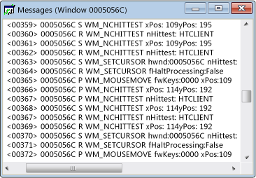

# Messages View
Each window has an associated message stream. A Messages view window displays this message stream. The window handle, message code, and message are shown. You can create a Messages view for a thread or process as well. This allows you to view messages sent to all windows owned by a specific process or thread, which is particularly useful for capturing window initialization messages.  
  
 A typical Messages view window appears below. Note that the first column contains the window handle, and the second column contains a message code (explained in [Message Codes](../vs140/Message-Codes.md)). Decoded message parameters and return values are on the right.  
  
   
Spy++ Messages View  
  
## Procedures  
  
#### To open a Messages view for a window, process, or thread  
  
1.  Move the focus to a [Windows View](../vs140/Windows-View.md), [Processes View](../vs140/Processes-View.md), or [Threads View](../vs140/Threads-View.md) window.  
  
2.  Find the node for the item whose messages you want to examine, and select it.  
  
3.  From the **Spy** menu, choose **Log Messages**.  
  
     The [Message Options Dialog Box](../vs140/Message-Options-Dialog-Box.md) opens.  
  
4.  Select the options for the message you want to display.  
  
5.  Press **OK** to begin logging messages.  
  
     A Messages view window opens, and a **Messages** menu is added to the Spy++ toolbar. Depending upon the options selected, messages begin streaming into the active Messages view window.  
  
6.  When you have enough messages, choose **Stop Logging** from the **Messages** menu.  
  
## In This Section  
 [Controlling Messages View](../vs140/How-to--Control-Messages-View.md)  
 Explains how to manage Messages view.  
  
 [Opening Messages View from Find Window](_asug_choosing_message_options)  
 Explains how to open Messages view from the Find Window dialog box.  
  
 [Searching for a Message in Messages View](../vs140/How-to--Search-for-a-Message-in-Messages-View.md)  
 Explains how to find a specific message in Messages view.  
  
 [Starting and Stopping the Message Log Display](../vs140/How-to--Start-and-Stop-the-Message-Log-Display.md)  
 Explains how to start and stop message logging.  
  
 [Message Codes](../vs140/Message-Codes.md)  
 Defines the codes for messages listed in Messages view.  
  
 [Displaying Message Properties](../vs140/How-to--Display-Message-Properties.md)  
 How to show more information about a message.  
  
## Related Sections  
 [Spy++ Views](../vs140/Spy---Views.md)  
 Explains the Spy++ tree views of windows, messages, processes, and threads.  
  
 [Using Spy++](../vs140/Using-Spy--.md)  
 Introduces the Spy++ tool and explains how it can be used.  
  
 [Message Options Dialog Box](../vs140/Message-Options-Dialog-Box.md)  
 Used to select which messages are listed in the active Messages view.  
  
 [Message Search Dialog Box](../vs140/Message-Search-Dialog-Box.md)  
 Used to find the node for a specific message in Messages view.  
  
 [Message Properties Dialog Box](../vs140/Message-Properties-Dialog-Box.md)  
 Used to display the properties of a message selected in Message view.  
  
 [Spy++ Reference](../vs140/Spy---Reference.md)  
 Includes sections describing each Spy++ menu and dialog box.