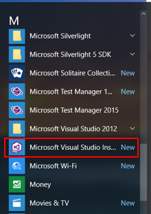
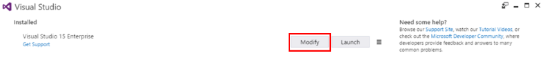
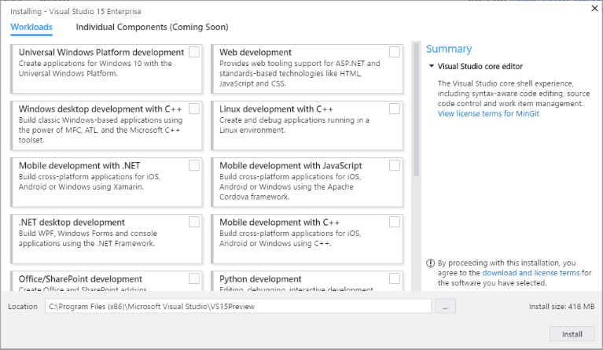

# Modifying Visual Studio &#39;15&#39; Preview 4
Not only have we made is easier for you to personalize Visual Studio to match the tasks you want to accomplish, we’ve also made it easier to modify Visual Studio, too. No more looking in Control Panel to do so; simply start the new Visual Studio installer and make the changes you want.  
  
 Here's how.  
  
> [!CAUTION]
>  This is an unsupported prerelease version of Visual Studio. We do not advise that you use it in a production environment.  
  
## Modify workloads  
 Workloads contain the features you need for the programming language or platform that you are using. Use workloads to modify Visual Studio so that it supports the work you want to do, when you want to do it.  
  
1.  Find the Visual Studio installer on your computer.  
  
     For example, on a computer running Windows 10 Anniversary Update, click **Start**, and then scroll to the letter **M**, where you’ll see it listed as **Microsoft Visual Studio Installer**.  
  
       
  
2.  Click to start the installer, and then click **Modify**.  
  
       
  
3.  From the **Workloads** screen, click to select or deselect the workloads that you want to install or uninstall.  
  
       
  
4.  Click **Install**.  
  
    > [!NOTE]
    >  You might be asked to reboot your computer.  
  
 That's all there is to it!  
  
## See Also  
 [Installing Visual Studio '15' Preview 4](../vs140/Installing-Visual-Studio--15--Preview-4.md)