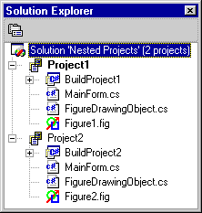

# Nesting Projects
Enterprise application developers who use your VS Package can conveniently group similar types of projects together in [!INCLUDE[vsprvs](../vs140/includes/vsprvs_md.md)] by using *project nesting*. For example, the Enterprise Template project uses nested projects to group projects into categories. Business facade projects, Web UI projects, and so on are grouped together in one category.  
  
 In this scenario, there is no limit to the number of projects the developer can nest under each parent project, although the developer can programmatically provide limits. This type of grouping can also be made recursive, in which case the projects of the same type as a child project can be nested under the child to become a subproject of the child, which is a subproject of the parent.  
  
 Project nesting is not an intrinsic part of [!INCLUDE[vsprvs](../vs140/includes/vsprvs_md.md)]. You have to write the code to enable nesting and subproject nesting within child projects. The parent project is a special VSPackage, or project type, created and registered with its own GUID that includes the code that is required to implement project nesting.  
  
 You can find an example of nested projects in the C# Example.Nested Project sample.  
  
## Nested projects example  
   
Nested projects example  
  
## See Also  
 [How to: Implement Nested Projects](../Topic/How%20to:%20Implement%20Nested%20Projects.md)   
 [Conditions for Unloading and Reloading Nested Project Items](../Topic/Considerations%20for%20Unloading%20and%20Reloading%20Nested%20Projects.md)   
 [Wizard Support for Nested Projects](../vs140/Wizard-Support-for-Nested-Projects.md)   
 [Registering Project and Item Templates](../vs140/Registering-Project-and-Item-Templates.md)   
 [Implementing Command Handling for Nested Projects](../Topic/Implementing%20Command%20Handling%20for%20Nested%20Projects.md)   
 [Filtering the AddItem Dialog Box for Nested Projects](../Topic/Filtering%20the%20AddItem%20Dialog%20Box%20for%20Nested%20Projects.md)   
 [Checklist: Creating New Project Types](../Topic/Checklist:%20Creating%20New%20Project%20Types.md)   
 [Context Parameters](../Topic/Context%20Parameters.md)   
 [Wizard (.Vsz) File](../vs140/Wizard--.Vsz--File.md)