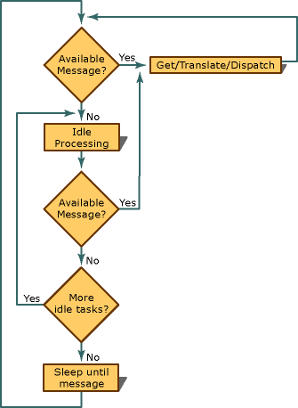

# OnIdle Member Function
When no Windows messages are being processed, the framework calls the [CWinApp](../vs140/CWinApp-Class.md) member function [OnIdle](../vs140/CWinApp--OnIdle.md) (described in the MFC Library Reference).  
  
 Override `OnIdle` to perform background tasks. The default version updates the state of user-interface objects such as toolbar buttons and performs cleanup of temporary objects created by the framework in the course of its operations. The following figure illustrates how the message loop calls `OnIdle` when there are no messages in the queue.  
  
   
The Message Loop  
  
 For more information about what you can do in the idle loop, see [Idle Loop Processing](../vs140/Idle-Loop-Processing.md).  
  
## See Also  
 [CWinApp: The Application Class](../vs140/CWinApp--The-Application-Class.md)