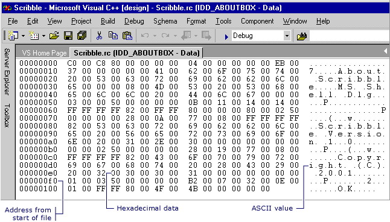

# Opening a Resource for Binary Editing
### To open a Windows desktop resource for binary editing  
  
1.  In [Resource View](../vs140/Resource-View-Window.md), select the specific resource file you want to edit.  
  
    > [!NOTE]
    >  If your project doesn't already contain an .rc file, please see [Creating a New Resource Script File](../vs140/How-to--Create-a-Resource-Script-File.md).  
  
2.  Right-click the resource and click **Open Binary Data** from the shortcut menu.  
  
    > [!NOTE]
    >  If you use the [Resource View](../vs140/Resource-View-Window.md) window to open a resource with a format that Visual Studio does not recognize (such as RCDATA or a custom resource), the resource is automatically opened in the Binary editor.  
  
### To open a managed resource for binary editing  
  
1.  In Solution Explorer, select the specific resource file you want to edit.  
  
2.  Right-click the resource and choose **Open With** from the shortcut menu.  
  
3.  In the **Open With** dialog box, choose **Binary Editor**.  
  
    > [!NOTE]
    >  You can use the [Image editor](../vs140/Image-Editor-for-Icons.md) and the [Binary editor](../vs140/Binary-Editor.md) to work with resource files in managed projects. Any managed resources you want to edit must be linked resources. The Visual Studio resource editors do not support editing embedded resources.  
  
    > [!NOTE]
    >  For information on adding resources to managed projects, please see [Resources in Applications](assetId:///8ad495d4-2941-40cf-bf64-e82e85825890) in the *.NET Framework Developer's Guide.* For information on manually adding resource files to managed projects, accessing resources, displaying static resources, and assigning resources strings to properties, see [Walkthrough: Localizing Windows Forms](assetId:///9a96220d-a19b-4de0-9f48-01e5d82679e5) and [Walkthrough: Using Resources for Localization with ASP.NET](assetId:///bb4e5b44-e2b0-48ab-bbe9-609fb33900b6).  
  
   
Binary Data for a Dialog Box Displayed in the Binary Editor  
  
 Only certain ASCII values are represented in the Binary editor (0x20 through 0x7E). Extended characters are displayed as periods in the ASCII Value section of the Binary editor (the right panel). The "printable" characters are ASCII values 32 through 126.  
  
> [!NOTE]
>  If you want to use the Binary editor on a resource already being edited in another editor window, close the other editor window first.  
  
 **Requirements**  
  
 None  
  
## See Also  
 [Binary Editor](../vs140/Binary-Editor.md)