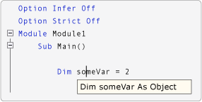

# Option Infer Statement
Enables the use of local type inference in declaring variables.  
  
## Syntax  
  
```  
Option Infer { On | Off }  
```  
  
## Parts  
  
|||  
|-|-|  
|Term|Definition|  
|`On`|Optional. Enables local type inference.|  
|`Off`|Optional. Disables local type inference.|  
  
## Remarks  
 To set `Option Infer` in a file, type `Option Infer On` or `Option Infer Off` at the top of the file, before any other source code. If the value set for `Option Infer` in a file conflicts with the value set in the IDE or on the command line, the value in the file has precedence.  
  
 When you set `Option Infer` to `On`, you can declare local variables without explicitly stating a data type. The compiler infers the data type of a variable from the type of its initialization expression.  
  
 In the following illustration, `Option Infer` is turned on. The variable in the declaration `Dim someVar = 2` is declared as an integer by type inference.  
  
   
IntelliSense when Option Infer is on  
  
 In the following illustration, `Option Infer` is turned off. The variable in the declaration `Dim someVar = 2` is declared as an `Object` by type inference. In this example, the **Option Strict** setting is set to **Off** on the [Compile Page, Project Designer (Visual Basic)](../vs140/Compile-Page--Project-Designer--Visual-Basic-.md).  
  
   
IntelliSense when Option Infer is off  
  
> [!NOTE]
>  When a variable is declared as an `Object`, the run-time type can change while the program is running. [!INCLUDE[vbprvb](../vs140/includes/vbprvb_md.md)] performs operations called *boxing* and *unboxing* to convert between an `Object` and a value type, which makes execution slower. For information about boxing and unboxing, see the [Visual Basic Language Specification](../vs140/Visual-Basic-Language-Specification.md).  
  
 Type inference applies at the procedure level, and does not apply outside a procedure in a class, structure, module, or interface.  
  
 For additional information, see [Local Type Inference (Visual Basic)](../vs140/Local-Type-Inference--Visual-Basic-.md).  
  
## When an Option Infer Statement Is Not Present  
 If the source code does not contain an `Option Infer` statement, the **Option Infer** setting on the [Compile Page, Project Designer (Visual Basic)](../vs140/Compile-Page--Project-Designer--Visual-Basic-.md) is used. If the command-line compiler is used, the [/optioninfer](../vs140/-optioninfer.md) compiler option is used.  
  
#### To set Option Infer in the IDE  
  
1.  In **Solution Explorer**, select a project. On the **Project** menu, click **Properties**. For more information, see [NIB: Managing Project Properties with the Project Designer](assetId:///983f3c18-832f-4666-afec-74b716ff3e0e).  
  
2.  Click the **Compile** tab.  
  
3.  Set the value in the **Option infer** box.  
  
 When you create a new project, the **Option Infer** setting on the **Compile** tab is set to the **Option Infer** setting in the **VB Defaults** dialog box. To access the **VB Defaults** dialog box, on the **Tools** menu, click **Options**. In the **Options** dialog box, expand **Projects and Solutions**, and then click **VB Defaults**. The initial default setting in **VB Defaults** is `On`.  
  
#### To set Option Infer on the command line  
  
-   Include the [/optioninfer](../vs140/-optioninfer.md) compiler option in the **vbc** command.  
  
## Default Data Types and Values  
 The following table describes the results of various combinations of specifying the data type and initializer in a `Dim` statement.  
  
|||||  
|-|-|-|-|  
|Data type specified?|Initializer specified?|Example|Result|  
|No|No|`Dim qty`|If `Option Strict` is off (the default), the variable is set to `Nothing`.<br /><br /> If `Option Strict` is on, a compile-time error occurs.|  
|No|Yes|`Dim qty = 5`|If `Option Infer` is on (the default), the variable takes the data type of the initializer. See [Local Type Inference (Visual Basic)](../vs140/Local-Type-Inference--Visual-Basic-.md).<br /><br /> If `Option Infer` is off and `Option Strict` is off, the variable takes the data type of `Object`.<br /><br /> If `Option Infer` is off and `Option Strict` is on, a compile-time error occurs.|  
|Yes|No|`Dim qty As Integer`|The variable is initialized to the default value for the data type. For more information, see [Dim Statement (Visual Basic)](../Topic/Dim%20Statement%20\(Visual%20Basic\).md).|  
|Yes|Yes|`Dim qty  As Integer = 5`|If the data type of the initializer is not convertible to the specified data type, a compile-time error occurs.|  
  
## Example  
 The following examples demonstrate how the `Option Infer` statement enables local type inference.  
  
 [!CODE [VbVbalrTypeInference#6](../CodeSnippet/VS_Snippets_VBCSharp/VbVbalrTypeInference#6)]  
  
## Example  
 The following example demonstrates that the run-time type can differ when a variable is identified as an `Object`.  
  
 [!CODE [VbVbalrTypeInference#11](../CodeSnippet/VS_Snippets_VBCSharp/VbVbalrTypeInference#11)]  
  
## See Also  
 [Dim Statement](../Topic/Dim%20Statement%20\(Visual%20Basic\).md)   
 [Local Type Inference](../vs140/Local-Type-Inference--Visual-Basic-.md)   
 [Option Compare Statement](../Topic/Option%20Compare%20Statement.md)   
 [Option Explicit Statement](../vs140/Option-Explicit-Statement--Visual-Basic-.md)   
 [Option Strict Statement](../vs140/Option-Strict-Statement.md)   
 [Visual Basic Defaults, Projects, Options Dialog Box](../vs140/Visual-Basic-Defaults--Projects--Options-Dialog-Box.md)   
 [/optioninfer](../vs140/-optioninfer.md)   
 [Boxing and Unboxing (C# Programming Guide)](../Topic/Boxing%20and%20Unboxing%20\(C%23%20Programming%20Guide\).md)