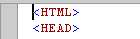
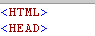

# Options, Text Editor, General
This dialog box lets you change global settings for the [!INCLUDE[vsprvs](../vs140/includes/vsprvs_md.md)] Code and Text Editor. To display this dialog box, click **Options** on the **Tools** menu, expand the **Text Editor** folder, and then click **General**.  
  
> [!NOTE]
>  The dialog boxes and menu commands you see might differ from those described in Help depending on your active settings or edition. To change your settings, choose **Import and Export Settings** on the **Tools** menu. For more information, see [Customizing Development Settings in Visual Studio](assetId:///22c4debb-4e31-47a8-8f19-16f328d7dcd3).  
  
## Settings  
 Drag and drop text editing  
 When selected, enables you to move text by selecting it and dragging it with the mouse to another location within the current document or any other open document.  
  
 Automatic delimiter highlighting  
 When selected, delimiter characters that separate parameters or item-value pairs, as well as matching braces, are highlighted.  
  
 Track changes  
 When the code editor is selected, a vertical yellow line appears in the selection margin to mark code that has changed since the file was most recently saved. When you save the changes, the vertical lines become green.  
  
 Auto-detect UTF-8 encoding without signature  
 By default, the editor detects encoding by searching for byte order marks or charset tags. If neither is found in the current document, the code editor attempts to auto-detect UTF-8 encoding by scanning byte sequences. To disable the auto-detection of encoding, clear this option.  
  
## Display  
 Selection margin  
 When selected, displays a vertical margin along the left edge of the editor's text area. You can click this margin to select an entire line of text, or click and drag to select consecutive lines of text.  
  
|Selection Margin on|Selection Margin off|  
|-------------------------|--------------------------|  
|||  
  
 Indicator margin  
 When selected, displays a vertical margin outside the left edge of the editor's text area. When you click in this margin, an icon and ToolTip that are related to the text appear. For example, breakpoint or task list shortcuts appear in the indicator margin. Indicator Margin information does not print.  
  
 Vertical scroll bar  
 When selected, displays a vertical scrollbar which allows you to scroll up and down to view elements that fall outside the viewing area of the Editor. If vertical scrollbars are not available, you can use the Page Up, Page Down and cursor keys to scroll.  
  
 Horizontal scroll bar  
 When selected, displays a horizontal scrollbar which allows you to scroll from side-to-side to view elements that fall outside the viewing area of the Editor. If horizontal scrollbars are unavailable, you can use the cursor keys to scroll.  
  
 Highlight current line  
 When selected, displays a gray box around the line of code in which the cursor is located.  
  
## See Also  
 [General, All Languages, Text Editor, Options Dialog Box](../vs140/Options--Text-Editor--All-Languages.md)   
 [Tabs, All Languages, Text Editor, Options Dialog Box](../vs140/Options--Text-Editor--All-Languages--Tabs.md)   
 [File Extension, Text Editor, Options Dialog Box](../vs140/Options--Text-Editor--File-Extension.md)   
 [How to: Work with Keyboard Shortcuts](../vs140/Identifying-and-Customizing-Keyboard-Shortcuts-in-Visual-Studio.md)   
 [Customizing the Editor](../vs140/Customizing-the-Editor.md)   
 [Using IntelliSense](../vs140/Using-IntelliSense.md)