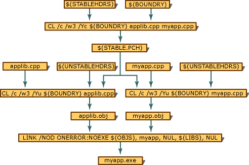

# PCH Files in the Build Process
The code base of a software project is usually contained in multiple C or C++ source files, object files, libraries, and header files. Typically, a makefile coordinates the combination of these elements into an executable file. The following figure shows the structure of a makefile that uses a precompiled header file. The NMAKE macro names and the file names in this diagram are consistent with those in the example code found in [Sample Makefile for PCH](../vs140/Sample-Makefile-for-PCH.md) and [Example Code for PCH](../vs140/Example-Code-for-PCH.md).  
  
 The figure uses three diagrammatic devices to show the flow of the build process. Named rectangles represent each file or macro; the three macros represent one or more files. Shaded areas represent each compile or link action. Arrows show which files and macros are combined during the compilation or linking process.  
  
   
Structure of a Makefile That Uses a Precompiled Header File  
  
 Beginning at the top of the diagram, both STABLEHDRS and BOUNDRY are NMAKE macros in which you list files not likely to need recompilation. These files are compiled using the command string  
  
```  
CL /c /W3 /Yc$(BOUNDRY) applib.cpp myapp.cpp  
```  
  
 only if the precompiled header file (STABLE.pch) does not exist or if you make changes to the files listed in the two macros. In either case, the precompiled header file will contain code only from the files listed in the STABLEHDRS macro. List the last file you want precompiled in the BOUNDRY macro.  
  
 The files you list in these macros can be either header files or C or C++ source files. (A single .pch file cannot be used with both C and C++ modules.) Note that you can use the **hdrstop** macro to stop precompilation at some point within the BOUNDRY file. See [hdrstop](../vs140/hdrstop.md) for more information.  
  
 Continuing down the diagram, APPLIB.obj represents the support code used in your final application. It is created from APPLIB.cpp, the files listed in the UNSTABLEHDRS macro, and precompiled code from the precompiled header.  
  
 MYAPP.obj represents your final application. It is created from MYAPP.cpp, the files listed in the UNSTABLEHDRS macro, and precompiled code from the precompiled header.  
  
 Finally, the executable file (MYAPP.EXE) is created by linking the files listed in the OBJS macro (APPLIB.obj and MYAPP.obj).  
  
 For a further discussion of the figure, see:  
  
-   [Sample Makefile for PCH](../vs140/Sample-Makefile-for-PCH.md)  
  
-   [Example Code for PCH](../vs140/Example-Code-for-PCH.md)  
  
## See Also  
 [Using Precompiled Headers in a Project](../vs140/Using-Precompiled-Headers-in-a-Project.md)