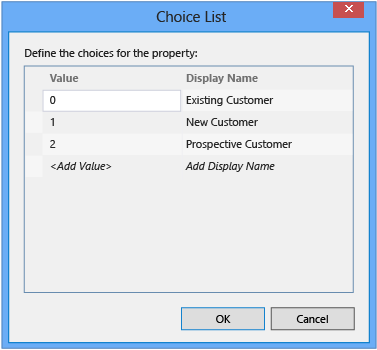

# Presenting a List of Choices in a LightSwitch Application
In this lesson, you’ll learn how to define an entity field so that users can choose a value from a list.  
  
## Create a Choice List  
 Sometimes an entity field represents data that must be restricted to a small set of valid values. For example, a contact might be an existing customer, a new customer, or a prospective customer. To prevent a user from entering a value that isn't valid, you can present these three values as a choice list.  
  
#### To create a choice list  
  
1.  In **Solution Explorer**, open the shortcut menu for the **Contacts.lsml** node, and then choose **Open**.  
  
     The **Data Designer** opens and displays the **Contacts** entity.  
  
2.  In the **Name** column, replace the **<Add Property\>** placeholder with **ContactType**, and then choose the Enter key.  
  
3.  In the **Type** column, open the list, and then choose **Integer**.  
  
4.  In the **Required** column, clear the check box to mark the **ContactType** property as optional.  
  
     In this guided tour, you already have contacts without a **ContactType** value, so marking this field as required would invalidate your existing data. If you add the **ContactType** field for your existing contacts, you could mark this property as required.  
  
5.  In the **Properties** window, choose the **Choice List** link.  
  
     The **Choice List** dialog box opens.  
  
6.  In the **Choice List** dialog box, enter the following values, and then choose the **OK** button.  
  
       
  
     When the **ContactType** field appears in your application, users can choose from a list that contains the three **Display Name** values that you entered.  
  
## Closer Look  
 In this procedure, you created a choice list that offers three possible values. The data is stored in its native data type, `Integer` (as shown in the Value column of the **Choice List** dialog box), but the choices appear at run time as a list with three text values. LightSwitch handles the conversion for you so that you don’t need to write any code.  
  
 You can also create choice lists in which the value and the display name have the same data type. For example, you might want to provide a fixed list of destination cities in a travel application. In this case, both the values that are presented to the user and the values that are stored in the data source would be of type `String`. However, note that if you use a choice list, users can't enter a city that isn't in the list.  
  
## Next Steps  
 In the next lesson, you’ll learn how to validate data entry.  
  
 Next Lesson: [Adding Validation](../vs140/Validating-Data-in-a-LightSwitch-Application.md)  
  
## See Also  
 [How to: Create a List of Values for a Field in a LightSwitch Application](../vs140/How-to--Create-a-List-of-Values-for-a-Field-in-a-LightSwitch-Application.md)   
 [Working with Data in Kitty Hawk (Guided Tour)](../vs140/Working-with-Data-in-LightSwitch.md)