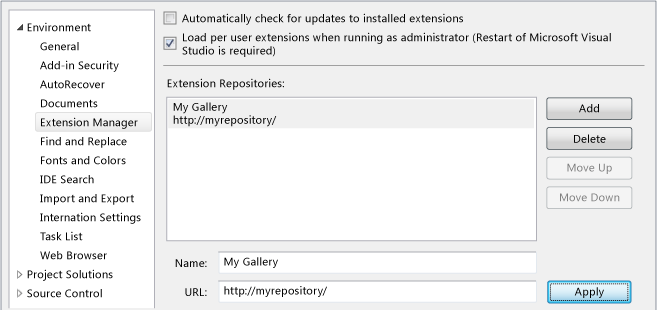
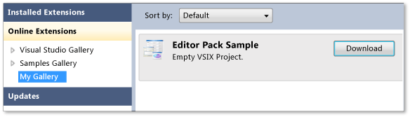
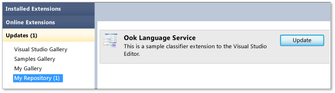

# Private Galleries
You can share the controls, templates, and tools that you develop by posting them to a *private gallery* on the intranet for your organization, as follows:  
  
-   Create an Atom (RSS) feed to a suitably configured central location (repository) on your intranet. For more information, see [How To: Create an Atom Feed for a Private Gallery](../vs140/How-to--Create-an-Atom-Feed-for-a-Private-Gallery.md).  
  
-   Distribute a .pkgdef file that describes the private gallery. We recommend this configuration for administrators who want to connect a private gallery to many computers at the same time.  
  
## Adding a Private Gallery to Extensions and Updates in Visual Studio  
 When a private gallery is available, you can add it to **Extensions and Updates** in Visual Studio.  
  
   
  
#### To add a private gallery to Extensions and Updates  
  
1.  On the menu bar, choose **Tools**, **Options**.  
  
2.  In the **Environment** node, select **Extensions and Updates**.  
  
3.  Choose the **Add** button.  
  
4.  In the **Name** field, enter a name for the private gallery, for example, `My Gallery`.  
  
5.  In the **URL** field, enter the URL of the Atom feed or SharePoint site that is hosting the private gallery.  
  
    1.  If the host is an Atom feed that connects to the private gallery, the URL would resemble this one: http://www.mywebsite/mygallery/atom.xml.  This URL can refer to a file or a network path.  
  
    2.  If the host is a SharePoint site, the URL would resemble this one: http://mysharepoint/sites/mygallery/forms/AllItems.aspx.  
  
### Managing Private Galleries  
 An administrator can make a private gallery available to several computers at the same time by modifying the system registry on each computer. To accomplish this, create a .pkgdef file that describes the new registry keys and their values.  The format of this file is as follows.  
  
```  
[$RootPath$\ExtensionManager\Repositories\{UniqueGUID}]  
@={URI}  (REG_SZ)  
Disabled=0 | 1 (DWORD)  
Priority=0 (highest priority) … MaxInt (lowest priority) (DWORD) (uint)  
Protocol=VSGallery|Atom|Sharepoint (REG_SZ)  
DisplayName={DisplayName} (REG_SZ)  
DisplayNameResourceID={ID} (REG_SZ)  
DisplayNamePackageGuid={GUID} (REG_SZ)  
  
```  
  
 For more information, see [How To: Manage a Private Gallery with Registry Settings](../vs140/How-to--Manage-a-Private-Gallery-By-Using-Registry-Settings.md).  
  
## Installing Extensions from a Private Gallery  
 You can search for and install Visual Studio extensions from a private gallery in **Extensions and Updates**. The following steps use a private gallery named `My Gallery`.  
  
   
  
#### To search for and install extensions from a private gallery  
  
1.  On the menu bar, choose **Tools**, **Extensions and Updates**.  
  
2.  In the left pane, select **Online Extensions**, and then select **My Gallery**.  
  
3.  In the right pane, select an extension, and then choose the **Download** button.  
  
## Updating Extensions from a Private Gallery  
 As new versions of Visual Studio extensions are posted in the private gallery, you can update the extensions that you have installed. The following steps use a private gallery named `My Repository`.  
  
   
  
#### To update an installed extension from a private gallery  
  
1.  On the menu bar, choose **Tools**, **Extensions and Updates**.  
  
2.  In the left pane, select **Updates**, and then select **My Repository**.  
  
3.  In the right pane, select an extension, and then choose the **Update** button.  
  
## See Also  
 [Installing and Managing Visual Studio Tools and Extensions](../vs140/Finding-and-Using-Visual-Studio-Extensions.md)   
 [VSIX Deployment](../vs140/Shipping-Visual-Studio-Extensions.md)