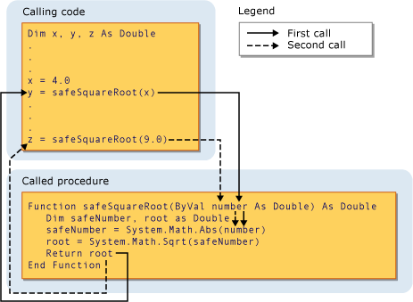

# Procedure Parameters and Arguments (Visual Basic)
In most cases, a procedure needs some information about the circumstances in which it has been called. A procedure that performs repeated or shared tasks uses different information for each call. This information consists of variables, constants, and expressions that you pass to the procedure when you call it.  
  
 A *parameter* represents a value that the procedure expects you to supply when you call it. The procedure's declaration defines its parameters.  
  
 You can define a procedure with no parameters, one parameter, or more than one. The part of the procedure definition that specifies the parameters is called the *parameter list*.  
  
 An *argument* represents the value you supply to a procedure parameter when you call the procedure. The calling code supplies the arguments when it calls the procedure. The part of the procedure call that specifies the arguments is called the *argument list*.  
  
 The following illustration shows code calling the procedure `safeSquareRoot` from two different places. The first call passes the value of the variable `x` (4.0) to the parameter `number`, and the return value in `root` (2.0) is assigned to the variable `y`. The second call passes the literal value 9.0 to `number`, and assigns the return value (3.0) to variable `z`.  
  
   
Passing an argument to a parameter  
  
 For more information, see [Differences Between Parameters and Arguments](../vs140/Differences-Between-Parameters-and-Arguments--Visual-Basic-.md).  
  
## Parameter Data Type  
 You define a data type for a parameter by using the `As` clause in its declaration. For example, the following function accepts a string and an integer.  
  
 [!CODE [VbVbcnProcedures#32](../CodeSnippet/VS_Snippets_VBCSharp/VbVbcnProcedures#32)]  
  
 If the type checking switch ([Option Strict Statement](../vs140/Option-Strict-Statement.md)) is `Off,` the `As` clause is optional, except that if any one parameter uses it, all parameters must use it. If type checking is `On`, the `As` clause is required for all procedure parameters.  
  
 If the calling code expects to supply an argument with a data type different from that of its corresponding parameter, such as `Byte` to a `String` parameter, it must do one of the following:  
  
-   Supply only arguments with data types that widen to the parameter data type;  
  
-   Set `Option Strict Off` to allow implicit narrowing conversions; or  
  
-   Use a conversion keyword to explicitly convert the data type.  
  
### Type Parameters  
 A *generic procedure* also defines one or more *type parameters* in addition to its normal parameters. A generic procedure allows the calling code to pass different data types each time it calls the procedure, so it can tailor the data types to the requirements of each individual call. See [Generic Procedures in Visual Basic](../vs140/Generic-Procedures-in-Visual-Basic.md).  
  
## See Also  
 [Procedures in Visual Basic](../vs140/Procedures-in-Visual-Basic.md)   
 [Sub Procedures](../vs140/Sub-Procedures--Visual-Basic-.md)   
 [Function Procedures](../Topic/Function%20Procedures%20\(Visual%20Basic\).md)   
 [Property Procedures](../vs140/Property-Procedures--Visual-Basic-.md)   
 [Operator Procedures](../vs140/Operator-Procedures--Visual-Basic-.md)   
 [How to: Define a Parameter for a Procedure](../vs140/How-to--Define-a-Parameter-for-a-Procedure--Visual-Basic-.md)   
 [How to: Pass Arguments to a Procedure](../Topic/How%20to:%20Pass%20Arguments%20to%20a%20Procedure%20\(Visual%20Basic\).md)   
 [Argument Passing By Value and By Reference](../vs140/Passing-Arguments-by-Value-and-by-Reference--Visual-Basic-.md)   
 [Procedure Overloading](../Topic/Procedure%20Overloading%20\(Visual%20Basic\).md)   
 [Type Conversions in Visual Basic](../vs140/Type-Conversions-in-Visual-Basic.md)