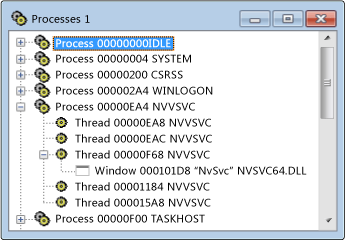

# Processes View
The Processes view displays a tree of all active processes on your system. The process ID and module name are shown. Use the Processes view if you want to examine a particular system process, which usually corresponds to an executing program. Processes are identified by module names, or they are designated "system processes."  
  
 Microsoft Windows supports multiple processes. Each process can have one or more threads, and each thread can have one or more associated top-level windows. Each top-level window can own a series of windows. A + symbol indicates that a level is collapsed. The collapsed view consists of one line per process. Click the + symbol to expand the level.  
  
 Use the Processes view if you want to examine a particular system process, which usually corresponds to an executing program. Processes are identified by module names, or they are designated "system processes." To find a process, collapse the tree and search the list.  
  
## Procedures  
  
#### To open the Processes view  
  
1.  From the **Spy** menu, choose **Processes**.  
  
   
Spy++ Processes View  
  
 The figure above shows the Processes view with process and thread nodes expanded.  
  
### In This Section  
 [Searching for a Process in Processes View](../vs140/How-to--Search-for-a-Process-in-Processes-View.md)  
 Explains how to find a specific process in Processes view.  
  
 [Displaying Process Properties](../vs140/How-to--Display-Process-Properties.md)  
 Explains how to show more information about a message.  
  
### Related Sections  
 [Spy++ Views](../vs140/Spy---Views.md)  
 Explains the Spy++ tree views of windows, messages, processes, and threads.  
  
 [Using Spy++](../vs140/Using-Spy--.md)  
 Introduces the Spy++ tool and explains how it can be used.  
  
 [Process Search Dialog Box](../vs140/Process-Search-Dialog-Box.md)  
 Used to find the node for a specific process in Processes view.  
  
 [Process Properties Dialog Box](../vs140/Process-Properties-Dialog-Box.md)  
 Displays the properties of a process selected in Processes View.  
  
 [Spy++ Reference](../vs140/Spy---Reference.md)  
 Includes sections describing each Spy++ menu and dialog box.