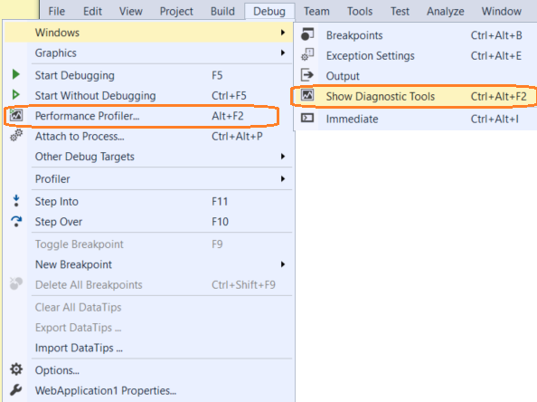
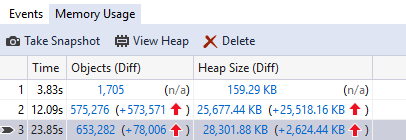
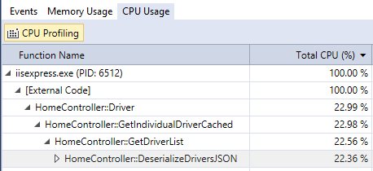
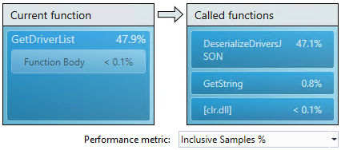
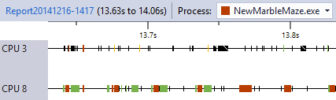
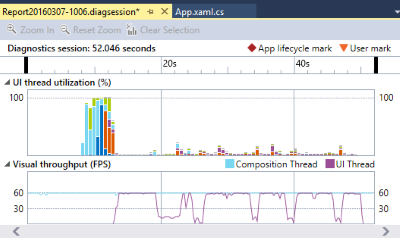
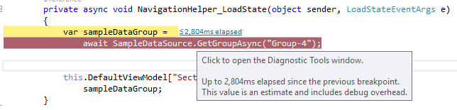
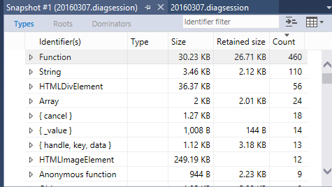
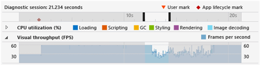
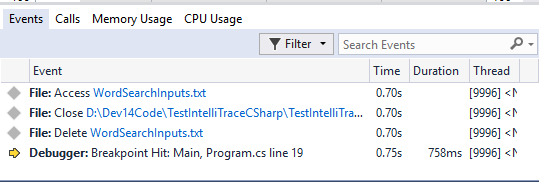

# Profiling Tools
Profiling and diagnostics tools help you diagnose memory and CPU usage and other application-level issues. With these tools, you can accumulate data (such as variable values, function calls, and events) over the time you run your application in the debugger. You can view the state of your application at different points during the execution of your code.  
  
 Check out the summary at the bottom to see what tools are available for your project type (for example, desktop, UWP, ASP.NET).  
  
 You can access the profiling tools by using **Debug / Windows / Show Diagnostic Tools** to use the tools during your debug session, or by using **Debug / Performance Profiler...** to do a focused performance analysis.  See [Running Profiling Tools With or Without the Debugger](../vs140/Running-Profiling-Tools-With-or-Without-the-Debugger.md) for more information on the different approaches.  
  
   
  
 See [What's New in Diagnostic Tools](../vs140/What-s-New-in-Profiling-Tools.md) to learn about new features for this release.  
  
 The following sections describe the different performance tools that are available in Visual Studio.  
  
## Memory Usage  
   
  
 Find memory leaks and inefficient memory while you’re debugging with the **Memory Usage** tool. The tool lets you take snapshots of the managed and native memory heap. You can use this tool with desktop apps, Windows Universal apps, and ASP.NET apps. The **Memory Usage** tool can be run from the **Diagnostics Tools** window while you are debugging (**Debug / Windows / Show Diagnostic Tools**) or outside the debugger (**Debug / Performance Profiler...**). See  [Analyze memory use in the debugger](../vs140/Memory-Usage.md) and [Analyze memory use without debugging](../vs140/Memory-Usage-without-Debugging1.md) for more information.  
  
## CPU Usage  
   
  
 The **CPU Usage** tool shows you where the CPU is spending time executing C++, C#/VB, and JavaScript code.  You can use this tool with both desktop and Windows Universal apps, as well as Azure App Services apps. The **CPU Usage** tool can be run from the **Diagnostics Tools** window while you are debugging (**Debug / Windows / Show Diagnostic Tools**) or outside the debugger (**Debug / Performance Profiler...**). See [Analyze CPU use without debugging](../vs140/CPU-Usage.md) for more information.  
  
## Performance Explorer  
   
  
 The **Performance Explorer** (**Debug / Profiler / Performance Explorer**) allows you to use many different tools, including **CPU Sampling**,  **Instrumentation**, **.NET Memory Allocation**, and **Resource Contention**. You can use Performance Explorer tools with desktop apps and ASP.NET apps, but not Windows Universal apps. For more information, see [Using Performance Tools](../vs140/Performance-Explorer.md).  
  
## GPU Usage  
   
  
 Use the [GPU Usage](../vs140/GPU-Usage.md) tool to better understand the high-level hardware utilization of your Direct3D app. You can use this tool with both desktop and Windows Universal apps, but not ASP.NET apps. The **GPU Usage** tool can be run from the **Diagnostic Tools** window while you are debugging (**Debug / Show Diagnostic Tools**) or outside the debugger (**Debug / Performance Profiler...**).  
  
## Application Timeline  
   
  
 The [Application Timeline](../vs140/Application-Timeline.md) tool helps improve the performance of XAML applications by providing a detailed view of their resource consumption. You can use the **Application Timeline** with desktop and Windows Universal apps, but not  ASP.NET apps. The **Application Timeline** tool can be run from the **Diagnostics Tools** window (**Debug / Performance Profiler...**).  
  
## PerfTips  
   
  
 When the debugger stops execution at a breakpoint or stepping operation, the elapsed time between the break and the previous breakpoint appears as a tip in the editor window. These [PerfTips](../vs140/PerfTips.md) help you to monitor and analyze the performance of your app while you are debugging. You can see **PerfTips** in desktop, Windows Universal, and ASP.NET apps.  
  
## JavaScript Memory  
   
  
 The [JavaScript Memory](../vs140/JavaScript-Memory.md) tool lets you measure, evaluate, and target performance-related issues in your code by collecting timing information at the entrance and exit of each function in your app. You can use this tool with Windows Universal HTML apps. The **JavaScript Function Timing** tool can be run from the **Diagnostics Tools** window (**Debug / Performance Profiler...**).  
  
## HTML UI Responsiveness  
   
  
 The [HTML UI responsiveness](../vs140/HTML-UI-responsiveness.md) tool helps you isolate performance problems in your apps, including lack of responsiveness, slow loading time, and visual updates that are less frequent than expected. You can use this tool with Windows Universal HTML apps. The **HTML UI Responsiveness** tool can be run from the **Diagnostics Tools** window (**Debug / Performance Profiler...**).  
  
## IntelliTrace  
   
  
 [IntelliTrace](../vs140/IntelliTrace.md) lets you record specific events, examine data in the **Locals** window during debugger events and function calls, and debug errors that are hard to reproduce.  IntelliTrace is primarily a debugging tool, but it also provides information that can be used for performance investigations. You can use this tool in Visual Studio Enterprise only, with desktop, Windows Universal, and ASP.NET C# apps. You can find IntelliTrace in the **Diagnostics Tools** window while you are debugging (**Debug / Windows / Show Diagnostic Tools**).  
  
## Profiling in Production  
 The recommended approach to profiling in production is to profile from the [command line using vsperf.exe](../vs140/Using-the-Profiling-Tools-From-the-Command-Line.md) to collect a CPU Profile. For remote profiling support in Azure App Service, you can profile through the [Server Explorer or Kudu Portal](https://azure.microsoft.com/en-us/blog/remote-profiling-support-in-azure-app-service/).  
  
## Which Tool Should I Use?  
 Here is a table that lists the different tools Visual Studio offers and the different project types you can use them with:  
  
|Performance Tool|Windows desktop|Windows Universal/Store|ASP.NET|  
|----------------------|---------------------|------------------------------|-------------|  
|[Memory Usage](../vs140/Memory-Usage.md)|yes|yes|no|  
|[CPU Usage](../vs140/CPU-Usage.md)|yes|yes|Azure App Service only|  
|[GPU Usage](../vs140/GPU-Usage.md)|yes|yes|no|  
|[Application Timeline](../vs140/Application-Timeline.md)|yes|yes|no|  
|[PerfTips](../vs140/PerfTips.md)|yes|yes for XAML, no for HTML|no|  
|[Performance Explorer](../vs140/Performance-Explorer.md)|yes|no|yes|  
|[IntelliTrace](../vs140/IntelliTrace.md)|.NET Enterprise only|.NET Enterprise only|.NET Enterprise only|  
|[HTML UI responsiveness](../vs140/HTML-UI-responsiveness.md)|no|yes for HTML, no for XAML|no|  
|[JavaScript Memory](../vs140/JavaScript-Memory.md)|no|yes for HTML, no for XAML|no|  
  
## See Also  
 [Visual Studio IDE](../Topic/Visual%20Studio%20IDE.md)