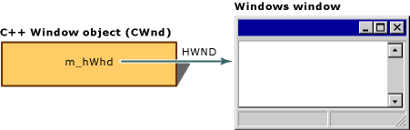

# Relationship Between a C++ Window Object and an HWND
The window *object* is an object of the C++ `CWnd` class (or a derived class) that your program creates directly. It comes and goes in response to your program's constructor and destructor calls. The Windows *window*, on the other hand, is an opaque handle to an internal Windows data structure that corresponds to a window and consumes system resources when present. A Windows window is identified by a "window handle" (`HWND`) and is created after the `CWnd` object is created by a call to the **Create** member function of class `CWnd`. The window may be destroyed either by a program call or by a user's action. The window handle is stored in the window object's `m_hWnd` member variable. The following figure shows the relationship between the C++ window object and the Windows window. Creating windows is discussed in [Creating Windows](../vs140/Creating-Windows.md). Destroying windows is discussed in [Destroying Window Objects](../vs140/Destroying-Window-Objects.md).  
  
   
Window Object and Windows Window  
  
## See Also  
 [Window Objects](../vs140/Window-Objects.md)