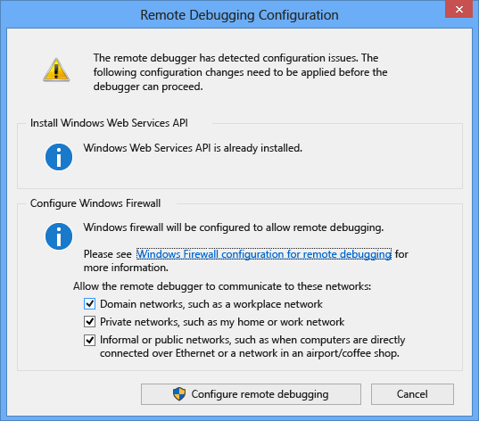
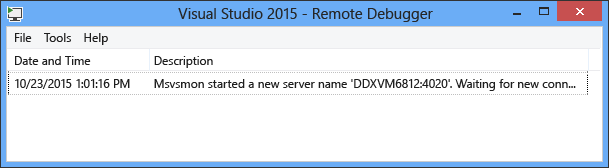
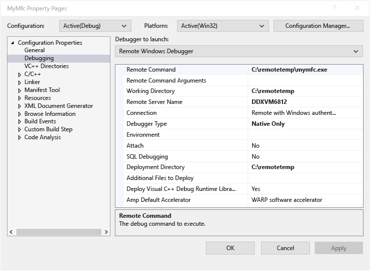
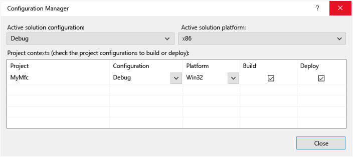
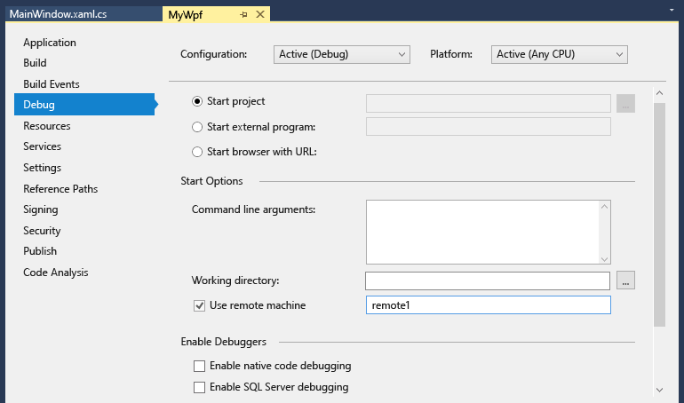

# Remote Debugging
You can debug a Visual Studio application that has been deployed on a different computer.  To do so, you use the Visual Studio remote debugger.  
  
 The information here applies to Windows desktop applications and ASP.NET applications.  For information about remote debugging Windows Store apps and Azure apps, see [Remote Debugging on Windows Store and Azure apps](#bkmk_winstoreAzure).  
  
## Download and Install the Remote Tools  
 You can download the remote tools for debugging at [Remote Tools for Visual Studio 2015](https://www.visualstudio.com/downloads/download-visual-studio-vs#d-remote-tools). You can choose x86, x64, and ARM versions of the tools.  
  
 The ARM version of this download actually provides the Visual Studio 2015 Update 1 ARM version of the remote tools. You can use the Update 1 ARM remote tools along with Visual Studio 2015 Update 3. You can find downloads of the Remote Tools for earlier releases of Visual Studio 2015 on [My.VisualStudio.com](https://my.visualstudio.com/Downloads?q=remote%20tools%20visual%20studio%202015)  
  
> [!IMPORTANT]
>  We recommend you install the most recent version of the remote tools that matches your version of Visual Studio. Mismatched versions are not recommended.  
>   
>  In addition, you must install the remote tools that have the same architecture as the operating system on which you want to install it. In other words, if you want to debug a 32-bit application on a  a remote computer running a 64-bit operating system, you must install the 64-bit version of the remote tools on the remote computer.  
  
 When you have finished downloading the executable, follow the directions to install the application on the remote computer.  
  
 If the remote computer already has Visual Studio 2015 Community, Professional, or Enterprise already installed, the remote debugger (**msvsmon.exe**) is already installed, and you can start it from its directory:  
  
 **<Visual Studio installation directory\>\Common7\IDE\Remote Debugger\\(x64, x86, Appx)\msvsmon.exe**  
  
 However, the **Remote Debugger Configuration Wizard** (**rdbgwiz.exe**) is installed only when you download and install the tools, and you may need to use it for configuration later, especially if you want the remote debugger to run as a service. For more information, see [Configure the remote debugger as a service](#bkmk_configureService) below.  
  
## Supported Operating Systems  
 The remote computer must be running one of the following operating systems:  
  
-   Windows 10  
  
-   Windows 8 or 8.1  
  
-   Windows 7 Service Pack 1  
  
-   Windows Server 2012 or Windows Server 2012 R2  
  
-   Windows Server 2008 Service Pack 2, Windows Server 2008 R2 Service Pack 1  
  
## Supported Hardware Configurations  
  
-   1.6 GHz or faster processor  
  
-   1 GB of RAM (1.5 GB if running on a virtual machine)  
  
-   1 GB of available hard disk space  
  
-   5400 RPM hard drive  
  
-   DirectX 9-capable video card running at 1024 x 768 or higher display resolution  
  
## Network configuration  
 The remote computer and the Visual Studio computer must be connected over a network, workgroup, or homegroup, or else connected directly through an Ethernet cable. Debugging over the Internet is not supported.  
  
## Set up the remote debugger  
 You must have administrative permissions on the remote computer  
  
1.  Locate the Remote Debugger application. You can search for **Remote Debugger** in the **Start** menu.  
  
2.  When you start the remote tools for the first time (or before you have configured it), the **Remote Debugging Configuration** dalog box appears.  
  
       
  
3.  If the Windows Service API is not installed (which happens only on Windows Server 2008 R2), choose the **Install** button.  
  
4.  Select the network types you want use the remote tools on. At least one network type must be selected. If the computers are connected through a domain, you must choose the first item. If the computers are connected through a workgroup or homegroup, you need to choose the second or third item as appropriate.  
  
5.  Choose **Configure remote debugging** to configure the firewall and start the tool.  
  
6.  When configuration is complete, the Remote Debugger window appears.  
  
       
  
 You can stop the remote debugger by clicking **File / Exit** on the window. You can restart it from the **Start** menu or from the command line:  
  
 **<Visual Studio installation directory\>\Common7\IDE\Remote Debugger\\<x86, x64, or Appx\msvsmon.exe**.  
  
## Configure the remote debugger  
 You can change some aspects of the configuration of the remote debugger after you have started it for the first time.  
  
-   To enable other users to connect to the remote debugger, choose **Tools / Permissions**. You must have administrator privileges to grant or deny permissions.  
  
-   To change the Authentication mode or the port number, or to specify a timeout value for the remote tools: choose Tools / Options.  
  
     For a listing of the port numbers used by default, see [Remote Debugger Port Assignments](../vs140/Remote-Debugger-Port-Assignments.md).  
  
> [!WARNING]
>  You can choose to run the remote tools in No Authentication mode, but this mode is strongly discouraged. There is no network security when you run in this mode. Choose the No Authentication mode only if you are sure that the network is not at risk from malicious or hostile traffic.  
  
##   Configure the remote debugger as a service  
 For debugging in ASP.NET and other server environments, you need to run the remote debugger as a service.  
  
1.  Find the **Remote Debugger Configuration Wizard** (rdbgwiz.exe). (This is a separate application from the Remote Debugger.) It is available only when you install the remote tools. It is not installed with Visual Studio.  
  
2.  Start running the configuration wizard. When the first page comes up, click **Next**.  
  
3.  Check the **Run the Visual Studio 2015 Remote Debugger as a service** checkbox.  
  
4.  Add the name of the user account and password.  
  
     You may need to add the **Log on as a service** user right to this account. (Find **Local Security Policy** (secpol.msc) in the **Start** page or window (or type **secpol** at a command prompt). When the window appears, double-click **User Rights Assignment**, then find **Log on as a service** in the right pane. Double-click it. Add the user account to the **Properties** window and click **OK**.) Click **Next**.  
  
5.  Select the type of network that you want the remote tools to communicate with. At least one network type must be selected. If the computers are connected through a domain, you should choose the first item. If the computers are connected through a workgroup or homegroup, you should choose the second or third items. Click **Next**.  
  
6.  If the service can be started, you will see **You have successfully completed the Visual Studio Remote Debugger Configuration Wizard**. If the service cannot be started, you will see **Failed to complete the Visual Studio Remote Debugger Configuration Wizard**. The page also gives some tips to follow to get the service to start.  
  
7.  Click **Finish**.  
  
 At this point the remote debugger is running as a service. You can verify this by going to **Control Panel / Services** and looking for **Visual Studio 2015 Remote Debugger**.  
  
 You can stop and start the remote debugger service from **Control Panel / Services**.  
  
## Running the remote debugger with different user accounts  
 It is possible to run the remote debugger under a user account that differs from the user account you are using on the Visual Studio computer, but you must add the different user account to the remote debugger’s permissions.  
  
-   You can start the remote debugger from the command line with the **/allow <username\>** parameter: **msvsmon /allow <username@computer\>**.  
  
-   You can add the user to the remote debugger's permissions (in the remote debugger window(**Tools / Permissions**).  
  
## Remote debug a Visual C++ project  
 In the following procedure, the name and path of the project is C:\remotetemp\MyMfc, and the name of the remote computer is **remote1**.  
  
1.  Create an MFC application named **mymfc.**  
  
2.  Set a breakpoint somewhere in the application that is easily reached, for example in **MainFrm.cpp**, at the start of `CMainFrame::OnCreate`.  
  
3.  In Visual Studio, on the **Project** menu, select **Properties**. Open the **Debugging** tab.  
  
4.  Set the **Debugger to launch** to **Remote Windows Debugger**.  
  
       
  
5.  Make the following changes to the properties:  
  
    |||  
    |-|-|  
    |**Setting**|**Value**|  
    |Remote Command|C:\remotetemp\mymfc.exe|  
    |Working Directory|C:\remotetemp|  
    |Remote Server Name|remote1|  
    |Connection|Remote with Windows Authentication|  
    |Debugger Type|Native Only|  
    |Deployment Directory|C:\remotetemp.|  
    |Additional Files to Deploy|C:\data\mymfcdata.txt.|  
  
6.  On the toolbar, open the **Solution Configuration** drop-down menu, and choose **Configuration Manager**.  
  
7.  For the **Debug** configuration, select the **Deploy** check box.  
  
       
  
8.  Start debugging (**Debug / Start Debugging**, or **F5**).  
  
9. The executable is automatically deployed to the remote computer.  
  
10. On the Visual Studio computer, you should see that execution is stopped at the breakpoint.  
  
    > [!TIP]
    >  Alternatively, you can deploy the files as a separate step. In the **Solution Explorer,** right-click the **mymfc** node and then choose **Deploy**.  
  
 If you have non-code files that need to be used by the application, you need to include them in the Visual Studio project. Create a project folder for the additional files (in the **Solution Explorer**, click **Add / New Folder**.) Then add the files to the folder (in the S**olution Explorer**, click **Add / Existing Item**, then select the files.). On the **Properties** page for each file, set **Copy to Output Directory** to **Copy always**.  
  
## Remote debug a Visual C# or Visual Basic project  
 The debugger cannot deploy Visual C# or Visual Basic desktop applications to a remote machine, but you can still debug them remotely as follows. The following procedure assumes that you want to debug it on a computer named **remote1**.  
  
1.  Create a WPF project named **MyWpf**.  
  
2.  Set a breakpoint somewhere in the code that is easily reached. For example, you might set a breakpoint in a button handler.  
  
3.  On the **Project** menu, choose **Properties**.  
  
4.  On the **Properties** page, choose the **Debug** tab.  
  
       
  
5.  Make sure the **Working directory** text box is empty.  
  
6.  Choose **Use remote machine**, and type **remote1** in the text box.  
  
7.  Make sure that **Enable native code debugging** is not selected.  
  
8.  Build the project.  
  
9. Create a folder on the remote computer that is the same path as the **Debug** folder on your Visual Studio computer: **<source path\>\MyWPF\MyWPF\bin\Debug**.  
  
10. Copy the executable that you just built from your Visual Studio computer to the newly-created folder on the remote computer.  
  
    > [!CAUTION]
    >  Do not make changes to the code or rebuild before this step. The executable you copied to the remote machine must exactly match your local source and symbols.  
  
11. In Visual Studio, start debugging (**Debug / Start Debugging**, or **F5**).  
  
12. Check the breakpoint. You should see that the breakpoint is active. If it isn’t, the symbols for the application haven’t loaded. For information about loading symbols and how troubleshoot them, see [Understanding symbol files and Visual Studio’s symbol settings](http://blogs.msdn.com/b/visualstudioalm/archive/2015/01/05/understanding-symbol-files-and-visual-studio-s-symbol-settings.aspx).  
  
13. You should see that the WPF application’s main window is open on the remote computer. Perform the action that causes the breakpoint to be hit.  
  
14. On the Visual Studio machine, you should see that execution has stopped at the breakpoint.  
  
 If you have non-code files that need to be used by the application, you need to include them in the Visual Studio project. Create a project folder for the additional files (in the **Solution Explorer**, click **Add / New Folder**.) Then add the files to the folder (in the S**olution Explorer**, click **Add / Existing Item**, then select the files.). On the **Properties** page for each file, set **Copy to Output Directory** to **Copy always**.  
  
## Remote debug an ASP.NET application  
 Deploying an ASP.NET application to a remote computer running IIS has different steps, depending on the operating system and version of IIS. For remote computers running Windows 8 or later or Windows Server 2012 operating systems that have IIS 8 (or later) installed, please see [Publishing to IIS](https://docs.asp.net/en/latest/publishing/iis.html).  
  
 For remote computers running Windows 7 or Windows Server 2008 that have IIS 7.5 installed, please see [Remote Debugging ASP.NET on a Remote IIS 7.5 Computer](../vs140/Remote-Debugging-ASP.NET-on-a-Remote-IIS-7.5-Computer.md).  
  
## Set Up Debugging with Remote Symbols  
 You should be able to debug your code with the symbols you generate on the Visual Studio computer. The performance of the remote debugger is much better when you use local symbols.  If you must   use remote symbols, you need to tell the remote debugging monitor to look for symbols on the remote machine.  
  
 Starting in Visual Studio 2013 Update 2, you can use the following msvsmon command-line switch to use remote symbols for managed code: `Msvsmon / /FallbackLoadRemoteManagedPdbs`  
  
 For more information, please see the remote debugging help (press **F1** in the remote debugger window, or click **Help / Usage**). You can find more information at [.NET Remote Symbol Loading Changes in Visual Studio 2012 and 2013](http://blogs.msdn.com/b/visualstudioalm/archive/2013/10/16/net-remote-symbol-loading-changes-in-visual-studio-2012-and-2013.aspx)  
  
##   Remote Debugging on Windows Store and Azure apps  
 For information about remote debugging with Windows Store apps, see [Debug and test Windows Store apps on a remote device from Visual Studio](http://msdn.microsoft.com/library/windows/apps/hh441469.aspx).  
  
 For information about debugging on Azure, see one of these topics:  
  
-   [Debugging a Cloud Service or Virtual Machine in Visual Studio](http://msdn.microsoft.com/library/azure/ff683670.aspx)  
  
-   [Debugging the .NET Backend in Visual Studio](http://blogs.msdn.com/b/azuremobile/archive/2014/03/14/debugging-net-backend-in-visual-studio.aspx)  
  
-   Introduction to Remote Debugging on Azure Web Sites ([Part 1](http://azure.microsoft.com/blog/2014/05/06/introduction-to-remote-debugging-on-azure-web-sites/), [Part 2](http://azure.microsoft.com/blog/2014/05/07/introduction-to-remote-debugging-azure-web-sites-part-2-inside-remote-debugging/), [Part 3](http://azure.microsoft.com/blog/2014/05/08/introduction-to-remote-debugging-on-azure-web-sites-part-3-multi-instance-environment-and-git/)).  
  
## See Also  
 [Debugging in Visual Studio](../vs140/Debugging-in-Visual-Studio.md)   
 [Configure the Windows Firewall for Remote Debugging](../vs140/Configure-the-Windows-Firewall-for-Remote-Debugging.md)   
 [Remote Debugger Port Assignments](../vs140/Remote-Debugger-Port-Assignments.md)   
 [Remote Debugging ASP.NET on a Remote IIS 7.5 Computer](../vs140/Remote-Debugging-ASP.NET-on-a-Remote-IIS-7.5-Computer.md)   
 [Remote Debugging Errors and Troubleshooting](../vs140/Remote-Debugging-Errors-and-Troubleshooting.md)