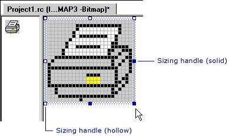

# Resizing an Image (Image Editor for Icons)
The behavior of the Image editor while resizing an image depends on whether you've [selected](../vs140/Selecting-an-Area-of-an-Image--Image-Editor-for-Icons-.md) the entire image or just part of it.  
  
 When the selection includes only part of the image, the Image editor shrinks the selection by deleting rows or columns of pixels and filling the vacated regions with the current background color, or it stretches the selection by duplicating rows or columns of pixels.  
  
 When the selection includes the entire image, the Image editor either shrinks and stretches the image, or crops and extends it.  
  
 There are two mechanisms for resizing an image: the sizing handles and the [Properties window](../vs140/Properties-Window.md). You can drag the sizing handles to change the size of all or part of an image. Sizing handles that you can drag are solid. You cannot drag handles that are hollow. You can use the Properties window to resize the entire image only, not a selected part.  
  
   
Sizing Handles  
  
> [!NOTE]
>  If you have the Tile Grid option selected in the [Grid Settings dialog box](../vs140/Grid-Settings-Dialog-Box--Image-Editor-for-Icons-.md), then resizing snaps to the next tile grid line. If only the Pixel Grid option is selected (the default setting), resizing snaps to the next available pixel.  
  
-   [Resizing an Entire Image](../vs140/Resizing-an-Entire-Image--Image-Editor-for-Icons-.md)  
  
-   [Cropping or Extending an Entire Image](../vs140/Cropping-or-Extending-an-Entire-Image--Image-Editor-for-Icons-.md)  
  
-   [Shrinking or Stretching an Entire Image](../vs140/Shrinking-or-Stretching-an-Entire-Image--Image-Editor-for-Icons-.md)  
  
-   [Shrinking or Stretching Part of an Image](../vs140/Shrinking-or-Stretching-Part-of-an-Image--Image-Editor-for-Icons-.md)  
  
 For information on adding resources to managed projects, please see [Resources in Applications](assetId:///8ad495d4-2941-40cf-bf64-e82e85825890) in the *.NET Framework Developer's Guide.* For information on manually adding resource files to managed projects, accessing resources, displaying static resources, and assigning resources strings to properties, see [Walkthrough: Localizing Windows Forms](assetId:///9a96220d-a19b-4de0-9f48-01e5d82679e5) and [Walkthrough: Using Resources for Localization with ASP.NET](assetId:///bb4e5b44-e2b0-48ab-bbe9-609fb33900b6).  
  
## Requirements  
 None  
  
## See Also  
 [Accelerator Keys](../vs140/Accelerator-Keys--Image-Editor-for-Icons-.md)   
 [Editing Graphical Resources](../vs140/Editing-Graphical-Resources--Image-Editor-for-Icons-.md)   
 [Image Editor for Icons](../vs140/Image-Editor-for-Icons.md)