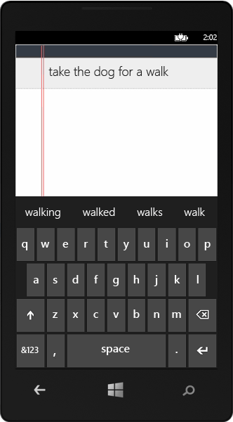

# Run Your Apache Cordova App on Windows Phone
[!INCLUDE[cordova_header](../vs140/includes/cordova_header_md.md)]  
  
 Visual Studio provides these two options for deploying your app built with Visual Studio Tools for Apache Cordova on Windows Phone:  
  
-   Windows Phone emulator  
  
-   Windows Phone device  
  
 Windows 8, Windows 8.1, or Windows Server 2012 R2 (with Desktop Experience enabled) is required to deploy and run your app on Windows Phone.  
  
 You can choose either Windows Phone 8 or Windows Phone (Universal) as your deployment target. When you choose Windows Phone (Universal), the generated project is an APPX package, which is a native Windows Store app targeting Windows Phone 8.1. If you choose Windows Phone 8, the generated project is a XAP package; Windows Phone 8 apps for Cordova are hosted in a Silverlight WebView control.  
  
> [!NOTE]
>  You can attach the Visual Studio debugger when targeting Windows Phone 8.1, but not Windows Phone 8.  
  
## Run your app on the emulator  
 Follow these instructions to run your app on the Windows Phone emulator. For additional information, see [Run Windows Phone apps in the emulator](http://msdn.microsoft.com/library/windows/apps/dn632391.aspx) in the Windows Dev Center.  
  
#### To run your app on the emulator  
  
1.  Make sure that Hyper-V is enabled on your PC. Your PC must support the Windows Phone emulator [system requirements](http://msdn.microsoft.com/library/windowsphone/develop/ff626524.aspx).  
  
2.  With your app open in Visual Studio, choose **Windows Phone 8** or **Windows Phone (Universal)** from the **Solution Platforms** list. If you don’t see this list, choose **Solution Platforms** from the **Add/Remove Buttons** list to display it.  
  
3.  Choose one of the emulators, such as **Emulator WVGA 512MB**.  
  
4.  Press F5 to start the app.  
  
     Visual Studio starts the emulator and runs the app.  
  
       
  
## Run your app on a Windows Phone device  
 Follow these instructions to run your app on a Windows Phone device that is connected to your PC.  
  
#### To run your app on a device  
  
1.  With your app open in Visual Studio, choose **Windows Phone 8** or **Windows Phone (Universal)** from the **Solution Platforms** list. If you don’t see this option, choose **Solution Platforms** from the **Add/Remove Buttons** list to display it.  
  
2.  Choose **Device**.  
  
3.  Press F5 to start the app.  
  
     Visual Studio starts the app on the connected Windows Phone device.  
  
  [Get the Visual Studio Tools for Apache Cordova](http://aka.ms/mchm38) or [learn more](https://www.visualstudio.com/cordova-vs.aspx)  
  
## See Also  
 [Install the Visual Studio Tools for Apache Cordova Extension](../vs140/Install-Visual-Studio-Tools-for-Apache-Cordova.md)   
 [Debug Your App Built with Visual Studio Tools for Apache Cordova](../Topic/Debug%20Your%20App%20Built%20with%20Visual%20Studio%20Tools%20for%20Apache%20Cordova.md)   
 [Package Your App Built with Visual Studio Tools for Apache Cordova](../vs140/Package-Your-App-Built-with-Visual-Studio-Tools-for-Apache-Cordova.md)