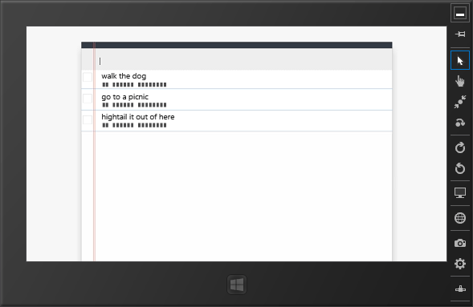

# Run Your Apache Cordova App on Windows
[!INCLUDE[cordova_header](../vs140/includes/cordova_header_md.md)]  
  
 Visual Studio provides these three options for deploying an app built using Visual Studio Tools for Apache Cordova on Windows:  
  
-   Local machine, to run the app on your PC.  
  
-   Simulator, to run your app on the Windows Simulator.  
  
-   Remote machine, to run your app on a remote device. To use this option, follow [these instructions](http://msdn.microsoft.com/library/windows/apps/hh441469.aspx) from the Windows Dev Center to install and use Visual Studio Remote Tools.  
  
 Windows 8, Windows 8.1, or Windows Server 2012 R2 (with Desktop Experience enabled) is required to deploy and run your app on Windows.  
  
 You can configure your Windows app to target either Windows 8 or Windows 8.1 using the configuration designer. For more information, see [Configure your App](../Topic/Configure%20Your%20App%20Built%20with%20Visual%20Studio%20Tools%20for%20Apache%20Cordova.md).  
  
## Run your app on the local machine or simulator  
 Follow these instructions to run your app on your computer or on the Windows Simulator.  
  
#### To run your app  
  
1.  With your app open in Visual Studio, choose a Windows platform such as **Windows-x64** from the **Solution Platforms** list. If you don’t see this list, choose **Solution Platforms** from the **Add/Remove Buttons** list to display it.  
  
2.  In the deployment target list, choose **Local Machine** or **Simulator**.  
  
3.  Press F5 to start the app, or Shift+F5 to start the app without attaching the debugger.  
  
     Visual Studio runs the app on your computer or in the Windows Simulator, as shown here.  
  
       
  
  [Get the Visual Studio Tools for Apache Cordova](http://aka.ms/mchm38) or [learn more](https://www.visualstudio.com/cordova-vs.aspx)  
  
## See Also  
 [Install the Visual Studio Tools for Apache Cordova Extension](../vs140/Install-Visual-Studio-Tools-for-Apache-Cordova.md)   
 [Debug Your App Built with Visual Studio Tools for Apache Cordova](../Topic/Debug%20Your%20App%20Built%20with%20Visual%20Studio%20Tools%20for%20Apache%20Cordova.md)   
 [Package Your App Built with Visual Studio Tools for Apache Cordova](../vs140/Package-Your-App-Built-with-Visual-Studio-Tools-for-Apache-Cordova.md)