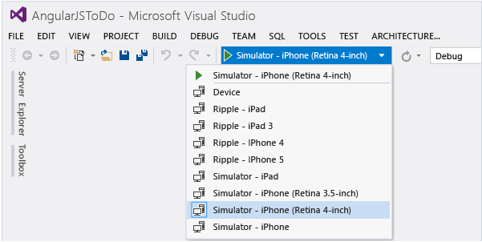
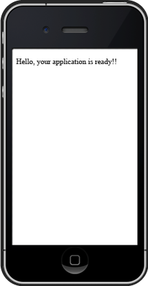
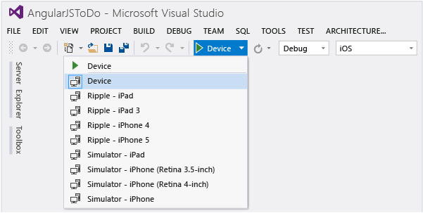

# Run Your Apache Cordova App on iOS
[!INCLUDE[cordova_header](../vs140/includes/cordova_header_md.md)]  
  
 When you create app using Visual Studio Tools for Apache Cordova, you have several options for emulating and deploying your app on iOS:  
  
-   [Apache Ripple emulator](../vs140/Run-Your-Apache-Cordova-App-on-the-Apache-Ripple-Simulator.md), which provides basic validation of layout and CSS. (This does not require installation of the remote agent for iOS.)  
  
-   [iOS Simulator](#iOSSimulator), which requires installation and configuration of the [remotebuild agent](https://msdn.microsoft.com/library/dn757054.aspx#ios) when running from Visual Studio.  
  
-   [iOS device](#iOSDevice), which also requires installation and configuration of the [remotebuild agent](https://msdn.microsoft.com/library/dn757054.aspx#ios) when running from Visual Studio.  
  
 If you run into errors building for iOS, see these [tips and workarounds](https://github.com/Microsoft/cordova-docs/tree/master/tips-and-workarounds/ios).  
  
##   iOS Simulator  
 If you have configured your Mac as described in the article [Install tools for iOS](https://msdn.microsoft.com/library/dn757054.aspx#ios), you can build and run your app on the iOS Simulator. The iOS Simulator runs on your Mac.  
  
> [!NOTE]
>  We recommend that you use the iOS Simulator if you have a personal Mac or if you’re running Windows from a Mac using virtualization technology such as Parallels .  
  
#### To run your app on the iOS Simulator  
  
1.  Make sure that you have [installed the remote agent](https://msdn.microsoft.com/library/dn757054.aspx#ios) on a Mac that meets all system requirements, and that you have started the remote agent.  
  
2.  Make sure that you have [specified iOS processing](https://msdn.microsoft.com/library/dn757054.aspx#ios), the host name or IP address, port, and security PIN in Visual Studio.  
  
3.  With your app open in Visual Studio, choose **iOS** from the **Solution Platforms** list. If you don’t see this list, choose **Solution Platforms** from the **Add/Remove Buttons** list to display it.  
  
4.  In the simulator list, choose **Simulator – iPhone** or another iOS simulator.  
  
       
  
5.  Press F5 to start the app.  
  
     If the remote agent is set up correctly, Visual Studio deploys the app to the iOS Simulator on your Mac.  
  
       
  
    > [!TIP]
    >  If you are running a version of the iOS Simulator with a Retina display on a lower-resolution Mac with a non-Retina display, you may need to scale the emulator to 50% so the app will fit on the screen (chose **Window**, **Scale** > **50%**).  
  
##   iOS device  
 If you have configured the **remotebuild** agent on your Mac as described in the article [Install tools for iOS](https://msdn.microsoft.com/library/dn757054.aspx#ios), you can build and run your app on an iOS device that is connected to your Mac or PC.  
  
#### To run your app on an iOS device  
  
1.  If you are running your app on a device that is connected to your Windows PC, make sure that you have installed iTunes on the PC.  
  
    > [!NOTE]
    >  iTunes is not required if you are running your app on a device that is connected to your Mac.  
  
2.  Make sure that you have [installed the remote agent](https://msdn.microsoft.com/library/dn757054.aspx#ios) on a Mac that meets all system requirements, and that you have started the remote agent.  
  
3.  Make sure that the iOS device has been provisioned with the same provisioning profile as the remote build server that you have configured. For more information about provisioning, see [Package your App](../vs140/Package-Your-App-Built-with-Visual-Studio-Tools-for-Apache-Cordova.md).  
  
4.  Make sure that you have [specified iOS processing](https://msdn.microsoft.com/library/dn757054.aspx#ios), the host name or IP address, port, secure mode, and security PIN in Visual Studio.  
  
5.  With your app open in Visual Studio, choose **iOS** from the **Solution Platforms** list. If you don’t see this list, choose **Solution Platforms** from the **Add/Remove Buttons** list to display it.  
  
6.  In the device list, choose **Local Device** to run your app on a device connected to your PC, or choose **Remote Device** to run your app on a device connected to your Mac.  
  
       
  
7.  Press F5 to start the app.  
  
     If the remote agent and is set up correctly and your iOS device is connected, the app will run on your device.  
  
     If you are running the app on your PC (**Local Device**), iTunes will start and the iOS app will automatically be added to (or replaced in) your library. You can [install or update the app](http://support.apple.com/kb/PH12315) on a connected device as you would any other iOS app.  
  
  [Get the Visual Studio Tools for Apache Cordova](http://aka.ms/mchm38) or [learn more](https://www.visualstudio.com/cordova-vs.aspx)  
  
## See Also  
 [Install tools for iOS](https://msdn.microsoft.com/library/dn757054.aspx#ios)