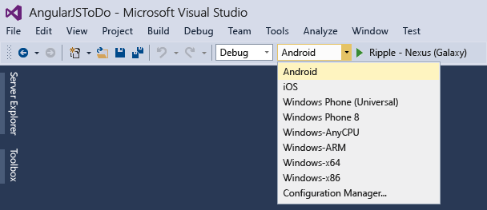

# Run Your Apache Cordova App on the Apache Ripple Simulator
[!INCLUDE[cordova_header](../vs140/includes/cordova_header_md.md)]  
  
 The Apache Ripple simulator runs as a web app inside the Google Chrome browser. In Cordova, it can be used to simulate your app on a number of iOS and Android devices, and it provides basic support for core Cordova plugins like Geolocation and Device Orientation.  
  
 The Ripple simulator helps you quickly start validating how your apps looks and feels on iOS and Android, because both platforms use a browser with a similar code base. The Ripple simulator is particularly useful for validating layout and CSS code. For higher fidelity emulation that’s specific to a platform, use the [Android](../vs140/Run-Your-Apache-Cordova-App-on-Android.md) or [iOS](../vs140/Run-Your-Apache-Cordova-App-on-iOS.md) emulators or an actual device.  
  
> [!CAUTION]
>  Ripple doesn’t provide a complete simulation of Cordova APIs or native device capabilities. It also doesn’t simulate specific browser versions for a particular platform. You can achieve this by testing on actual devices or emulators.  
  
 Here are a few things to keep in mind when testing layout using Ripple.  
  
-   If you target Android 4.4 or later (Chromium-based browser), support for current CSS standards and other web technologies is better. See [caniuse.com](http://www.caniuse.com) for specific information on supported features.  
  
-   If you target iOS or Android versions before 4.4, the browser is WebKit-based. (The Ripple simulator, which uses your installed version of Chrome, behaves more like Android 4.4.) Some WebKit browser behavior is different. For example, WebKit browsers don't provide consistent support for [vw and vh units](http://caniuse.com/#feat=viewport-units).  
  
## Run your app on the Apache Ripple simulator  
 The following procedure shows you how to run your app on the emulator and attach the debugger.  
  
#### To run your app on the Ripple simulator  
  
1.  If it is not already installed, install Chrome.  
  
    > [!NOTE]
    >  Chome is not installed by the installer for Visual Studio when you choose to install Visual Studio Tools for Apache Cordova.  
  
2.  Choose **Android** or **iOS** from the **Solution Platforms** list.  
  
       
  
    > [!NOTE]
    >  If you don’t see this list, choose **Solution Platforms** from the **Add/Remove Buttons** list to display it.  
  
3.  In the list of target devices, choose one of the Ripple simulators.  
  
       
  
4.  Press F5 to start debugging, or Shift+F5 to start your app without debugging.  
  
    > [!TIP]
    >  If you get an error that indicates you need to install a new version of the Android SDK, use the Android SDK Manager to install it. To open the SDK Manager on Windows, open a command line and type the following command: `android sdk`  
  
## Change the proxy for the emulator  
 Ripple avoids cross-domain limitations in the browser by using a proxy. Two proxies are available: a remote proxy and a local proxy. The remote proxy is cloud-hosted.  
  
> [!IMPORTANT]
>  If your app is transferring sensitive data (for example, Active Directory authentication tokens), we strongly recommend using the local proxy instead of the remote proxy.  
  
#### To change the proxy  
  
1.  In Chrome, while your app is running, choose the arrow button on the right, and then choose the **Settings** section.  
  
2.  Choose the **Cross Domain Proxy** button, and then choose a proxy.  
  
       
  
## Change the device while running the app  
 You can change the target device on the fly while your app is running in Chrome. By doing this, you can avoid restarting the app in Visual Studio.  
  
#### To change the device  
  
1.  While your app is running in Chrome, choose the arrow button on the left, and then choose the **Devices** section.  
  
2.  Choose the button that specifies the name of the current device, and then choose a different device.  
  
       
  
  [Get the Visual Studio Tools for Apache Cordova](http://aka.ms/mchm38) or [learn more](https://www.visualstudio.com/cordova-vs.aspx)  
  
## See Also  
 [Install the Visual Studio Tools for Apache Cordova Extension](../vs140/Install-Visual-Studio-Tools-for-Apache-Cordova.md)   
 [Debug Your App Built with Visual Studio Tools for Apache Cordova](../Topic/Debug%20Your%20App%20Built%20with%20Visual%20Studio%20Tools%20for%20Apache%20Cordova.md)   
 [Package Your App Built with Visual Studio Tools for Apache Cordova](../vs140/Package-Your-App-Built-with-Visual-Studio-Tools-for-Apache-Cordova.md)