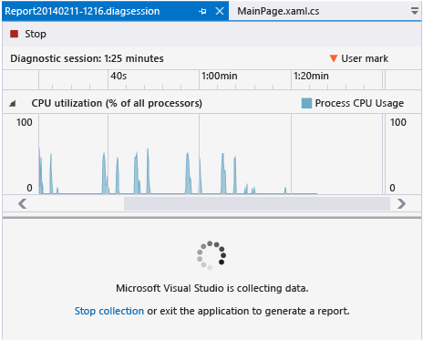
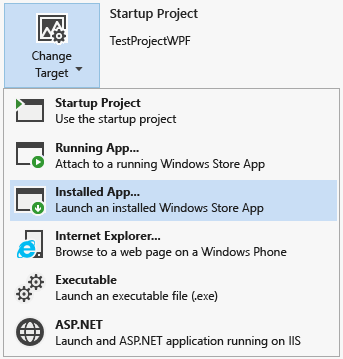
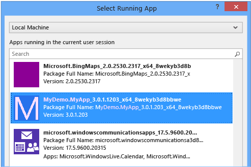
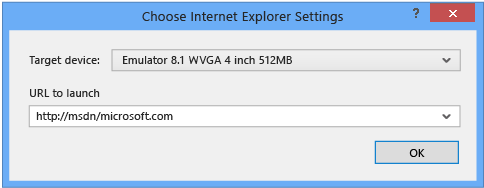
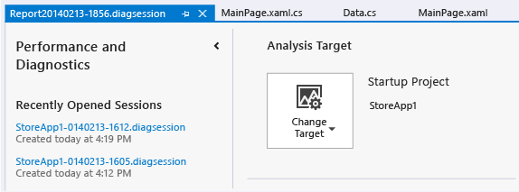

# Run profiling tools without debugging
Visual Studio diagnostic tools help you analyze the performance of your programs .Click **Debug / Start Diagnostic Tools Without Debugging** to select and run individual tools, combine multiple tools in a single diagnostic run, and manage the reports they produce. You can target the diagnostic tools on an open Visual Studio project, or you can attach to a running program or start a program that is already installed. You can run the tools in most deployment locations, including local and remote PCs, emulators, and devices. Because not all tools run on all platforms or on all languages, the diagnostics tool launch page displays only those tools that apply to your selections.  
  
 After you have collected the data, the diagnostic report displays timeline graphs and detail views of the data. Report filters and settings help you to focus on the critical parts of the data.  
  
 The tools in the diagnostics tool launch page run without using the Visual Studio debugger. Some diagnostic tools are integrated with the debugger, which can give you more control over your profiling. See [Debugger-integrated diagnostics](../vs140/Debugger-integrated-profiling.md).  
  
> [!IMPORTANT]
>  Some tools require administrator privileges to run. You can run Visual Studio as an administrator, or you can choose to run the tools as an administrator when you start the diagnostic session.  
  
##   Quick start: Collect diagnostic data  
  
1.  Open the project in Visual Studio.  
  
2.  Set the deployment location.  
  
     From the debug location list on the debugger toolbar, select the deployment location for your app. Here's the list for Windows Phone apps:  
  
       
  
3.  On the **Debug** menu, choose **Start Diagnostic Tools Without Debugging** (Shortcut key: Alt + F2).  
  
4.  On the diagnostic launch page, choose one or more tools to run in the session. Only the tools that are applicable to the project type, operating system, and programming language are displayed. When you choose a diagnostic tool, the selections for tools that cannot be run in the same diagnostic session are disabled. Here's how your choices might look for a C# Windows Store app:  
  
       
  
5.  To start the diagnostic session, click **Start**.  
  
6.  Run the scenarios for which you want to collect data.  
  
     While you are running the session, some tools display graphs of real-time data on the diagnostic tools launch page.  
  
       
  
7.  To end the diagnostic session, click **Stop collection**.  
  
## Setting the analysis target  
 Besides starting your app from the Visual Studio project, you can also run diagnostic sessions on alternative targets. For example, you might want to diagnose performance issues on a version of your app that was installed from the Windows App Store.  
  
   
  
 You can start apps that are already installed on a device, or you can attach the diagnostic tools to some apps that are already running. When you choose **Running App** or **Installed App**, you select the app from a list that discovers the apps on the specified deployment target.  
  
   
  
 When you choose **Internet Explorer**, you specify the URL and you can change the phone deployment target.  
  
   
  
##   Open a diagnostic session file  
 When you stop collecting data in a diagnostic session, the data is analyzed and the report is displayed in the Diagnostic page.  
  
 You can also open saved .diagnostic session files from the recently opened list on the diagnostic tools launch page.  
  
   
  
 Choose the show or hide button at the top of the launch page to expand or collapse the recently used file list.  
  
##   The Diagnostic report  
   
  
|||  
|-|-|  
||The timeline shows the length of the profiling session, app lifecycle activation events, and user marks.|  
||You can restrict the report to a part of the timeline by dragging the blue bars to select a region of the timeline.|  
||A tool displays one or more master graphs. If your diagnostic session is created with multiple tools, all of the master graphs are displayed.|  
||You can collapse and expand the individual graphs.|  
||When your data includes information from multiple tools, the details for the tool is collected under tabs.|  
||A tool can have one or more detail views. The view is filtered by the selected region of the timeline.|  
  
## Running diagnostic tools on a remote device  
 Running a diagnostic session on a remote PC or device requires that the Visual Studio Remote Tools be installed and running on the remote target.  
  
1.  For desktop applications, see [Remote Debugging and Diagnostics](../vs140/Remote-Debugging.md).  
  
2.  For Windows Store and Windows Universal apps, see [Debug and test Windows Store apps on a remote machine from Visual Studio](../vs140/Run-Windows-Store-apps-on-a-remote-machine.md).  
  
##   Troubleshooting  
  
###   Diagnostic events dropped. Some information in the report may be missing or inaccurate  
 The data collector in performance and diagnostic tools can be memory and CPU intensive. When the data collector is unable to log all of the diagnostic events it displays the message in an information bar at the top of the Performance and diagnostic page. Some report data might be missing or invalid.  
  
 To resolve this issue, try these steps to free up resources on the machine and then rerun the diagnostic session:  
  
1.  Close other apps that are not part of the diagnostic session.  
  
2.  Simplify your scenario so that you are collecting less data.  
  
3.  Use fewer diagnostic tools in a single session.  
  
## See Also  
 [Diagnostic Tools in Visual Studio](../vs140/Profiling-Tools.md)