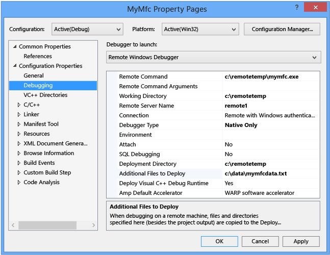
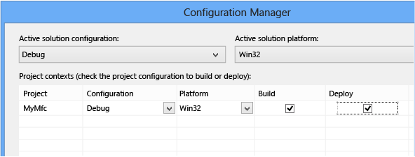
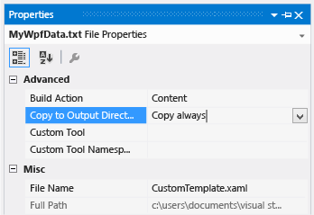
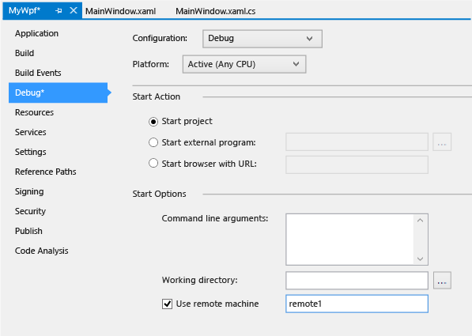

# Set Up Remote Debugging for a Visual Studio Project
You might want to debug a project that is built locally and then run the executable on a remote computer. This topic explains how to change your local project settings to run a Windows Desktop app on a remote computer.  
  
 These examples assume that the Visual Studio Remote Debugging Monitor has already been set up on the remote computer. See [Remote Debugging Setup](../vs140/Remote-Debugging.md).  
  
 The topic contains these examples:  
  
 [Set up a Visual C++ project](#BKMK_Set_up_a_Visual_C___project)  
  
 [Set up a Visual C#/Visual Basic project](#BKMK_Set_up_a_Visual_C__Visual_Basic_project)  
  
##   Set up a Visual C++ project  
 The procedure shown here assumes that you have an MFC project, **MyMfc**, built on computer **local1**. You want to run the application **MyMfc.exe** on computer **remote1** in the **c:\RemoteTemp** folder, and then debug by using the [!INCLUDE[vs_current_short](../vs140/includes/vs_current_short_md.md)] debugger on computer **local1**. Additionally, you want to copy the file **c:\Data\MyMfcData.txt** to the remote computer.  
  
> [!NOTE]
>  The dialog boxes and menu commands you see might differ from those described in Help depending on your active settings or software edition. To change your settings, select **Import and Export Settings** on the **Tools** menu. For more information, see [Customizing Development Settings in Visual Studio](assetId:///22c4debb-4e31-47a8-8f19-16f328d7dcd3).  
  
#### To prepare the remote computer  
  
1.  Install and start the Visual Studio Remote Debugger on **remote1**. See [Set Up the Remote Tools on the Device](../vs140/Set-Up-the-Remote-Tools-on-the-Device.md) and [Start  the Remote Debugging Monitor](../vs140/Start--the-Remote-Debugging-Monitor.md)  
  
#### To prepare the Visual Studio computer  
  
1.  On the **Project** menu, select **Properties**.  
  
2.  In the **MyMfc Property Pages** dialog box, expand the **Configuration Properties** node and choose **Debugging**.  
  
       
  
3.  Make the following changes to the properties:  
  
    |Setting|Change|  
    |-------------|------------|  
    |**Debugger to launch**|Choose **Remote Windows Debugger**.|  
    |**Remote Command**|Type **c:\remotetemp\mymfc.exe**.|  
    |**Working Directory**|Change to **c:\remotetemp**.|  
    |**Remote Server Name**|Type **remote1**.|  
    |**Connection**|Make sure it is set to **Remote with Windows Authentication**.|  
    |**Debugger Type**|Change from **Auto** to **Native Only**, because you know you are debugging native code.|  
    |**Deployment Directory**|Change to **c:\remotetemp**.|  
    |**Additional Files to Deploy**|Change to **c:\data\mymfcdata.txt**.|  
  
4.  On the toolbar, open the **Solution Configuration** drop-down menu, and choose **Configuration Manager**.  
  
5.  For the **Debug** configuration, select the **Deploy** check box.  
  
       
  
6.  On the **Debug** menu, select **Start** and begin debugging.  
  
    > [!TIP]
    >  The Debug command automatically deploys (copies) the project output and additional files to the remote computer. You can deploy the files as a separate step. In **Solution Explorer**, open the context menu for **MyMfc**, and then choose **Deploy**.  
  
#### To deploy additional files to the remote computer  
  
1.  (Optional) Create a project folder for the additional file. Select the project in Solution Explorer. On the context menu, choose **Add**, **New Folder**. Copy the data file to the new folder.  
  
2.  Add the file to your Visual Studio project. Select a project directory in Solution Explorer. On the context menu, choose **Add**, **Add Existing Item** and select the file.  
  
3.  In Solution Explorer, select the file and choose **Properties**.  
  
       
  
4.  Select **Copy always** from the **Copy to Output Directory** list.  
  
##   Set up a Visual C#/Visual Basic project  
 The debugger can not deploy your Visual C# or Visual Basic desktop app to a remote machine. But you can debug the app on a remote machine by using the following procedures.  
  
 The procedures shown here assume that you have a WPF app project, MyWpf, built on computer **local1**. The Debug version of the app is created in the folder **C:\Projects\MyWPF\MyWPF\bin\Debug** as **MyWpf.exe**. You want to run the app on computer **remote1**, and then debug by using the Visual Studio debugger on computer **local1**.  
  
#### To prepare the Visual Studio computer  
  
1.  Open the **MyWpf** project in Visual Studio.  
  
2.  On the **Project** menu, choose **Properties**.  
  
3.  On the MyWpf properties page, choose **Debug**.  
  
       
  
4.  Make sure the **Working directory** text box is empty.  
  
5.  Choose **Use remote machine**, and type **remote1** in the text box.  
  
6.  (Optional) Under **Debugger Type**, select **Mixed mode** to explicitly enable debugging of both managed and unmanaged code.  
  
7.  Build the app.  
  
#### To prepare the remote computer  
  
1.  Install and start the Visual Studio Remote Debugger on **remote1**. See [Set Up the Remote Tools on the Device](../vs140/Set-Up-the-Remote-Tools-on-the-Device.md) and [Start  the Remote Debugging Monitor](../vs140/Start--the-Remote-Debugging-Monitor.md)  
  
2.  Create a folder on **remote1** that is the same path as the Debug folder on **local1**: **C:\Projects\MyWPF\MyWPF\bin\Debug**.  
  
3.  Copy **MyWPF.exe** from **local1** to **remote1**  
  
#### To start debugging on the remote computer  
  
1.  In Visual Studio on **local1**, choose **Debug, Start Debugging**, or pres  
  
## See Also  
 [Remote Debugging](../vs140/Remote-Debugging.md)   
 [Specify Symbol (.pdb) and Source Files in the Visual Studio Debugger](../vs140/Specify-Symbol--.pdb--and-Source-Files-in-the-Visual-Studio-Debugger.md)