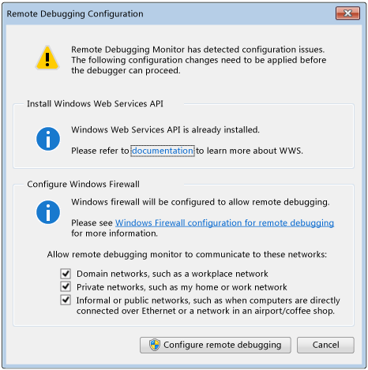

# Set Up the Remote Tools on the Device
The Visual Studio Remote Tools lets you run, debug, and test an application that is running on one device from another computer that is running Visual Studio.  
  
> [!NOTE]
>  **Windows Store apps**  
>   
>  For information about remote debugging of Windows Store apps, see [Run Windows Store apps on a remote machine](../vs140/Run-Windows-Store-apps-on-a-remote-machine.md).  
  
##   Prerequisites  
 To debug on a remote device:  
  
-   The remote device and the Visual Studio computer must be connected over a network or connected directly through an Ethernet cable. Debugging over the internet is not supported.  
  
-   The remote device must be running the remote debugging components.  
  
-   You must be an administrator to install the remote tools on the remote device. To communicate with the remote tools, you must have user access to the remote device.  
  
##   Installing the Remote Tools  
  
> [!NOTE]
>  **Versions and updates**  
>   
>  We recommend that you install the update version of the Remote Tools for Visual Studio that matches the version of your Visual Studio installation.  
>   
>  The newest functionality in Visual Studio requires both Visual Studio and the Remote Tools to be on the most up to date version.  
  
 **Downloading the remote debugging components on a remote device**  
  
 You can download remote tools for debugging on x86, x64, and ARM devices at [Remote Tools for Visual Studio 2015](http://go.microsoft.com/fwlink/?LinkId=533003).  
  
 By default, the remote debugging components are installed in the **C:\Program Files\Microsoft Visual Studio 14.0\Common7\IDE\Remote Debugger** folder.  
  
##   Start and configure the remote tools for the first time  
  
> [!NOTE]
>  To start the remote tools for the first time, you must have administrative permissions on the remote device to allow the debugger to configure the firewall.  
  
1.  On the **Start** menu of the remote device, choose **Remote Debugger**. You must have administrator privileges to start the remote tools for the first time.  
  
     When you start the remote tools for the first time, the **Configure Remote Debugging** dialog box appears.  
  
       
  
2.  If the Windows Service API is not installed, choose the **Install** button.  
  
3.  Select the type of networks that you want the remote tools to communicate with. At least one network type must be selected.  
  
4.  Choose **Configure remote debugging** to configure the firewall and start the Remote Debugging Monitor.  
  
5.  To change the Authentication mode or to specify a timeout value for the remote tools, choose **Options** on the Remote Debugging Monitor **Tools** menu.  
  
    > [!WARNING]
    >  By default, the remote tools use Windows Authentication. You can choose to run the remote tools in No Authentication mode, but this mode is strongly discouraged. There is no network security when you run in this mode. Choose the No Authentication mode only if you are sure that the network is not at risk of from malicious or hostile traffic.  
  
6.  By default, Administrators of the remote device can connect to the remote tools. To grant or deny other users permission to use the remote tools, choose **Permissions** on the **Tools** menu.  
  
 When the debugger is running, it broadcasts its identity on the local sub-net of the network, which allows a Visual Studio computer on the same sub-net to know that the remote device is available as a remote debugging target.  
  
##   Reconfiguring the remote tools  
 You can change the configuration of the remote tools after you have started it for the first time.  
  
1.  Start the remote tools. On the **Start** menu of the remote device, choose **Remote Debugger**.  
  
2.  To grant or deny other users permission to use the remote tools, choose **Permissions** on the **Tools** menu. You must have administrator privileges to grant or deny permissions.  
  
3.  To change the Authentication mode or to specify a timeout value for the remote tools, choose **Options** on the Remote Debugging Monitor **Tools** menu.  
  
    > [!WARNING]
    >  You can choose to run the remote tools in No Authentication mode, but this mode is strongly discouraged. There is no network security when you run in this mode. Choose the No Authentication mode only if you are sure that the network is not at risk of from malicious or hostile traffic.  
  
4.  **To run the remote tools as a service or change remote debugging network options** To run the remote tools as a service or change remote debugging network options, on the **Start** menu, search for **Remote Debugger Configuration Wizard**. By default, the remote tools run as a Windows application. In the Configuration Wizard, you can choose to run the remote tools as a Windows service. You can also restrict the networks with which the remote tools are allowed to communicate. You must have administrator privileges to perform these actions.  
  
##   Related topics in the Windows Dev Center  
  
## See Also  
 [How to: Run the Remote Debugging Monitor](../vs140/Start--the-Remote-Debugging-Monitor.md)   
 [Remote Debugging of a Project Built Locally](../vs140/Set-Up-Remote-Debugging-for-a-Visual-Studio-Project.md)   
 [Remote Debugging Across Domains](../vs140/Remote-Debugging-Across-Domains.md)   
 [Debugger Project Settings](../vs140/Debugger-Project-Settings.md)   
 [Debugging and testing Windows Store apps with Visual Studio](../vs140/Testing-Store-apps-with-Visual-Studio.md)   
 [Run Windows Store apps from Visual Studio](../vs140/Run-Store-apps-from-Visual-Studio.md)   
 [Debug and test Windows Store apps on a remote device from Visual Studio](../vs140/Run-Windows-Store-apps-on-a-remote-machine.md)