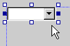
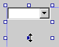

# Setting the Size of the Combo Box and Its Drop-Down List
You can size a combo box when you add it to the dialog box. You can also specify the size of the drop-down list box.  
  
### To size a combo box  
  
1.  Select the combo-box control in your dialog box.  
  
     Initially, only the right and left sizing handles are active.  
  
2.  Use the sizing handles to set the width of the combo box.  
  
 You can also set the vertical size of the drop-down portion of the combo box.  
  
#### To set the size of the combo box drop-down list  
  
1.  Click the drop-down arrow button at the right of the combo box.  
  
       
  
     The outline of the control changes to show the size of the combo box with the drop-down list area extended.  
  
2.  Use the lower sizing handle to change the initial size of the drop-down list area.  
  
       
  
3.  Click the drop-down arrow again to close the drop-down list portion of the combo box.  
  
 For information on adding resources to managed projects, please see [Resources in Applications](assetId:///8ad495d4-2941-40cf-bf64-e82e85825890) in the *.NET Framework Developer's Guide.* For information on manually adding resource files to managed projects, accessing resources, displaying static resources, and assigning resources strings to properties, see [Walkthrough: Localizing Windows Forms](assetId:///9a96220d-a19b-4de0-9f48-01e5d82679e5) and [Walkthrough: Using Resources for Localization with ASP.NET](assetId:///bb4e5b44-e2b0-48ab-bbe9-609fb33900b6).  
  
### Requirements  
 Win32  
  
## See Also  
 [Adding Values to a Combo Box Control](../vs140/Adding-Values-to-a-Combo-Box-Control.md)   
 [Controls in Dialog Boxes](../vs140/Controls-in-Dialog-Boxes.md)   
 [Controls](../vs140/Controls--MFC-.md)