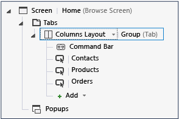

# Setting the Startup Screen for a LightSwitch Application
In this lesson, you'll learn how to change the startup screen for a LightSwitch application.  
  
## Setting the Startup Screen  
 When users run an application, the startup screen appears first. By default, the first screen that you create is set as the startup screen. In many cases, you’ll want to show a different screen on startup. For example, if most users use your application to track orders, you'll probably want to show the **Browse Orders** screen when they start the application.  
  
 You might also want to display a startup screen with buttons to launch other available screens. You can do this by creating a screen without any associated data.  
  
#### To change the startup screen  
  
1.  In **Solution Explorer**, open the shortcut menu for the **BrowseOrders.lsml** node, and then choose **Set as Home Screen**.  
  
2.  Run the application and verify the change.  
  
     When the application starts, the **Browse Orders** screen appears first.  
  
#### To add a home screen  
  
1.  In **Solution Explorer**, open the shortcut menu for the **Screens** node, and then choose **Add Screen**.  
  
2.  In the **Add Screen** dialog box, in the **Select a screen template** list, choose **Browse Data Screen**.  
  
3.  In the **Screen Name** text box, enter `Home`. In the **Screen Data** list, choose **(None)**, and then choose the **OK** button.  
  
4.  In the **Screen Designer**, choose the **Rows Layout &#124; Group (Tab)** node. In the **Rows Layout** list, choose **Columns Layout**.  
  
5.  Open the shortcut menu for the **Columns Layout &#124; Group (Tab)** node, and then choose **Add Button**.  
  
6.  In the **Add Button** dialog box, open the **showTab** list, choose **showBrowseContactLists**, and then choose the **OK** button.  
  
7.  In the **Properties** window, choose the  **Name** property, and then enter `Contacts`.  
  
8.  Repeat steps 5-7 to add buttons for **showCurrentProductList** and **showBrowseOrders**, and name them **Products** and **Orders** respectively.  
  
       
  
9. In **Solution Explorer**, open the shortcut menu for the **Home.lsml** node, and then choose **Set as Home Screen**.  
  
10. Run the application and verify the change.  
  
     When the application starts, the **Home** screen appears first, and the buttons can be used to launch the other screens.  
  
## Closer Look  
 In this lesson, you learned how to change the startup screen for your application. A startup screen is required, but it doesn’t have to be a data screen. As you saw, you can also create a blank screen as the startup screen.  
  
## Next Steps  
 In the next set of lessons, you’ll learn how to enable authentication and authorization for your application.  
  
 Next lesson: [Enabling Authorization and Creating Permissions](../vs140/Enabling-Authorization-and-Creating-Permissions-in-LightSwitch.md)  
  
## See Also  
 [Creating Menus and Commands](../vs140/Creating-Commands-and-Working-with-Menus-in-LightSwitch.md)