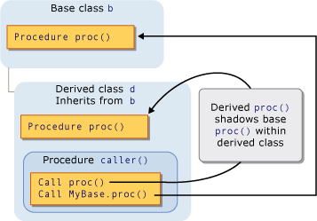

# Shadowing in Visual Basic
When two programming elements share the same name, one of them can hide, or *shadow*, the other one. In such a situation, the shadowed element is not available for reference; instead, when your code uses the element name, the [!INCLUDE[vbprvb](../vs140/includes/vbprvb_md.md)] compiler resolves it to the shadowing element.  
  
## Purpose  
 The main purpose of shadowing is to protect the definition of your class members. The base class might undergo a change that creates an element with the same name as one you have already defined. If this happens, the `Shadows` modifier forces references through your class to be resolved to the member you defined, instead of to the new base class element.  
  
## Types of Shadowing  
 An element can shadow another element in two different ways. The shadowing element can be declared inside a subregion of the region containing the shadowed element, in which case the shadowing is accomplished *through scope*. Or a deriving class can redefine a member of a base class, in which case the shadowing is done *through inheritance*.  
  
### Shadowing Through Scope  
 It is possible for programming elements in the same module, class, or structure to have the same name but different scope. When two elements are declared in this manner and the code refers to the name they share, the element with the narrower scope shadows the other element (block scope is the narrowest).  
  
 For example, a module can define a `Public` variable named `temp`, and a procedure within the module can declare a local variable also named `temp`. References to `temp` from within the procedure access the local variable, while references to `temp` from outside the procedure access the `Public` variable. In this case, the procedure variable `temp` shadows the module variable `temp`.  
  
 The following illustration shows two variables, both named `temp`. The local variable `temp` shadows the member variable `temp` when accessed from within its own procedure `p`. However, the `MyClass` keyword bypasses the shadowing and accesses the member variable.  
  
   
Shadowing through scope  
  
 For an example of shadowing through scope, see [How to: Hide a Variable with the Same Name as Your Variable](../vs140/How-to--Hide-a-Variable-with-the-Same-Name-as-Your-Variable--Visual-Basic-.md).  
  
### Shadowing Through Inheritance  
 If a derived class redefines a programming element inherited from a base class, the redefining element shadows the original element. You can shadow any type of declared element, or set of overloaded elements, with any other type. For example, an `Integer` variable can shadow a `Function` procedure. If you shadow a procedure with another procedure, you can use a different parameter list and a different return type.  
  
 The following illustration shows a base class `b` and a derived class `d` that inherits from `b`. The base class defines a procedure named `proc`, and the derived class shadows it with another procedure of the same name. The first `Call` statement accesses the shadowing `proc` in the derived class. However, the `MyBase` keyword bypasses the shadowing and accesses the shadowed procedure in the base class.  
  
   
Shadowing through inheritance  
  
 For an example of shadowing through inheritance, see [How to: Hide a Variable with the Same Name as Your Variable](../vs140/How-to--Hide-a-Variable-with-the-Same-Name-as-Your-Variable--Visual-Basic-.md) and [How to: Hide an Inherited Variable](../vs140/How-to--Hide-an-Inherited-Variable--Visual-Basic-.md).  
  
#### Shadowing and Access Level  
 The shadowing element is not always accessible from the code using the derived class. For example, it might be declared `Private`. In such a case, shadowing is defeated and the compiler resolves any reference to the same element it would have if there had been no shadowing. This element is the accessible element the fewest derivational steps backward from the shadowing class. If the shadowed element is a procedure, the resolution is to the closest accessible version with the same name, parameter list, and return type.  
  
 The following example shows an inheritance hierarchy of three classes. Each class defines a `Sub` procedure `display`, and each derived class shadows the `display` procedure in its base class.  
  
```  
Public Class firstClass  
    Public Sub display()  
        MsgBox("This is firstClass")  
    End Sub  
End Class  
Public Class secondClass  
    Inherits firstClass  
    Private Shadows Sub display()  
        MsgBox("This is secondClass")  
    End Sub  
End Class  
Public Class thirdClass  
    Inherits secondClass  
    Public Shadows Sub display()  
        MsgBox("This is thirdClass")  
    End Sub  
End Class  
Module callDisplay  
    Dim first As New firstClass  
    Dim second As New secondClass  
    Dim third As New thirdClass  
    Public Sub callDisplayProcedures()  
        ' The following statement displays "This is firstClass".  
        first.display()  
        ' The following statement displays "This is firstClass".  
        second.display()  
        ' The following statement displays "This is thirdClass".  
        third.display()  
    End Sub  
End Module  
```  
  
 In the preceding example, the derived class `secondClass` shadows `display` with a `Private` procedure. When module `callDisplay` calls `display` in `secondClass`, the calling code is outside `secondClass` and therefore cannot access the private `display` procedure. Shadowing is defeated, and the compiler resolves the reference to the base class `display` procedure.  
  
 However, the further derived class `thirdClass` declares `display` as `Public`, so the code in `callDisplay` can access it.  
  
## Shadowing and Overriding  
 Do not confuse shadowing with overriding. Both are used when a derived class inherits from a base class, and both redefine one declared element with another. But there are significant differences between the two. For a comparison, see [Differences Between Shadowing and Overriding](../vs140/Differences-Between-Shadowing-and-Overriding--Visual-Basic-.md).  
  
## Shadowing and Overloading  
 If you shadow the same base class element with more than one element in your derived class, the shadowing elements become overloaded versions of that element. For more information, see [Procedure Overloading](../Topic/Procedure%20Overloading%20\(Visual%20Basic\).md).  
  
## Accessing a Shadowed Element  
 When you access an element from a derived class, you normally do so through the current instance of that derived class, by qualifying the element name with the `Me` keyword. If your derived class shadows the element in the base class, you can access the base class element by qualifying it with the `MyBase` keyword.  
  
 For an example of accessing a shadowed element, see [How to: Access a Variable Hidden by a Derived Class](../vs140/How-to--Access-a-Variable-Hidden-by-a-Derived-Class--Visual-Basic-.md).  
  
### Declaration of the Object Variable  
 How you create the object variable can also affect whether the derived class accesses a shadowing element or the shadowed element. The following example creates two objects from a derived class, but one object is declared as the base class and the other as the derived class.  
  
```  
Public Class baseCls  
    ' The following statement declares the element that is to be shadowed.  
    Public z As Integer = 100  
End Class  
Public Class dervCls  
    Inherits baseCls  
    ' The following statement declares the shadowing element.  
    Public Shadows z As String = "*"  
End Class  
Public Class useClasses  
    ' The following statement creates the object declared as the base class.  
    Dim basObj As baseCls = New dervCls()  
    ' Note that dervCls widens to its base class baseCls.  
    ' The following statement creates the object declared as the derived class.  
    Dim derObj As dervCls = New dervCls()  
    Public Sub showZ()   
    ' The following statement outputs 100 (the shadowed element).  
        MsgBox("Accessed through base class: " & basObj.z)  
    ' The following statement outputs "*" (the shadowing element).  
        MsgBox("Accessed through derived class: " & derObj.z)  
    End Sub  
End Class  
```  
  
 In the preceding example, the variable `basObj` is declared as the base class. Assigning a `dervCls` object to it constitutes a widening conversion and is therefore valid. However, the base class cannot access the shadowing version of the variable `z` in the derived class, so the compiler resolves `basObj.z` to the original base class value.  
  
## See Also  
 [References to Declared Elements](../vs140/References-to-Declared-Elements--Visual-Basic-.md)   
 [Scope in Visual Basic](../vs140/Scope-in-Visual-Basic.md)   
 [Widening and Narrowing Conversions](../Topic/Widening%20and%20Narrowing%20Conversions%20\(Visual%20Basic\).md)   
 [Shadows](../vs140/Shadows--Visual-Basic-.md)   
 [Overrides](../vs140/Overrides--Visual-Basic-.md)   
 [Me, My, MyBase, and MyClass in Visual Basic](../vs140/Me--My--MyBase--and-MyClass-in-Visual-Basic.md)   
 [Inheritance Basics](../vs140/Inheritance-Basics--Visual-Basic-.md)