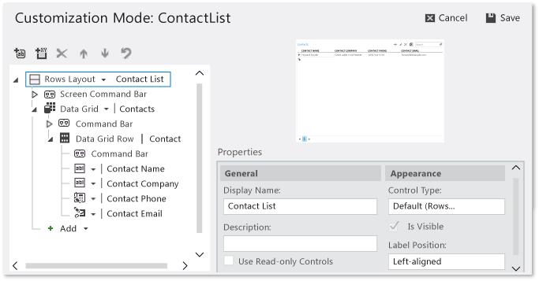

# Silverlight Client Screens for LightSwitch Apps
You can create and design the best Silverlight-based screens for your LightSwitch application by understanding the templates, tools, and tasks that this topic introduces.  
  
## Screen Templates  
 To get started, create a screen by using one of the following screen templates:  
  
-   New Data Screen  
  
-   Search Data Screen  
  
-   Details Screen  
  
-   Editable Grid Screen  
  
-   List and Details Screen  
  
 For information about how to choose a template, see [Choosing a Screen Type](../vs140/Choosing-a-Screen-Type.md).  
  
 For information about how to find these templates, see [How to: Create a Screen](../vs140/How-to--Create-a-Silverlight-Screen.md).  
  
## Screen Design Tools  
 You can modify the design of a screen by using the *screen designer* or by opening the **Customization Mode** screen while the application is running.  
  
### Screen Designer  
 The screen designer displays *items* such as data fields and commands, and the *screen content tree*, which is a hierarchical representation of your data. You can drag items to the screen content tree and arrange them in the order you want.  
  
 For more information about the screen designer, see [Tour of the Screen Designer](../vs140/Tour-of-the-Screen-Designer.md).  
  
 For more information about how to design a screen, see [Walkthrough: Designing a Screen](../vs140/Walkthrough--Designing-a-Silverlight-Screen-in-LightSwitch.md).  
  
 For more information about how to perform specific design tasks in the screen designer, see [How to: Design a Screen by Using the Screen Designer](../Topic/How%20to:%20Design%20a%20Silverlight%20Screen%20by%20Using%20the%20Screen%20Designer.md).  
  
### Customization Mode Screen  
 You can modify the appearance of a screen while the application is running by using the **Customization Mode** screen. You can also preview the modifications before you apply the changes. In the **Customization Mode** screen, you can perform the following design tasks while the application is running:  
  
-   Remove items from a screen  
  
-   Change item captions  
  
-   Change the control type of an item (for example, a label or a text box)  
  
-   Change the label position of an item  
  
-   Show or hide an item  
  
-   Move an item to another location in the screen  
  
-   Group items together  
  
-   Add buttons to a screen  
  
-   Undo changes  
  
-   Reset the properties items to their default values  
  
 The following illustration shows the **Customization Mode** screen.  
  
   
  
 For more information about the **Customization Mode** screen, see [How to: Customize a Screen in a Running Application](../vs140/How-to--Customize-a-Silverlight-Screen-in-a-Running-Application.md).  
  
## Screen Design Tasks  
 To modify the design of a screen, you can perform the following tasks:  
  
-   Modify the appearance of a screen  
  
-   Add fields and commands to a screen  
  
-   Filter the data that appears in a screen  
  
-   Add data to a screen  
  
-   Customize the screen navigation menu  
  
-   Modify a screen by using code  
  
### Modify the Appearance of a Screen  
 You can modify how data appears in a screen. For example, you can configure a collection of information to appear as a list or a grid. You can change the order in which fields appear, or group fields together.  
  
 For more information, see [How to: Design a Screen by Using the Screen Designer](../Topic/How%20to:%20Design%20a%20Silverlight%20Screen%20by%20Using%20the%20Screen%20Designer.md).  
  
 For an example about how to design the appearance of a screen that displays information from the Northwind sample database, see [Customizing Screen Appearance](../vs140/Customizing-Screen-Appearance-in-a-LightSwitch-Application.md).  
  
### Add Fields and Commands to a Screen  
 LightSwitch screens provide built-in commands so that users can view, update, delete, or save data. You can also add custom commands and fields.  
  
 Add a custom command if you want to add some kind of business logic to the screen. For example, you can add a button so that a user can view a list of customers based on sales order volume. For more information, see [How to: Add a Custom Command to a Screen](../vs140/How-to--Add-a-Custom-Command-to-a-Silverlight-Screen.md).  
  
 You can add custom *local properties* fields to collect or display information. For example, you can add a text box next to the sales-volume button so that the user can specify how many customers they want to appear in the list. For more information, see [How to: Add a Local Property to a Screen](../vs140/How-to--Add-a-Local-Property-to-a-Silverlight-Screen.md).  
  
### Add Custom Controls to a Screen  
 You can add Silverlight controls to a LightSwitch screen. Use Silverlight controls to display or collect information in ways that go beyond the capabilities of the built-in LightSwitch controls. You can also use a Silverlight control to replace any built-in [!INCLUDE[smb_current_short](../vs140/includes/smb_current_short_md.md)] control that appears on the screen. For more information, see [How to: Add a Custom Control to a Screen](../vs140/How-to--Add-a-Custom-Control-to-a-Silverlight-Screen.md).  
  
### Filter the Data that Appears in a Screen  
 You can filter the data that appears in a screen by modifying the conditions of screen queries.  
  
 Every group of data that appears in the left pane of the designer is based on a query. The screen only displays information that is returned by those queries. To change the information that is displayed for a group of data, modify its query.  
  
 For more information, see [How to: Filter the Data on a Screen by Using a Query](../vs140/How-to--Filter-Data-on-a-Silverlight-Screen.md).  
  
### Add Data to a Screen  
 You can add other kinds of data to a screen. For example, in a screen that displays customers, you can add a data grid that shows a list of orders. For more information, see [How to: Add Data to a Screen](../vs140/How-to--Add-Data-to-a-Screen.md).  
  
### Customize the Screen Navigation Menu  
 In the application, a user can open a screen by clicking its name on the navigation menu. You can specify the order in which you want these screens to appear on the menu. You can also specify which screen is to appear when the application starts, and you can specify whether the user can open multiple screens that appear as tabs.  
  
 For more information, see [How to: Create Menus and Navigation Groups](../vs140/How-to--Create-Menu-Items-and-Navigation-Groups-in-LightSwitch.md).  
  
### Enable Users to Search Data  
 LightSwitch provides built-in support for search. When your application runs, a search box is displayed above every data collection in a screen. A user can type terms in one of the search boxes, and then press ENTER to search for related information.  
  
 For information about how to hide a search box in a screen, see [How to: Design a Screen by Using the Screen Designer](../Topic/How%20to:%20Design%20a%20Silverlight%20Screen%20by%20Using%20the%20Screen%20Designer.md).  
  
 For information about how to exclude specific fields from searches, see [Reference: Entity Designer Properties](../vs140/Reference--Data-Designer-Properties.md).  
  
 LightSwitch provides a template that you can use to create a search screen.  For more information, see [Choosing a Screen Type](../vs140/Choosing-a-Screen-Type.md)  
  
 Only fields of type `String` are considered in a search request. In addition, a search request only applies to the associated data collection. For example, a search box that appears above a customer collection cannot be used to search for information about orders that were placed by a customer.  
  
 If you want to provide a search experience that considers non-string fields or information that exists in related collections, you must implement a custom search feature in your screen. For an example about how to accomplish this, see [Creating a Custom Search Screen in Visual Studio LightSwitch](http://go.microsoft.com/fwlink/?LinkID=207186).  
  
### Modify a Screen by Using Code  
 You can add code to partial methods that are called by LightSwitch so that when certain events occur at run time, the screen is modified appropriately. For example, you can add code that hides the name of a company that wants to remain anonymous to the users of your application. This code would examine the company names of customers and, when it finds a match, would set the `IsVisible` property of the `CompanyName` field to `False` before the information is displayed in the screen.  
  
 For more information about where to write your code, see [How to: Handle Screen Events](../vs140/How-to--Handle-Silverlight-Screen-Events.md) and [How to: Add a Custom Command to a Screen](../vs140/How-to--Add-a-Custom-Command-to-a-Silverlight-Screen.md).  
  
 For more information about how to add code that modifies a screen, see [How to: Modify a Screen by Using Code](../vs140/How-to--Modify-a-Silverlight-Screen-by-Using-Code.md).  
  
## Related Topics  
  
|Title|Description|  
|-----------|-----------------|  
|[Choosing a Screen Type](../vs140/Choosing-a-Screen-Type.md)|Describes templates that you can use as a starting point to create screens.|  
|[How to: Create a Screen](../vs140/How-to--Create-a-Silverlight-Screen.md)|Shows how to add screens to your application.|  
|[Tour of the Screen Designer](../vs140/Tour-of-the-Screen-Designer.md)|Illustrates the parts of the designer and their functions.|  
|[Walkthrough: Designing a Screen](../vs140/Walkthrough--Designing-a-Silverlight-Screen-in-LightSwitch.md)|Shows how to design a screen that displays data from the Northwind sample database.|  
|[How to: Design a Screen by Using the Screen Designer](../Topic/How%20to:%20Design%20a%20Silverlight%20Screen%20by%20Using%20the%20Screen%20Designer.md)|Shows how to use the screen designer.|  
|[How to: Customize a Screen in a Running Application](../vs140/How-to--Customize-a-Silverlight-Screen-in-a-Running-Application.md)|Show how to customize the appearance of a screen while the application is running.|  
|[How to: Add a Local Property to a Screen](../vs140/How-to--Add-a-Local-Property-to-a-Silverlight-Screen.md)|Shows how to add a custom *local property* field to a screen.|  
|[How to: Add a Custom Command to a Screen](../vs140/How-to--Add-a-Custom-Command-to-a-Silverlight-Screen.md)|Shows how to add a button or link that executes custom code in a screen.|  
|[How to: Add a Custom Control to a Screen](../vs140/How-to--Add-a-Custom-Control-to-a-Silverlight-Screen.md)|Shows how to create a control outside of [!INCLUDE[smb_current_short](../vs140/includes/smb_current_short_md.md)], and then use it in a [!INCLUDE[smb_current_short](../vs140/includes/smb_current_short_md.md)] screen.|  
|[How to: Add Data to a Screen](../vs140/How-to--Add-Data-to-a-Screen.md)|Shows how to add data from other queries to a screen.|  
|[How to: Filter the Data on a Screen by Using a Query](../vs140/How-to--Filter-Data-on-a-Silverlight-Screen.md)|Shows how to use queries to control which data appears in the screen.|  
|[How to: Handle Screen Events](../vs140/How-to--Handle-Silverlight-Screen-Events.md)|Describes how to customize your application by writing code that is executed when certain events happen.|  
|[How to: Modify a Screen by Using Code](../vs140/How-to--Modify-a-Silverlight-Screen-by-Using-Code.md)|Describes how to use code to modify controls and interact with items on a screen.|  
|[Reference: Screen Designer Properties](../vs140/Reference--Screen-Designer-Properties.md)|Describes the properties of items that appear in the screen members list and the screen content tree of the screen designer. You can modify the appearance and behavior of items by using the **Properties** window to set the value of the properties.|  
|[Reporting and Printing in LightSwitch](../vs140/Reporting-and-Printing-in-LightSwitch.md)|Describes the available options for adding reporting and printing capabilities to a [!INCLUDE[smb_current_short](../vs140/includes/smb_current_short_md.md)] application.|