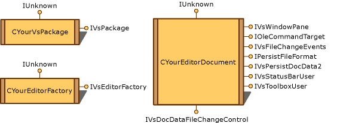

# Simplified Embedding
Simplified embedding is enabled in an editor when its document view object is parented to (that is, made a child of) [!INCLUDE[vsprvs](../vs140/includes/vsprvs_md.md)], and the <xref:Microsoft.VisualStudio.Shell.Interop.IVsWindowPane?qualifyHint=False> interface is implemented to handle its window commands. Simplified embedding editors cannot host active controls. The objects used to create an editor with simplified embedding are shown in the following illustration.  
  
   
Editor with simplified embedding  
  
> [!NOTE]
>  Of the objects in this illustration, only the `CYourEditorFactory` object is required to create a standard file-based editor. If you are creating a custom editor, you are not required to implement <xref:Microsoft.VisualStudio.Shell.Interop.IVsPersistDocData2?qualifyHint=False>, because your editor will likely have its own private persistence mechanism. For non-custom editors, however, you must do so.  
  
 All interfaces implemented to create an editor with simplified embedding are contained in the `CYourEditorDocument` object. However, to support multiple views of document data, split the interfaces onto separate data and view objects as indicated in the following table.  
  
|Interface|Location of interface|Use|  
|---------------|---------------------------|---------|  
|<xref:Microsoft.VisualStudio.Shell.Interop.IVsWindowPane?qualifyHint=False>|View|Provides connection to the parent window.|  
|<xref:Microsoft.VisualStudio.OLE.Interop.IOleCommandTarget?qualifyHint=False>|View|Handles commands.|  
|<xref:Microsoft.VisualStudio.Shell.Interop.IVsStatusbarUser?qualifyHint=False>|View|Enables status bar updates.|  
|<xref:Microsoft.VisualStudio.Shell.Interop.IVsToolboxUser?qualifyHint=False>|View|Enables **Toolbox** items.|  
|<xref:Microsoft.VisualStudio.Shell.Interop.IVsFileChangeEvents?qualifyHint=False>|Data|Sends notifications when the file changes.|  
|<xref:Microsoft.VisualStudio.Shell.Interop.IPersistFileFormat?qualifyHint=False>|Data|Enables the Save As feature for a file type.|  
|<xref:Microsoft.VisualStudio.Shell.Interop.IVsPersistDocData2?qualifyHint=False>|Data|Enables persistence for the document.|  
|<xref:Microsoft.VisualStudio.Shell.Interop.IVsDocDataFileChangeControl?qualifyHint=False>|Data|Allows suppression of file change events, such as reload triggering.|