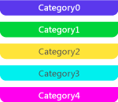

# Span Markers
A span marker represents a meaningful phase of an application. For example, you can use a span to represent an interval of time during which a particular work item is being processed. Its length represents the duration of the corresponding application phase. This illustration shows a span in Concurrency Visualizer:  
  
   
A span marker in the Concurrency Visualizer  
  
## Span Category  
 A span marker is displayed in one of five different colors, depending on its category. The colors are repeated if there are more than five categories. The category can be any integer. This illustration shows the five possible colors:  
  
   
The colors of the first five span categories  
  
## Span Aggregation Markers  
 Sometimes span markers occur so close to one another in the Concurrency Visualizer that they can’t be drawn individually. When this occurs, a gray *span aggregation marker* that represents the underlying spans is shown. When you rest the pointer on one of these icons, a tooltip displays the number of underlying spans that are represented. To view the spans, zoom in. If you zoom in all the way and still get an span aggregation marker, you can view the underlying span markers in the [Markers Report](../vs140/Markers-Report.md). This illustration shows a span aggregation marker:  
  
   
A span aggregation marker  
  
## See Also  
 [Concurrency Visualizer Markers](../vs140/Concurrency-Visualizer-Markers.md)   
 [Concurrency Visualizer SDK](../Topic/Concurrency%20Visualizer%20SDK.md)