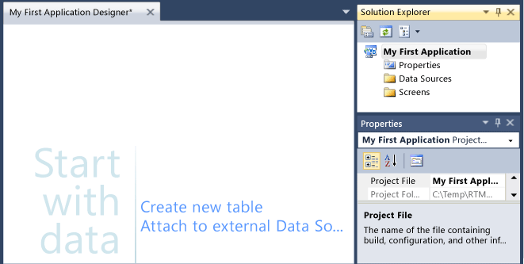

# Step 1: Create a LightSwitch Project
For your first project, you'll create an application for managing contact information. As your first step, you'll open Visual Studio and create a project.  
  
## Create a Project  
  
#### To create a project for your application  
  
1.  On the **Start** menu, choose **Visual Studio**.  
  
2.  On the menu bar, choose **File**, **New**, **Project**.  
  
     The **New Project** dialog box opens.  
  
3.  In the list of templates, expand the **Visual Basic** or **Visual C#** node, choose the **LightSwitch** node, and then choose the **LightSwitch HTML Application** template.  
  
4.  In the **Name** text box, enter **My First Application**, and then choose the **OK** button.  
  
     The **Start** window appears, and the necessary folders for your project are added to the **Solution Explorer** window, as the following illustration shows:  
  
       
  
## Closer Look  
 You just created a project for a contact management application so that you can store and organize the pieces of that application.  
  
 The **New Project** dialog box in step 2 includes templates for  several types of projects. Your contact management application will be an HTML-based application that’s optimized for display on mobile devices. You could also create a Silverlight-based desktop application that’s optimized for data entry by choosing the `LightSwitch Desktop Application` template. No matter which template you start with, you can mix the application types – in fact, you’ll add Silverlight user management screens later in this tutorial.  
  
 When you created the project, you chose either Visual Basic or Visual C# as the programming language, but both languages have the same capabilities. You can choose whichever language you prefer when you create a project, but you can't change that decision later.  
  
 In most cases, you'll want to enter a more meaningful name for the project in the **New Project** dialog box. You can also change where the project files are saved when you create the project.  
  
## Next Steps  
 In the next lesson, you'll learn how to define the data for your application by creating a data entity.  
  
 Next lesson: [Step 2: Define the Data](../vs140/Step-2--Define-the-Data-in-LightSwitch.md)  
  
## See Also  
 [Creating Your First LightSwitch Application](../vs140/Creating-Your-First-LightSwitch-Application.md)   
 [Projects: The Container for Your Application](../vs140/Projects--The-Container-for-Your-LightSwitch-Application.md)   
 [How to: Create, Open, Save, or Delete a Project](../vs140/How-to--Create--Open--Save--or-Delete-a-LightSwitch-Project.md)