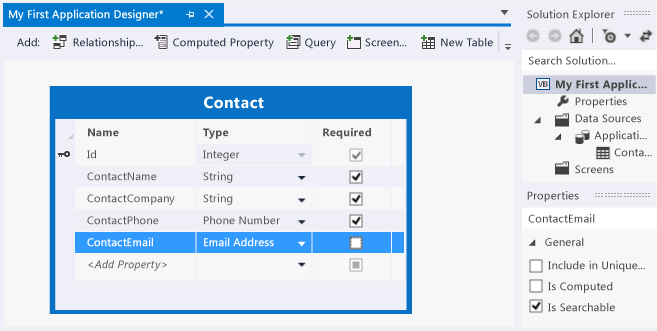

# Step 2: Define the Data in LightSwitch
In this lesson, you'll define the data for your contact management application by creating a table, also known as a *data entity*. By using the LightSwitch Entity Designer, you'll specify the *property fields* and *data types* that represent a contact.  
  
## Define the Data  
  
#### To create an entity for your application  
  
1.  In the **Start** window, choose the **Create new table** link.  
  
     The **Entity Designer** window opens.  
  
2.  In the **Properties** window, in the text box for the **Name** property, enter **Contact**, and then choose the Enter key.  
  
     The name in the title bar changes to "Contact" and the name in **Solution Explorer** changes to "Contacts.lsml".  
  
3.  In the **Name** column, choose the **<Add property\>** link, enter **ContactName**, and then choose the Enter key.  
  
     The data type, `String`, appears in the **Type** column and the **Required** check box is selected. A contact must have a name that consists of a string of characters.  
  
4.  In the **Name** column, choose the **<Add property\>** link, and then enter **ContactCompany**.  
  
5.  In the **Name** column, choose the **<Add property\>** link, and then enter **ContactPhone**.  
  
6.  In the **Type** column, open the list, and then choose **Phone Number**.  
  
     `Phone Number` is a *custom business type* that represents a standard format for telephone numbers.  
  
7.  In the  **Name** column, choose the **<Add property\>** link, and then enter **ContactEmail**.  
  
8.  In the **Type** column, open the list, and then choose **Email Address**.  
  
     `Email Address` is another custom business type that represents a correctly formatted e-mail address.  
  
9. In the **Required** column for the **ContactEmail** field, clear the check box.  
  
     This lets you enter a contact without having to provide an e-mail address.  
  
     At this point, your entity should look like the following illustration:  
  
       
  
## Closer Look  
 You just created a data entity that contains four fields. As you enter and save data in your contact management application, the entries in those fields are stored in an internal database.  
  
 You may have noticed that there is actually a fifth field, **Id**. This provides a unique value (the *primary key*) for each record. It’s assigned by LightSwitch and can’t be changed.  
  
 When you defined the data in your data entity, you used custom business types for the telephone number and e-mail address. Custom business types are a convenient way to specify complex data that's typically used in business applications. In addition to `Phone Number` and `Email Address`, LightSwitch includes other custom business types including `Money`, `Percent`, `Person`, and `Web Address`.  
  
## Next Steps  
 In the next step, you'll learn how to create a screen to display and edit the data.  
  
 Next lesson: [Step 3: Create a Screen](../vs140/Step-3--Create-Screens-in-LightSwitch.md)  
  
## See Also  
 [Step 1: Create a Kitty Hawk Project](../vs140/Step-1--Create-a-LightSwitch-Project.md)   
 [Creating Your First KittyHawk Application](../vs140/Creating-Your-First-LightSwitch-Application.md)   
 [Data and Entities: The Information Behind Your Application](../vs140/Data--The-Information-Behind-Your-Application.md)   
 [Extensions: Adding New Capabilities to Kitty Hawk](../vs140/Extensions--Adding-New-Capabilities-to-LightSwitch.md)