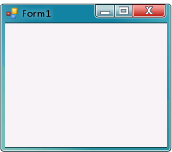

# Step 2: Run Your Program
When you created a new solution, you actually built a program that runs. It doesn't do much yet—it just displays an empty window that shows **Form1** in the title bar. But it does run, as you're about to find out.  
  
 For a video version of this topic, see [Tutorial 1: Create a Picture Viewer in Visual Basic - Video 1](http://go.microsoft.com/fwlink/?LinkId=205209) or [Tutorial 1: Create a Picture Viewer in C# - Video 1](http://go.microsoft.com/fwlink/?LinkId=205199). These videos use an earlier version of Visual Studio, so there are slight differences in some menu commands and other user interface elements. However, the concepts and procedures work similarly in the current version of Visual Studio.  
  
### To run your program  
  
1.  Use one of the following methods to run your program.  
  
    -   Choose the **F5** key.  
  
    -   On the menu bar, choose **Debug**, **Start Debugging**.  
  
    -   On the toolbar, choose the **Start Debugging** button, which appears as follows.  
  
           
Start Debugging toolbar button  
  
2.  Visual Studio runs your program, and a window called **Form1** appears. The following diagram shows the program you just built. The program is running, and you will soon add to it.  
  
       
Windows Form Application program running  
  
3.  Go back to the Visual Studio integrated development environment (IDE), and look at the new toolbar. Additional buttons appear on the toolbar when you run a program. These buttons let you do things like stop and start your program, and help you track down any errors (bugs) it may have. For this example, we're just using it to start and stop the program.  
  
       
Debugging toolbar  
  
4.  Use one of the following methods to stop your program.  
  
    -   On the toolbar, choose the **Stop Debugging** button.  
  
    -   On the menu bar, choose **Debug**, **Stop Debugging**.  
  
    -   Choose the X button in the upper corner of the **Form1** window.  
  
    > [!NOTE]
    >  When you run your program from inside the IDE, it's called *debugging* because you typically do it to locate and fix bugs (errors) in the program. Although this program is small and doesn't really do anything yet, it's still a real program. You follow the same procedure to run and debug other programs. To learn more about debugging, see [Debugger Roadmap](../vs140/Debugger-Basics.md).  
  
### To continue or review  
  
-   To go to the next tutorial step, see [Step 3: Set Up Your Form Properties](../vs140/Step-3--Set-Your-Form-Properties.md).  
  
-   To return to the previous tutorial step, see [Step 1: Create a Windows Forms Application Project](../vs140/Step-1--Create-a-Windows-Forms-Application-Project.md).