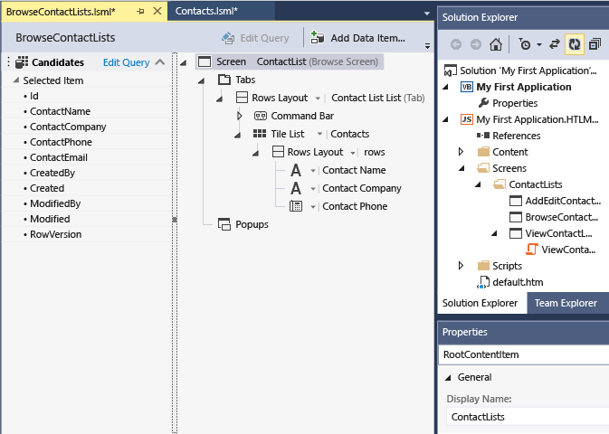

# Step 3: Create Screens in LightSwitch
In this lesson, you'll create screens to enter, display, and change data in your LightSwitch contact management application. You'll choose a screen template to create a common set of screens and specify the data to display.  
  
## Create a Screen  
  
#### To create a screen for your application  
  
1.  In **Solution Explorer**, open the shortcut menu for the **Screens** node, and then choose **Add Screen**.  
  
     The **Add New Screen** dialog box appears.  
  
2.  In the **Select a screen template** list, choose **Common Screen Set**.  
  
3.  In the **Screen Set Name** text box, enter **ContactList**.  
  
4.  In the **Screen Data** list, choose **Contacts**, and then choose the **OK** button.  
  
     Three screens are added to **Solution Explorer**: **AddEditContactList**, **BrowseContactLists**, and **ViewContactList**.  
  
     The Screen Designer opens and displays a representation of the layout and commands for the **BrowseContactLists** screen as the following illustration shows:  
  
       
  
## Closer Look  
 You just created a set of screens for your application. The **BrowseContactLists** screen displays a list of contacts and is the home screen for your application. The **ViewContactList** screen displays the details for a contact, and as you might expect, the **AddEditContactList** screen lets you add or edit contacts.  
  
 LightSwitch sets up the navigation between screens without the need for any code. For example, when you choose a contact on the Browse screen, the View screen for that contact is automatically launched.  
  
 For this application, the default screen settings are appropriate, but you will usually want to customize screens in the Screen Designer. For example, you can hide fields, make fields read-only, or change the appearance and layout of data.  
  
## Next Steps  
 In the next lesson, you'll run your application and test its capabilities.  
  
 Next lesson: [Step 4: Run and Test the Application](../vs140/Step-4--Run-and-Test-the-LightSwitch-Application.md)  
  
## See Also  
 [Step 2: Define the Data](../vs140/Step-2--Define-the-Data-in-LightSwitch.md)   
 [Creating Your First KittyHawk Application](../vs140/Creating-Your-First-LightSwitch-Application.md)   
 [Screens: What the User Sees](../vs140/Screens--The-User-Interface-of-Your-LightSwitch-Application.md)   
 [How to: Customize a Screen in a Running Application](../vs140/How-to--Customize-a-Silverlight-Screen-in-a-Running-Application.md)