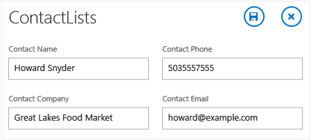
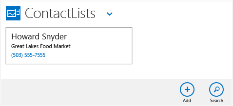
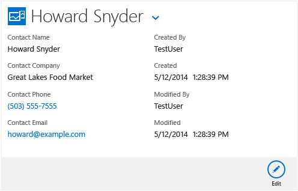
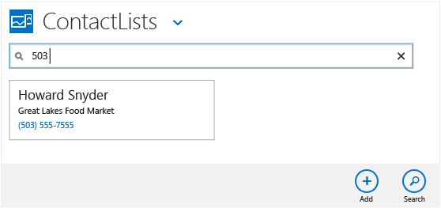
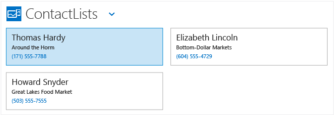
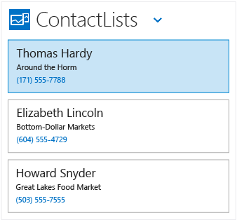

# Step 4: Run and Test the LightSwitch Application
You’ve just created your first LightSwitch application. In this lesson, you’ll run the application and enter some data.  
  
## Run and Test  
  
#### To run your application  
  
1.  On the menu bar, choose **Debug**, **Start Debugging**.  
  
     This command runs your program in a browser window and displays the **ContactLists** screen.  
  
    > [!TIP]
    >  You can also press F5 to run your application.  
  
#### To add a contact  
  
1.  In the **ContactLists** screen, choose the **Add** button.  
  
     The **ContactList** screen opens. You can see fields for entering a name, company, telephone number, and e-mail address.  
  
2.  In the **Contact Name** text box, enter `Howard Snyder`.  
  
3.  In the **Contact Company** text box, enter `Great Lakes Food Market`.  
  
4.  In the **Contact Phone** text box, enter `5035557555`.  
  
5.  In the **Contact Email** text box, enter `howard@example`, and then choose the **Save** button.  
  
     A dialog box appears to report an invalid e-mail address error. Choose the **OK** button to dismiss the dialog box.  
  
6.  Add `.com` to the end of the e-mail address, and then choose the **Save** button.  
  
       
  
     A tile displaying the new contact appears on the **Browse** screen.  
  
       
  
#### To view contact details  
  
1.  Choose the tile to open the **View** screen for the contact.  
  
       
  
     Notice that four additional fields have been added:  **Created By**, **Created**, **Modified By**, and **Modified**. These fields provide an audit trail to track who added or changed a record, and when.  
  
2.  Choose the **Edit** button.  
  
     The **ContactList** screen that you used to add the contact appears, this time with the data for the current contact.  
  
3.  Choose the **Discard** button to close the screen, and then choose the **Home** icon to return to the **Browse** screen.  
  
#### To search for a contact  
  
1.  Choose the **Search** button to display the **Search** text box at the top of the screen.  
  
2.  In the **Search** text box, enter `505`, and then press Enter.  
  
     The list is empty because there is no matching contact that contains 505.  
  
3.  In the **Search** text box, change the entry to `503`, and then press Enter.  
  
     The list now shows one matching contact, as shown in the following illustration:  
  
       
  
#### To view resizing behavior  
  
1.  Add two more contacts with the following values:  
  
    |Contact Name|Contact Company|Contact Phone|Contact Email|  
    |------------------|---------------------|-------------------|-------------------|  
    |Elizabeth Lincoln|Bottom-Dollar Markets|6045554729|elincoln@example.com|  
    |Thomas Hardy|Around the Horn|1715557788|thomash@example.com|  
  
     Notice how the contacts are displayed in a tiled list format, with the newest entry always on the top left.  
  
       
  
2.  Resize the browser window, and notice how the display changes to a single-column list when the window gets narrower. The display automatically adjusts for smaller screens such as phone screens.  
  
       
  
3.  Close the running application by closing the browser window.  
  
4.  On the menu bar, choose **File**, **Save All**.  
  
     This saves your project so that you can use it in future lessons.  
  
## Closer Look  
 In this lesson you ran your program to see how it works. You might be surprised that you have a fully functioning application that implements data entry, navigation, validation, search and more, all without writing a single line of code. All the necessary code is built into LightSwitch. This saves you a lot of work.  
  
 Of course, the contact management application you've created so far is much simpler than most applications. You'll probably need screens that combine data from multiple sources, or that change what’s displayed based on certain conditions, or that limit access based on the user’s ID. You’ll learn about all those things and more in the remaining lessons.  
  
 Although LightSwitch reduces the need to write code for common scenarios, there will be cases where you have to write code. Every business has its own set of rules. For example, you might want to set up your application so that some customers get a discount, or certain purchases are exempt from taxes. As a business application developer, you understand the business rules and can express them in code. You’ll learn more about how to do this in future lessons  
  
## Next Steps  
 Congratulations – you now have a fully functional LightSwitch application. In the following lessons, you’ll learn more about data entities and connecting to data.  
  
 Next lesson: [Connecting to Data](../vs140/Connecting-to-Data-in-a-LightSwitch-Application.md).  
  
## See Also  
 [Step 3: Create a Screen](../vs140/Step-3--Create-Screens-in-LightSwitch.md)   
 [Creating Your First KittyHawk Application](../vs140/Creating-Your-First-LightSwitch-Application.md)