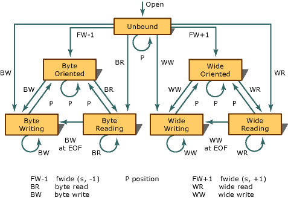

# Stream States
The valid states, and state transitions, for a stream are shown in the following figure.  
  
   
  
 Each of the circles denotes a stable state. Each of the lines denotes a transition that can occur as the result of a function call that operates on the stream. Five groups of functions can cause state transitions.  
  
 Functions in the first three groups are declared in <stdio.h>:  
  
-   The byte read functions — [fgetc](../vs140/fgetc--fgetwc.md), [fgets](../vs140/fgets--fgetws.md), [fread](../vs140/fread.md), [fscanf](../vs140/fscanf--_fscanf_l--fwscanf--_fwscanf_l.md), [getc](../vs140/getc--getwc.md), [getchar](../vs140/getc--getwc.md), [gets](../vs140/gets--_getws.md), [scanf](../vs140/scanf--_scanf_l--wscanf--_wscanf_l.md), and [ungetc](../vs140/ungetc--ungetwc.md)  
  
-   The byte write functions — [fprintf](../vs140/fprintf--_fprintf_l--fwprintf--_fwprintf_l.md), [fputc](../vs140/fputc--fputwc.md), [fputs](../vs140/fputs--fputws.md), [fwrite](../vs140/fwrite.md), [printf](../vs140/printf--_printf_l--wprintf--_wprintf_l.md), [putc](../vs140/putc--putwc.md), [putchar](../vs140/putc--putwc.md), [puts](../vs140/puts--_putws.md), [vfprintf](../vs140/vfprintf--_vfprintf_l--vfwprintf--_vfwprintf_l.md), and [vprintf](../vs140/vprintf--_vprintf_l--vwprintf--_vwprintf_l.md)  
  
-   The position functions — [fflush](../vs140/fflush.md), [fseek](../vs140/fseek--_fseeki64.md), [fsetpos](../vs140/fsetpos.md), and [rewind](../vs140/rewind.md)  
  
 Functions in the remaining two groups are declared in <wchar.h>:  
  
-   The wide read functions — [fgetwc](../vs140/fgetc--fgetwc.md), [fgetws](../vs140/fgets--fgetws.md), [fwscanf](../vs140/fscanf--_fscanf_l--fwscanf--_fwscanf_l.md), [getwc](../vs140/getc--getwc.md), [getwchar](../vs140/getc--getwc.md), [ungetwc](../vs140/ungetc--ungetwc.md), and [wscanf](../vs140/scanf--_scanf_l--wscanf--_wscanf_l.md),  
  
-   The wide write functions — [fwprintf](../vs140/fprintf--_fprintf_l--fwprintf--_fwprintf_l.md), [fputwc](../vs140/fputc--fputwc.md), [fputws](../vs140/fputs--fputws.md), [putwc](../vs140/putc--putwc.md), [putwchar](../vs140/fputc--fputwc.md), [vfwprintf](../vs140/vfprintf--_vfprintf_l--vfwprintf--_vfwprintf_l.md), [vwprintf](../vs140/vprintf--_vprintf_l--vwprintf--_vwprintf_l.md), and [wprintf](../vs140/printf--_printf_l--wprintf--_wprintf_l.md),  
  
 The state diagram shows that you must call one of the position functions between most write and read operations:  
  
-   You cannot call a read function if the last operation on the stream was a write.  
  
-   You cannot call a write function if the last operation on the stream was a read, unless that read operation set the end-of-file indicator.  
  
 Finally, the state diagram shows that a position operation never decreases the number of valid function calls that can follow.  
  
## See Also  
 [Files and Streams](../vs140/Files-and-Streams.md)