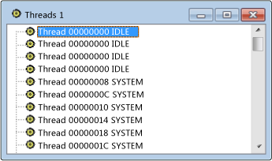

# Threads View
The Threads view is a flat listing of all threads associated with windows on your system. The Thread ID and module name for each thread are shown. Processes are not included, but you can easily find the process that owns a selected thread.  
  
## Procedures  
  
#### To open the Threads view  
  
1.  From the **Spy** menu, choose **Threads**.  
  
   
Spy++ Threads View  
  
 The figure above shows the Threads view.  
  
## In This Section  
 [Searching for a Thread in Threads View](../vs140/How-to--Search-for-a-Thread-in-Threads-View.md)  
 Explains how to find a specific thread in Threads view.  
  
 [Displaying Thread Properties](../vs140/How-to--Display-Thread-Properties.md)  
 Explains how to show more information about a thread.  
  
## Related Sections  
 [Spy++ Views](../vs140/Spy---Views.md)  
 Explains the Spy++ tree views of windows, messages, processes, and threads.  
  
 [Using Spy++](../vs140/Using-Spy--.md)  
 Introduces the Spy++ tool and explains how it can be used.  
  
 [Thread Search Dialog Box](../vs140/Thread-Search-Dialog-Box.md)  
 Used to find the node for a specific thread in Threads view.  
  
 [Thread Properties Dialog Box](../vs140/Message-Properties-Dialog-Box.md)  
 Displays the properties of a thread selected in Threads view or Messages view.  
  
 [Spy++ Reference](../vs140/Spy---Reference.md)  
 Includes sections describing each Spy++ menu and dialog box.