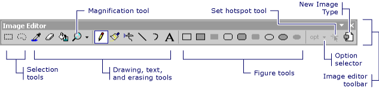
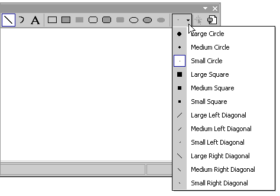

# Toolbar (Image Editor for Icons)
The **Image Editor** toolbar contains tools for drawing, painting, entering text, erasing, and manipulating views. It also contains an option selector, with which you can select options for using each tool. For example, you can choose from various brush widths, magnification factors, and line styles.  
  
> [!NOTE]
>  All tools available on the **Image Editor** toolbar are also available from the **Image** menu (under the **Tools** command).  
  
   
Image Editor Toolbar  
  
 To use the **Image Editor** toolbar and **Option** selector, click the tool or option that you want.  
  
> [!TIP]
>  Tool tips appear when you hover your cursor over a toolbar button. These tips can help you identify the function of each button.  
  
 With the **Option** selector you can specify the width of a line, brush stroke, etc. The icon on the **Option** selector button changes depending on which tool you have selected.  
  
   
Option Selector on the Image Editor Toolbar  
  
 For information on adding resources to managed projects, please see [Resources in Applications](assetId:///8ad495d4-2941-40cf-bf64-e82e85825890) in the *.NET Framework Developer's Guide.* For information on manually adding resource files to managed projects, accessing resources, displaying static resources, and assigning resources strings to properties, see [Walkthrough: Localizing Windows Forms](assetId:///9a96220d-a19b-4de0-9f48-01e5d82679e5) and [Walkthrough: Using Resources for Localization with ASP.NET](assetId:///bb4e5b44-e2b0-48ab-bbe9-609fb33900b6).  
  
## Requirements  
 None  
  
## See Also  
 [Displaying or Hiding the Toolbar](../vs140/Displaying-or-Hiding-the-Toolbar--Image-Editor-for-Icons-.md)   
 [Accelerator Keys](../vs140/Accelerator-Keys--Image-Editor-for-Icons-.md)   
 [Image Editor for Icons](../vs140/Image-Editor-for-Icons.md)