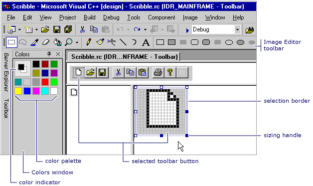

# Toolbar Editor
The Toolbar editor enables you to create toolbar resources and convert bitmaps into toolbar resources. The Toolbar editor uses a graphical display to show a toolbar and buttons that closely resemble how they will look in a finished application.  
  
 With the Toolbar editor, you can:  
  
-   [Create new toolbars and buttons](../vs140/Creating-New-Toolbars.md)  
  
-   [Convert bitmaps to toolbar resources](../vs140/Converting-Bitmaps-to-Toolbars.md)  
  
-   [Create, move, and edit toolbar buttons](../vs140/Creating--Moving--and-Editing-Toolbar-Buttons.md)  
  
-   [Create Tool Tips](../vs140/Creating-a-Tool-Tip-for-a-Toolbar-Button.md)  
  
 The Toolbar editor window shows two views of a button image, the same as the Image editor window. A split bar separates the two panes. You can drag the split bar from side to side to change the relative sizes of the panes. The active pane displays a selection border. Above the two views of the image is the subject toolbar.  
  
   
Toolbar Editor  
  
 The Toolbar editor is similar to the Image editor in functionality. The menu items, graphic tools, and bitmap grid are the same as those in the Image editor. There is a menu command on the Image menu to allow you to switch between the Toolbar editor and the Image editor. For more information on using the Graphics toolbar, Colors palette, or Image menu, see [Image Editor](../vs140/Image-Editor-for-Icons.md).  
  
 For information on adding resources to managed projects, please see [Resources in Applications](assetId:///8ad495d4-2941-40cf-bf64-e82e85825890) in the *.NET Framework Developer's Guide.* For information on manually adding resource files to managed projects, accessing resources, displaying static resources, and assigning resources strings to properties, see [Walkthrough: Localizing Windows Forms](assetId:///9a96220d-a19b-4de0-9f48-01e5d82679e5) and [Walkthrough: Using Resources for Localization with ASP.NET](assetId:///bb4e5b44-e2b0-48ab-bbe9-609fb33900b6).  
  
## Requirements  
 MFC or ATL  
  
## See Also  
 [Resource Editors](../vs140/Resource-Editors.md)   
 [Menus and Other Resources](http://msdn.microsoft.com/library/windows/desktop/ms632583.aspx)