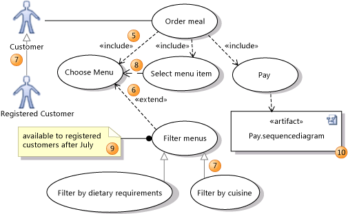

# UML Use Case Diagrams: Reference
In Visual Studio, a *use case diagram* summarizes who uses your application or system, and what they can do with it. To create a UML use case diagram, on the **Architecture** menu, click **New UML or Layer Diagram**.  
  
 A use case diagram acts as a focus for the description of user requirements. It describes the relationships between requirements, users, and the major components. It does not describe the requirements in detail; these can be described in separate diagrams or in documents that can be linked to each use case. For information about how use case diagrams can help you understand, discuss and communicate your users' needs, see [Modeling User Requirements](../vs140/Model-user-requirements.md).  
  
 To see which versions of Visual Studio support this feature, see [Version support for architecture and modeling tools](../vs140/What-s-new-for-design-in-Visual-Studio.md#VersionSupport).  
  
> [!NOTE]
>  This topic describes the elements that are available in use case diagrams. For more information about how to draw use case diagrams, see [Guidelines for Drawing Use Case Diagrams](../vs140/UML-Use-Case-Diagrams--Guidelines.md). For more information about how to create and draw modeling diagrams, see [How to Draw Modeling Diagrams](../vs140/Edit-UML-models-and-diagrams.md).  
  
## Reading Use Case Diagrams  
 The tables in the following sections describe the elements that are available on a use case diagram, together with their main properties. For a full list of properties, see [Properties of Elements in Use Case Diagrams](../vs140/Properties-of-elements-on-UML-use-case-diagrams.md).  
  
### Actors, Use cases, and Subsystems  
   
  
|**Shape**|**Element**|**Description and Main Properties**|  
|---------------|-----------------|-----------------------------------------|  
|1|**Actor**|Represents a user, organization, or external system that interacts with your application or system. An actor is a kind of type.   -   **Image Path** - the file path of an image that should be used instead of the default actor icon. The icon should be a resource file within the Visual Studio project.|  
|2|**Use Case**|Represents the actions performed by one or more actors in the pursuit of a particular goal. A use case is a kind of type.   -   **Subjects** - the Subsystem in which the use case appears.|  
|3|**Association**|Indicates that an actor takes part in a use case.|  
|4|**Subsystem or component**|The system or application that you are working on, or a part of it. Can be anything from a large network to a single class in an application.   The use cases that a system or component supports appear inside its rectangle. It can be useful to show some use cases outside the rectangle, to clarify the scope of your system.   A subsystem in a use case diagram has basically the same type as a component in a component diagram.   -   **Is Indirectly Instantiated** - If false, your executing system has one or more objects that directly correspond to this subsystem. If true, the subsystem is a construct in your design that appears in the executing system only through the instantiation of its constituent parts.|  
  
### Structuring Use Cases  
   
  
|Shape|**Element**|Description|  
|-----------|-----------------|-----------------|  
|5|**Include**|An including use case calls or invokes the included one. Inclusion is used to show how a use case breaks into smaller steps. The included use case is at the arrowhead end.   Notice that the diagram does not show the order of the steps. You can use an activity diagram, sequence diagram, or other document to describe these details.|  
|6|**Extend**|An extending use case adds goals and steps to the extended use case. The extensions operate only under certain conditions. The extended use case is at the arrowhead end.   Notice that the diagram does not show the exact circumstances under which the extension applies: you can record these in a comment or other document.|  
|7|**Inheritance**|Relates a specialized and a generalized element. The generalized element is at the arrowhead end.   A specialized use case inherits the goals and actors of its generalization, and may add more specific goals and steps for achieving them.   A specialized actor inherits the use cases, attributes and associations of its generalization, and may add more.|  
|8|**Dependency**|Indicates that the design of the source depends on the design of the target.|  
|9|**Comment**|Used to add general notes to the diagram.|  
|10|**Artifact**|An artifact provides a link to another diagram or document. You can create it by dragging a file from Solution Explorer. It can be linked with a Dependency to any other element on the diagram. An artifact is typically used to link a use case to a sequence diagram, OneNote page, Word document or PowerPoint presentation that describes it in detail. The document can either be an item in the [!INCLUDE[vsprvs](../vs140/includes/vsprvs_md.md)] solution, or a document in a shared location such as a SharePoint site.   -   **Hyperlink**. The URL or file path of the diagram or document.   Double-click an artifact to open the file or web page to which it links.|  
|11 (not shown)|**Packages**|Use cases, actors, and subsystems can be contained within packages. Package shapes do not appear on the diagram, but you can set the **LinkedPackage** property of the diagram. Elements that you subsequently create on the diagram are placed within the package. For more information, see [Defining Packages and Namespaces](../vs140/Define-packages-and-namespaces.md).|  
  
## See Also  
 [Use Case Diagrams: Guidelines for Drawing](../vs140/UML-Use-Case-Diagrams--Guidelines.md)   
 [How to: Draw Modeling Diagrams](../vs140/Edit-UML-models-and-diagrams.md)   
 [Sequence Diagrams: Overview](../vs140/UML-Sequence-Diagrams--Reference.md)   
 [UML Class Diagrams: Overview](../vs140/UML-Class-Diagrams--Reference.md)   
 [Component Diagrams: Overview](../vs140/UML-Component-Diagrams--Reference.md)   
 [Activity Diagrams: Overview](../vs140/UML-Component-Diagrams--Reference.md)