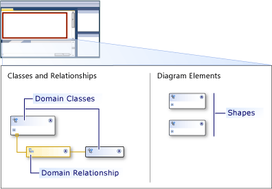
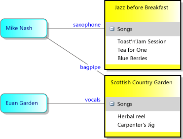
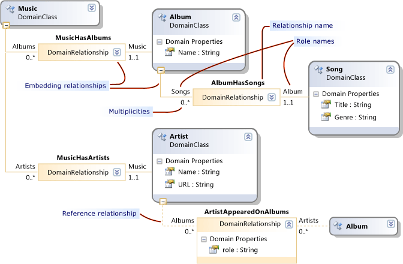
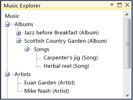
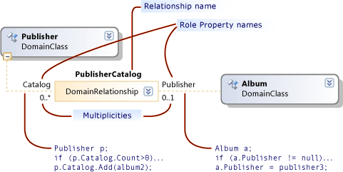

# Understanding Models, Classes and Relationships
A domain-specific language (DSL) is defined by its DSL Definition file, together with any custom program code that you might write. Most of the program code in the DSL solution is generated from this file.  
  
 This topic explains the central features of the DSL definition.  
  
## The DSL Definition  
 When you open `Dsl\DslDefinition.dsl`, your [!INCLUDE[vsprvs](../vs140/includes/vsprvs_md.md)] window resembles the following picture.  
  
   
  
 The most important information in the DSL Definition is displayed in the DSL Definition diagram. Additional information, which is also part of DslDefinition.dsl, is displayed in DSL Explorer, which usually appears at the side of the diagram. You work with the diagram for the most frequent tasks, and with DSL Explorer for more advanced customizations.  
  
 The DSL Definition diagram shows the domain classes that define model elements, and the relationships that define links between model elements. It also shows the shapes and connectors that are used to display the model elements to the user.  
  
   
  
 When you select an item in the DSL definition, either on the diagram or in DSL Explorer, information about it is displayed in the Properties window. Additional information may be displayed in the DSL Details window.  
  
### Models are instances of DSLs  
 A *model* is an instance of your DSL created by a user. A model contains model elements, which are instances of the domain classes that you define, and links between the elements, which are instances of the domain relationships that you define. A model can also have shapes and connectors, which display the model elements and links on a diagram. The DSL definition includes the shape classes, connector classes, and a class for the diagram.  
  
 A DSL Definition is also known as a *domain model*. A DSL Definition or domain model is the design-time representation of the domain-specific language, whereas the model is the run-time instantiation of the domain-specific language.  
  
## Domain Classes define Model Elements  
 Domain classes are used to create the various elements in the domain, and domain relationships are the links between the elements. They are the design-time representation of the elements and links that will be instantiated by the users of the design-specific language when they create their models.  
  
 This illustration shows a model that has been created by the user of a music library DSL. Music albums are represented by boxes that contain lists of songs. Artists are represented by round-cornered boxes, and are connected to the albums to which they have contributed.  
  
   
  
 The DSL Definition separates two aspects. The appearance of the model elements on the model diagram is defined by using shape classes and connector classes. The information carried in the model is defined using domain classes and domain relationships.  
  
 The following illustration shows the domain classes and relationships in the DSL Definition of the Music Library.  
  
   
  
 The illustration shows four domain classes: Music, Album, Artist and Song. The domain classes define domain properties such as Name, Title, and so on. In the instance model, the values of some of these properties are displayed on the diagram.  
  
 Between the classes are domain relationships: MusicHasAlbums, MusicHasArtists, AlbumbHasSongs, and ArtistAppearedOnAlbums. The relationships have multiplicities such as 1..1, 0..*. For example, every Song must be related to exactly one Album through the AlbumHasSongs relationship. Every Album can have any number of Songs.  
  
### Rearranging the DSL Definition Diagram  
 Notice that a domain class can appear several times on the DSL Definition diagram, as Album does in this picture. There is always one main view, and there can be some *reference* views.  
  
 To rearrange the DSL Definition diagram, you can:  
  
-   Swap main and reference views by using the **Bring Tree Here** and **Split Tree** commands. Right-click a single domain class to see these commands.  
  
-   Re-order the domain classes and shape classes by pressing Ctrl+Up and Ctrl+Down.  
  
-   Collapse or expand classes using the icon at the upper-right of each shape.  
  
-   Collapse parts of the tree by clicking the minus sign (-) at the bottom of a domain class.  
  
## Inheritance  
 Domain classes can be defined using inheritance. To create an inheritance derivation, click the Inheritance tool, click the derived class, and then click the base class. A model element has all the properties that are defined on its own domain class, together with all the properties inherited from the base class. It also inherits its roles in relationships.  
  
 Inheritance can also be used between Relationships, Shapes, and Connectors. Inheritance must keep within the same group. A shape cannot inherit from a domain class.  
  
## Domain Relationships  
 Model elements can be linked by relationships. Links are always binary; they link exactly two elements. However, any element can have many links to other objects, and there can even be more than one link between the same pair of elements.  
  
 Just as you can define different classes of elements, you can define different classes of links. The class of a link is called a *domain relationship*. A domain relationship specifies what classes of element its instances can connect. Each end of a relationship is called a *role*, and the domain relationship defines names for the two roles, as well as for the relationship itself.  
  
 There are two kinds of domain relationships: embedding relationships and reference relationships. On the DSL Definition diagram, embedding relationships have solid lines at each role, and reference relationships have dashed lines.  
  
### Embedding Relationships  
 Every element in a model, except for its root, is the target of one embedding link. Therefore, the whole model forms a single tree of embedding links. An embedding relationship represents containment or ownership. Two model elements that are related in this way are also known as parent and child. The child is said to be embedded in the parent.  
  
 Embedding links are not usually shown explicitly as connectors on a diagram. Instead, they are usually represented by containment. The root of the model is represented by the diagram, and elements embedded in it are displayed as shapes on the diagram.  
  
 In the example, the root class Music has an embedding relationship MusicHasAlbums to Album, which has an embedding AlbumHasSongs to Song. Songs are displayed as items in a list inside each Album. Music also has an embedding MusicHasArtists to the Artist class, whose instances also appear as shapes on the diagram.  
  
 By default, embedded elements are automatically deleted when their parents are deleted.  
  
 When a model is saved to file in XML form, embedded elements are nested inside their parents, unless you have customized the serialization.  
  
> [!NOTE]
>  Embedding is not the same as inheritance. Children in an embedding relationship do not inherit the parent's properties. An embedding is a type of link between model elements. Inheritance is a relationship between classes, and does not create links between model elements.  
  
### Embedding rules  
 Every element in an instance model must be the target of exactly one embedding link, except for the root of the model.  
  
 Therefore, every non-abstract domain class, except the root class, must be the target of at least one embedding relationship, or it must inherit an embedding from a base class. A class can be the target of two or more embeddings, but its instance model elements can only have one parent at a time. The multiplicity from target to source must be 0..1 or 1..1.  
  
### The Explorer Displays the Embedding Tree  
 Your DSL Definition also creates an explorer, which users see alongside their model diagram.  
  
   
  
 The explorer shows all the elements in the model, even those for which you have not defined any shapes. It shows elements and embedding relationships, but not reference relationships.  
  
 To see the values of the domain properties of an element, the user selects an element, either in the model diagram or in the model explorer, and opens the Properties window. It displays all the domain properties, including those that are not displayed on the diagram. In the example, each Song has both a Title and a Genre, but only the value of the Title is shown on the diagram.  
  
## Reference Relationships  
 A reference relationship represents any kind of relationship that is not embedding.  
  
 Reference relationships are typically displayed on a diagram as connectors between shapes.  
  
 In the XML representation of the model, a reference link between two elements is represented using *monikers.* That is, monikers are names that uniquely identify each element in the model. The XML node for each model element contains a node that specifies the name of the relationship and the moniker of the other element.  
  
## Roles  
 Every domain relationship has two roles, a source role and a target role.  
  
 In the following picture, the line between the **Publisher** domain class and the **PublisherCatalog** domain relationship is the source role. The line between the domain relationship and the **Album** domain class is the target role.  
  
   
  
 The names associated with a relationship are especially important when you write program code that traverses the model. For example, when you build the DSL solution, the generated class Publisher has a property Catalog that is a collection of Albums. The class Album has a property Publisher that is a single instance of the class Publisher.  
  
 When you create a relationship in a DSL Definition, the property and relationship names are given default values. However, you can change them.  
  
## Multiplicities  
 Multiplicities specify how many elements can have the same role in a domain relationship. In the example, the zero-to-many (0..\*) multiplicity setting on the **Catalog** role specifies that any instance of the **Publisher** domain class can have as many **PublisherCatalog** relationship links as you want to give it.  
  
 Configure the multiplicity of a role either by typing on the diagram or by modifying the `Multiplicity` property in the **Properties** window. The following table describes the settings for this property.  
  
|Multiplicity type|Description|  
|-----------------------|-----------------|  
|0..* (Zero to many)|Each instance of the domain class can have multiple instances of the relationship or no instances of the relationship.|  
|0..1 (Zero to one)|Each instance of the domain class can have no more than one instance of the relationship or no instances of the relationship.|  
|1..1 (One)|Each instance of the domain class can have one instance of the relationship. You cannot create more than one instance of this relationship from any instance of the role class. If validation is enabled, a validation error will appear when any instance of the role class has no instance of the relationship.|  
|1..* (One to many)|Each instance of the class on the role that has this multiplicity can have multiple instances of the relationship, and each instance must have at least one instance of the relationship. If validation is enabled, a validation error will appear when any instance of the role class has no instance of the relationship.|  
  
## Domain Relationships as Classes  
 A link is represented in the Store as an instance of LinkElement, which is a derived class of ModelElement. You can define these properties in the domain model diagram on domain relationships.  
  
 You can also make a relationship the source or target of other relationships. In the domain model diagram, right-click the domain relationship and then click **Show As Class**. An additional class box will appear. You can then connect relationships to it.  
  
 You can define a relationship partly by inheritance, just as you can with domain classes. Select the derived relationship and set **Base Relationship** in the Properties window.  
  
 A derived relationship specializes its base relationship. The domain classes that it links should be derived from or the same as the classes linked by the base relationship. When a link of the derived relationship is created in a model, it is an instance of both the derived and the base relationships. In program code, you can navigate to the opposite end of the link using the properties generated either by the base or by the derived class.  
  
## See Also  
 [Domain Relationships in the Generated API](../vs140/Domain-Relationships-in-the-Generated-API.md)   
 [Domain-Specific Language Tools Glossary](assetId:///ca5e84cb-a315-465c-be24-76aa3df276aa)