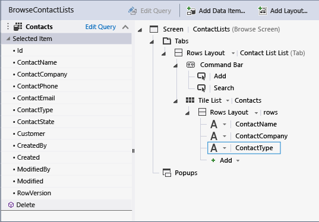
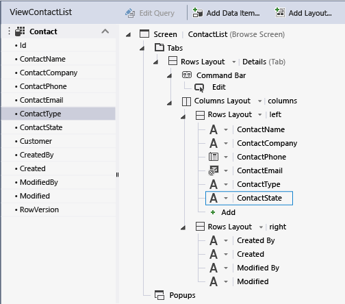
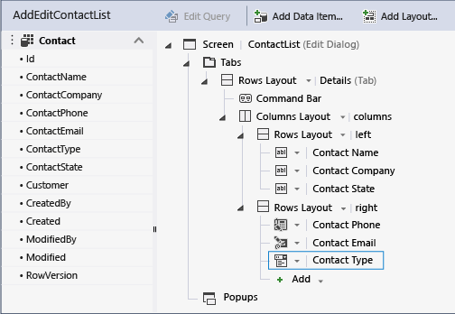
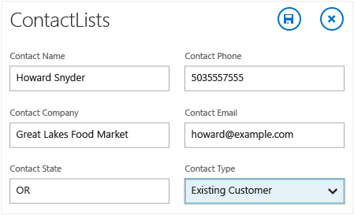

# Updating Existing Screens in a LightSwitch Application
In this lesson, you'll learn how to modify existing screens in your LightSwitch application.  
  
> [!NOTE]
>  This lesson builds upon the My First Application project that you developed in previous lessons. If you already have the project, open it now (in Visual Studio, on the menu bar, choose **File**, **Open Project**). Otherwise, complete the [Working with Data in LightSwitch (Guided Tour)](../vs140/Working-with-Data-in-LightSwitch.md) lesson series, and then return to this lesson.  
  
## Update Existing Screens  
 In a previous lesson, [Step 3: Create Screens in LightSwitch](../vs140/Step-3--Create-Screens-in-LightSwitch.md), you created a common screen set for the **Contacts** entity. In subsequent lessons you added **ContactType** and **ContactState** fields to the entity. Now you’ll add those fields to the existing screens.  
  
 The **ContactLists** screen currently shows the name, company, and phone number for each contact. You’ll replace the phone number with the contact type.  
  
#### To update the browse screen  
  
1.  In **Solution Explorer**, open the shortcut menu for the **BrowseContactLists.lsml** node, and then choose **Open**.  
  
2.  In the center pane of the Screen Designer, choose the **Contact Phone** node, and on the toolbar choose the **Delete** button.  
  
3.  Expand the **Add** list (under the **Contact Company** node) and choose **Contact Type**.  
  
       
  
 Next you’ll add the contact type and contact state to the view screen.  
  
#### To update the view screen  
  
1.  In **Solution Explorer**, open the shortcut menu for the **ViewContactList.lsml** node, and then choose **Open**.  
  
2.  In the center pane of the Screen Designer, expand the **Add** list (under the **Contact Email** node), and then choose **Contact Type**.  
  
3.  Expand the **Add** list and choose **Contact State**.  
  
       
  
    > [!TIP]
    >  You can also drag a field from the left pane and drop it in the content tree in the center pane.  
  
 Next you’ll add the contact type and contact state to the **ContactList** screen.  
  
#### To update the add/edit screen  
  
1.  In **Solution Explorer**, open the shortcut menu for the **AddEditContactList.lsml** node, and then choose **Open**.  
  
2.  In the center pane of the Screen Designer, select the **Rows Layout &#124; left** node, and then expand the **Add** list and choose **Contact State**.  
  
3.  Select the **Rows Layout &#124; right** node, and then expand the **Add** list and choose **Contact Type**.  
  
       
  
 As a final step you’ll update your existing contacts to include state and contact type, and then you’ll make the fields required for any new contacts.  
  
#### To update the Contacts entity  
  
1.  Run the application. On the **ContactLists** screen, choose a contact. On the view screen, choose the **Edit** button.  
  
2.  In the **Contact State** text box, enter a two-letter abbreviation for a state.  
  
3.  In the `Contact Type` list, choose **Existing Customer**, and then choose the **Save** button.  
  
       
  
4.  Repeat steps 1 through 3 for each additional contact on the **ContactLists** screen, and then close the application.  
  
5.  In **Solution Explorer**, open the shortcut menu for the **Contacts.lsml** node.  
  
6.  In the **Entity Designer**, select the **Required** check box for the **ContactType** and **ContactState** fields.  
  
## Closer Look  
 This lesson showed how to add fields to existing screens. This is necessary whenever new fields are added to an entity. You may have noticed that the new fields automatically showed up in the left pane of the Screen Designer. It’s up to you to determine where they should appear in the content tree (the center pane).  
  
 You also updated the existing contacts to include the new fields, and then marked the fields as required in the Entity Designer. If you had marked the fields as required when you first created them, you would have run into validation errors when editing existing contacts. You can avoid these extra steps by planning ahead and adding all necessary fields to an entity before creating the screens.  
  
## Next Steps  
 In the next lesson, you’ll learn how create a screen to display orders.  
  
 Next lesson: [Creating a Screen to Display Data in a LightSwitch Application](../vs140/Creating-Screens-to-Display-Data-in-a-LightSwitch-Application.md)