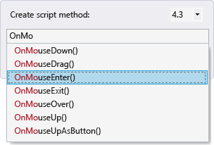
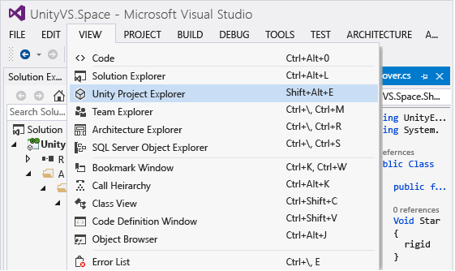
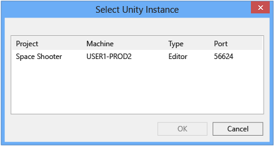
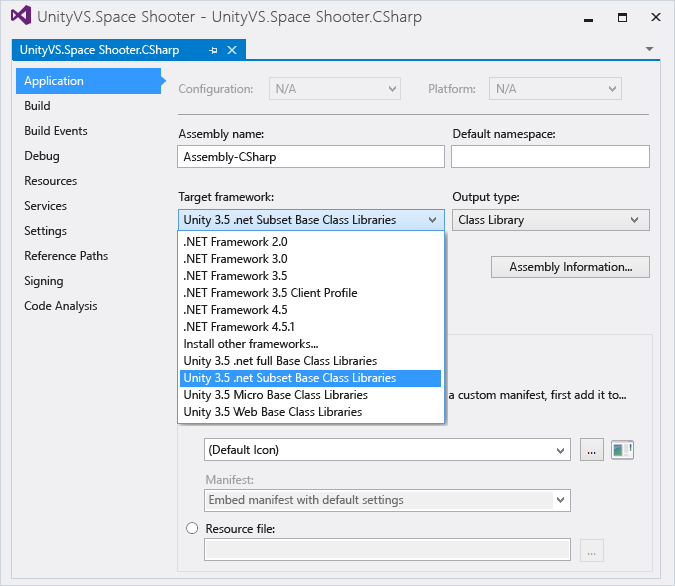

# Using Visual Studio Tools for Unity
In this section, you'll learn how to use Visual Studio Tools for Unity's integration and productivity features, and how to use the Visual Studio debugger for Unity development.  
  
## Unity Integration and Productivity  
 Visual Studio Tools for Unity integrates with the Unity Editor to help you be more productive. These productivity-enhancing features automate common scripting tasks and bring information from Unity into Visual Studio so that you don't have to switch to the Unity Editor to find it.  
  
### Unity documentation access  
 You can access the Unity scripting documentation quickly from Visual Studio. If Visual Studio Tools for Unity doesn't find the API documentation locally, it will try to find it online.  
  
##### To access Unity documentation  
  
-   In Visual Studio, highlight or place the cursor over the Unity API you want to learn about, then press **Ctrl+Alt+M, Ctrl+H**  
  
### Unity MonoBehavior scripting wizard  
 In Unity, most scripts are implemented by deriving from the MonoBehavior class and overriding some of its methods. You can use the MonoBehavior wizard to quickly create empty definitions of the MonoBehavior methods you want to overload. Using this wizard, you can specify one or more methods that you want to overload from the list of available methods, choose where they will be inserted into your code, and decide whether to include comments about how they are used.  
  
   
  
##### To create empty MonoBehavior method definitions by using the MonoBehavior wizard  
  
1.  In Visual Studio, position the cursor where you might want the methods to be inserted, then press **Ctrl+Shift+M** to launch the MonoBehavior wizard. Or, if you want to insert the new methods after one that's already been implemented, you can specify that later; just press **Ctrl+Shift+M**.  
  
2.  Select the methods you want to overload. In the **Create script methods** window, under **Select methods to create**, mark the checkbox next to the name of each method you want to overload.  
  
3.  Ensure that the framework version displayed in the **Framework version** dropdown matches the version you're using. If it doesn't match, change the value of the dropdown to the version you want to use.  
  
4.  Choose where the methods will be inserted. By default, the methods are inserted at the position of the cursor; if you want to insert them somewhere else, you can choose to insert them after any method that's already implemented in your class. To choose one of these locations, change the value of the **Insertion point** drop down to the location you want.  
  
5.  If you want the wizard to generate comments for the methods you selected, mark the **Generate method comments** checkbox. These comments are meant to help you understand when the method is called and what its general responsibilities are.  
  
6.  Choose the **OK** button to exit the wizard and insert the methods into your code.  
  
 The MonoBehavior wizard is especially helpful while you're still learning the Unity API, or when you need to overload a method you're not familiar with. As you become more experienced with the Unity API, you might prefer the Quick MonoBehavior wizard for quickly creating methods you're already familiar with.  
  
#### Quick MonoBehavior scripting wizard  
 When you're already familiar with the Unity API, you can implement overloaded methods even more quickly by using the Quick MonoBehavior Wizard. Using this wizard, you can specify just one method that's inserted without method comments at the cursor location.  
  
   
  
###### To create an empty MonoBehavior method definition by using the Quick MonoBehavior wizard  
  
1.  In Visual Studio, position the cursor where you want the method to be inserted, then press **Ctrl+Shift+Q** to launch the Quick MonoBehavior wizard. Unlike the other MonoBehavior wizard, you must position the cursor intentionally when using this wizard because the new method is always inserted there.  
  
2.  Ensure that the framework version displayed in the upper right-hand corner of the **Create script method** window matches the version you're using. If it doesn't match, change the value of the dropdown to the version you want to use.  
  
3.  Find the method that you want to overload. In the Create script method window, begin typing the name of the method in the textbox. A list of the methods whose names match what you've entered will appear.  
  
4.  Choose the method you want to overload. When the method you want is displayed in the list, select it with the mouse or arrow keys, then press **Enter**. If it’s the only method in the list, you can just press **Enter**. The method is inserted into your code.  
  
### Unity Project Explorer  
 You can use the Unity Project Explorer to navigate your Unity project inside Visual Studio.  
  
   
  
##### To view the Unity Project Explorer  
  
-   In Visual Studio, on the main menu, choose **View**, **Unity Project Explorer**. Keyboard: **Alt+Shift+E**  
  
       
  
 The Unity Project Explorer shows all of your Unity project files and directories in the same way that the Unity Editor does – this is different than navigating your unity scripts with the Solution Explorer, which contains only your script files and displays them as the projects and solution generated by Visual Studio Tools for Unity organizes them. Especially in large projects, it's often easier to locate the script you want to modify by using the Unity Project Explorer; it also makes it easy to modify other kinds of files—for example, text-based configuration files—in Visual studio without adding them to one of the projects in the Visual Studio solution.  
  
### Unity Error List  
 You can view messages from the Unity console inside Visual Studio when it's connected to a Unity instance. This includes errors and warnings from Unity. The messages are displayed in Visual Studio's **Error List** window; error messages from Unity are displayed on the **Errors** tab, warning messages on the **Warnings** tab, and other messages—for example, messages sent by using the Debug.Log Unity API—are displayed on the **Messages** tab.  
  
 In order to see the messages, your Unity project must be [properly configured](#debugging-your-project-in-a-unity-player) to support Script Debugging and to import the Visual Studio Tools for Unity package that's right for your version of Visual Studio, and Visual Studio must be [connected to Unity](#connecting-visual-studio-to-unity).  
  
 If you don't want to see errors, warnings, and messages from Unity in Visual Studio's **Error List** window, you can disable them in the Configuration menu.  
  
### Keyboard shortcuts  
 You can quickly access the Unity Tools for Visual Studio functionality by using their keyboard shortcuts. Here's a summary of the shortcuts that are available.  
  
|Command|Shortcut|Shortcut command name|  
|-------------|--------------|---------------------------|  
|Open the MonoBehavior Wizard|**Ctrl+Shift+M**|**EditorContextMenus.CodeWindow.ImplementMonoBehaviours**|  
|Open the Quick MonoBehavior Wizard|**Ctrl+Shift+Q**|**EditorContextMenus.CodeWindow.QuickMonoBehaviours**|  
|Open the Unity Project Explorer|**Alt+Shift+E**|**View.UnityProjectExplorer**|  
|Access Unity documentation|**Ctrl+Alt+M, Ctrl+H**|**Help.UnityAPIReference**|  
|Attach to Unity debugger (player or editor)|***no default***|**Debug.AttachUnityDebugger**|  
  
 You can change the shortcut key combinations if you don't like the default. For information on how to change it, see [Identifying and Customizing Keyboard Shortcuts in Visual Studio](https://msdn.microsoft.com/en-us/library/5zwses53.aspx).  
  
## Unity Debugging  
 Visual Studio Tools for Unity lets you debug both editor and game scripts for your Unity project using Visual Studio's powerful debugger.  
  
###   Connecting Visual Studio to Unity  
 Visual Studio Tools for Unity communicates with Unity through a UDP connection. This means that you can connect to a Unity instance running locally or anywhere on your network in exactly the same way. You can connect to any of the Unity instances you can see on your network by using the **Select Unity Instance** dialog.  
  
##### To open the Select Unity Instance dialog  
  
-   In Visual Studio, on the main menu, choose **Debug**, **Attach Unity Debugger**.  
  
       
  
-   *Or*, in Visual Studio, on the status bar, choose the plug icon in the lower right-hand corner of Visual Studio.  
  
       
  
> [!TIP]
>  If the plug icon shows a checkmark, you're already connected to a Unity instance.  
  
 The **Select Unity Instance** dialog displays some information about each Unity instance that you can connect to.  
  
   
  
 **Project**  
 The name of the Unity project that's running in this instance of Unity.  
  
 **Machine**  
 The name of the computer or device that this instance of Unity is running on.  
  
 **Type**  
 **Editor** if this instance of Unity is running as part of the Unity Editor; **Player** if this instance of Unity is a stand-alone player.  
  
 **Port**  
 The port number of the UDP socket that this instance of Unity is communicating over.  
  
> [!IMPORTANT]
>  Because Visual Studio Tools for Unity and the Unity instance are communicating over a UDP network socket, your firewall might ask about it. If this happens, you'll have to authorize the connection so that VSTU and Unity can communicate.  
  
###   Debugging your project in a Unity Player  
 You can connect Visual Studio Tools for Unity directly to your Unity app running in a stand-alone player when you are not running Unity Editor, or to debug problems that are platform specific.  
  
##### To enable script debugging in a Unity player  
  
-   Make sure you are creating a development build with script debugging enabled. In the build settings of your Unity project, mark the **Development Build** and **Script Debugging** checkboxes.  
  
   
  
 Additionally, to debug a Unity app running in the **Unity Web Player**, you also need to configure it to use the **Development Release Channel**.  
  
##### To configure the Development Release Channel in Unity Web Player  
  
-   In the Unity Web Player, on the context menu, choose **Release Channel** and make sure that the **Development** option is enabled.  
  
    > [!IMPORTANT]
    >  In Unity 4.2 and later, the **Release Channel** context menu item is only available on the Web Player context menu when the **Alt** key is pressed as the context menu is opened. If the Web Player is running on Mac OS X, press the **Option** key instead.  
  
 Finally, make sure you're connected to the Unity instance that you want to debug. For information on how to do that, see the [Connecting Visual Studio to Unity](#connecting-visual-studio-to-unity) section.  
  
### Debugging a DLL in your Unity project  
 Many Unity developers are writing code components as external DLLs so that the functionality they develop can be easily shared with other projects. Visual Studio Tools for Unity makes it easy to debug code in these DLLs seamlessly with other code in your Unity project.  
  
> [!NOTE]
>  At this time, Visual Studio Tools for Unity only supports managed DLLs. It does not support debugging of native code DLLs, such as those written in C++.  
  
 Note that the scenario described here assumes that you have the source code—that is, you are developing or re-using your own first-party code, or you have the source code to a third-party library, and plan to deploy it in your Unity project as a DLL. This scenario does not describe debugging a DLL for which you do not have the source code.  
  
##### To debug a managed DLL project used in your Unity project  
  
1.  Add your existing DLL project to the Visual Studio solution generated by Visual Studio Tools for Unity. Less commonly, you might be starting a new managed DLL project to contain code components in your Unity project; if that's the case, you can add a new managed DLL project to the Visual Studio solution instead. For more information on adding a new or existing project to a solution, see [How to: Add Projects to a Solution](https://msdn.microsoft.com/en-us/library/vstudio/ff460187.aspx).  
  
       
  
     In either case, Visual Studio Tools for Unity maintains the project reference, even if it has to regenerate the project and solution files again, so you only need to perform these steps once.  
  
2.  Reference the correct Unity framework profile in the DLL project. In Visual Studio, in the DLL project's properties, set the **Target framework** property to the Unity framework version you're using. This is the Unity Base Class Library that matches the API compatibility that your project targets, such as the Unity full, micro, or web base class libraries. This prevents your DLL from calling framework methods that exist in other frameworks or compatibility levels, but which might not exist in the Unity framework version you're using.  
  
       
  
3.  Copy the DLL to your Unity project's Asset folder. In Unity, assets are files that are packaged and deployed together with your Unity app so that they can be loaded at run-time. Since DLLs are linked at runtime, DLLs must be deployed as assets. To be deployed as an asset, the Unity Editor requires the DLLs to be put inside the Assets folder in your Unity project. There are two ways you can do this:  
  
    -   Modify the build settings of your DLL project to include a post-built task that copies the output DLL and PDB files from its output folder to the **Assets** folder of your Unity project.  
  
    -   Modify the build settings of your DLL project to set its output folder to be the **Assets** folder of your Unity project. Both DLL and PDB files will be placed in the **Assets** folder.  
  
     The PDB files are needed for debugging because they contain the DLL's debugging symbols, and map the DLL code to its source code form. Visual Studio Tools for Unity will use information from the DLL and PDB to create a DLL.MDB file, which is the debug symbol format used by the Unity scripting engine.  
  
4.  Debug your code. You can now debug your DLL source code together with your Unity project's source code, and use all the debugging features you are used to, such as breakpoints and stepping through code.