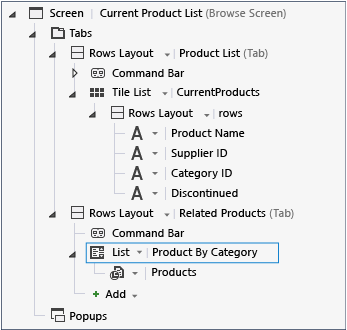

# Using a Parameterized Query on a LightSwitch Screen
In this lesson, you’ll learn how to filter data on a screen by using a parameterized query.  
  
## Using a Parameterized Query  
 In the previous lesson, you created a query to filter products based on a **CategoryID** parameter. At run time, you can use this parameter to apply the filter to another entity that contains a **CategoryID** field. For example, you can use the parameterized query to display all products that are in the same category as the product that appears on the screen.  
  
 The parameter value can be supplied as a property in the **Screen Designer** at design time or by the user at run time. In this example, you'll assign the value at design time.  
  
#### To add a parameterized query to a screen  
  
1.  In **Solution Explorer**, open the shortcut menu for the **CurrentProductList.lsml** node, and then choose **Open**.  
  
2.  In the **Screen Designer**, on the toolbar, choose the **Add Data Item** button.  
  
3.  In the **Add Data Item** dialog box, choose the **Query** option button.  
  
4.  In the **Name** column, choose **NorthwindEntitiesData.ProductsByCategory**, and then choose the **OK** button.  
  
     A **ProductsByCategory** node appears in the left pane.  
  
5.  Under the **Query Parameters** node, choose the **CategoryID** node.  
  
6.  In the **Properties** window, choose the **Parameter Binding** property, and then enter `CurrentProducts.SelectedItem. CategoryID`.  
  
7.  In the **Screen Designer**, choose the **Tabs** node, and then choose the **Add Tab** node.  
  
     A **Rows Layout &#124; Group** node appears in the screen content tree.  
  
8.  In the **Properties** window, choose the **Name** property, and then enter `RelatedProducts`.  
  
9. In the **Screen Designer**, choose the **Rows Layout &#124; Related Products** node. In the **Add** list, choose **Products By Category**.  
  
       
  
10. Run the application and open the **Current Product List** screen.  
  
11. Choose a product, and then choose the **Related Products** tab.  
  
     Notice that all products that have the same **CategoryID** as the product you’ve selected are displayed in the tab.  
  
## Closer Look  
 In this procedure, you used the parameterized query that you created in the last lesson to display a list of products. The query was added to an existing screen, the **Current Product List** screen. The **Parameter Binding** property of the query specifies the **CategoryID** value for the selected item from the existing **CurrentProducts** collection on the screen and supplies the parameter at run time. As a result, a list of products that have a matching **CategoryID** is displayed every time the user selects a product in the **CurrentProducts** list.  
  
## Next Steps  
 In the next set of lessons, you’ll learn how to work with menus and commands.  
  
 Next lesson: [Creating Menus and Commands](../vs140/Creating-Commands-and-Working-with-Menus-in-LightSwitch.md)  
  
## See Also  
 [Filtering Data with Queries](../vs140/Filtering-Data-with-Queries-in-LightSwitch.md)   
 [How to: Provide a Value to a Query Parameter](../vs140/How-to--Provide-a-Value-to-a-Query-Parameter.md)   
 [How to: Extend a Query by Using Code](../Topic/How%20to:%20Extend%20a%20Query%20by%20Using%20Code.md)   
 [Queries: Retrieving Information From a Data Source](../Topic/Queries:%20Retrieving%20Information%20from%20a%20Data%20Source.md)