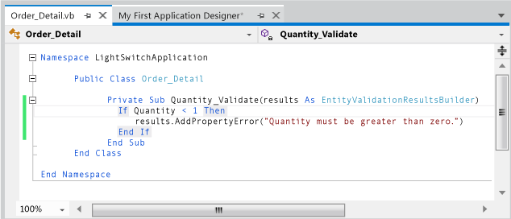

# Validating Data in a LightSwitch Application
This lesson shows how to validate the data that a user enters in a LightSwitch application. For example, in your LightSwitch application, you might want to verify that a telephone number contains the correct number of digits or that a required field isn't empty.  
  
## Adding Data Validation  
 In almost any application that involves data input, the data must be validated before it's saved.  
  
 The **Data Designer** contains an example of one kind of validation: Every entity field has a **Required** check box. If a field is empty but marked as required, LightSwitch displays a warning when the user tries to save the data.  
  
 You can also handle validation in LightSwitch by usingproperties that specify minimum or maximum values for a field, or by writing custom validation code.  
  
#### To set minimum or maximum values  
  
1.  In **Solution Explorer**, open the shortcut menu for the **Contacts.lsml** node, and then choose **Open**.  
  
2.  In the **Data Designer**, on the **Perspective** bar, choose **Server**.  
  
3.  Choose the **<Add Property\>** link and enter `ContactState`.  
  
4.  In the **Type** column, choose `String`.  
  
5.  In the **Required** column, clear the check box to mark the **ContactState** property as optional.  
  
6.  In the **Properties** window, set the **Maximum Length** property to `2`.  
  
     This setting ensures that users can enter no more than two characters in the **ContactState** field.  
  
#### To add custom validation code  
  
1.  In **Solution Explorer**, open the shortcut menu for the **Order_Details.lsml** node, and then choose **Open**.  
  
2.  In the **Data Designer**, on the **Perspective** bar, choose **Server**, and then choose the **Quantity** field.  
  
3.  In the **Properties** window, choose the **Custom Validation** link.  
  
     The **Code Editor** opens, and a code block for the `Quantity_Validate` method appears.  
  
       
  
4.  Add the following code to the `Quantity_Validate` method immediately under the comment line.  
  
    > [!WARNING]
    >  Add either Visual Basic or C# code, depending on the programming language that you chose when you created the project.  
  
    ```vb  
    If Quantity < 1 Then  
        results.AddPropertyError("Quantity must be greater than zero.")  
    End If  
  
    ```  
  
    ```c#  
    if (Quantity < 1)   
    {  
        results.AddPropertyError("Quantity must be greater than zero.");  
    }  
  
    ```  
  
     This code triggers a validation error if a user tries to save a value that's less than one in the **Quantity** field.  
  
## Closer Look  
 This lesson showed how to validate data by setting validation properties or by writing validation code. You can set different properties for different data types. For example, a `String` type has a **Maximum Length** property, and an `Integer` has **Minimum Value** and **Maximum Value** properties. All types have an **Is Required** property, which is used for the **Required** check box in the Data Designer.  
  
 The validation properties for the **Customers** entity appear dimmed and can't be changed. Some fields such as **Address** already have a value in the **Maximum Length** property. You can’t set validation properties for an entity from an attached data source; you can set them only in the entities that you create.  
  
 You can add validation for an entity from an attached data source by writing your own validation code. You can’t override existing validation properties unless you're adding more restrictive validation. For example, for a field that has a **Maximum Length** of 30, you can’t add validation code to set the length to 40. However, you could add code to restrict the length to less than 30.  
  
## Next Steps  
 In the next lesson, you’ll learn how to add computed properties to data entities.  
  
 Next lesson: [Adding Computed Fields](../vs140/Adding-a-Computed-Property-in-a-LightSwitch-Application.md)  
  
## See Also  
 [Working with Data in Kitty Hawk](../vs140/Working-with-Data-in-LightSwitch.md)   
 [How to: Validate Data in a LightSwitch Application](../vs140/How-to--Validate-Data-in-a-LightSwitch-Application.md)   
 [Data and Entities: The Information Behind Your Application](../vs140/Data--The-Information-Behind-Your-Application.md)