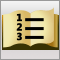

# Visual F# Development Portal
F# is a highly productive programming language combining functional programming and object-oriented programming, and is ideally suited for parallel, algorithmic, technical and explorative development.  
  
|||  
|-|-|  
||`Documentation`   -   [Using Visual Studio to Write F# Programs](../vs140/Using-Visual-Studio-to-Write-F#-Programs.md) -   [F# Language Reference](../Topic/F%23%20Language%20Reference.md) -   [Visual F# Core Library Reference](../Topic/F%23%20Core%20Library%20Reference.md) -   [F# Compiler (fsc.exe) Reference](../vs140/F#-Compiler--fsc.exe--Reference.md) -   [F# Interactive (fsi.exe) Reference](../Topic/F%23%20Interactive%20\(fsi.exe\)%20Reference.md)|  
||`Featured Tasks`   -   [Functions (F#)](../vs140/Functions--F#-.md) -   [Lists (F#)](../Topic/Lists%20\(F%23\).md) -   [Keyword Reference (F#)](../vs140/Keyword-Reference--F#-.md) -   [Sequences (F#)](../Topic/Sequences%20\(F%23\).md) -   [Discriminated Unions (F#)](../vs140/Discriminated-Unions--F#-.md) -   [Walkthrough: Your First F# Program](../vs140/Walkthrough--Your-First-F#-Program.md) -   [Type Providers](../vs140/Type-Providers.md) -   [Query Expressions (F#)](../Topic/Query%20Expressions%20\(F%23\).md)|  
||`Walkthroughs`   -   [Visual F# Walkthroughs](../vs140/Visual-F#-Samples-and-Walkthroughs.md) -   [Walkthrough: Accessing a SQL Database by Using Type Providers (F#)](../Topic/Walkthrough:%20Accessing%20a%20SQL%20Database%20by%20Using%20Type%20Providers%20\(F%23\).md) -   [Walkthrough: Accessing Typed Data from the Entity Data Model (F#)](../Topic/Walkthrough:%20Accessing%20a%20SQL%20Database%20by%20Using%20Type%20Providers%20and%20Entities%20\(F%23\).md)|  
||`Code Samples`   -   [F# Sample Pack](http://go.microsoft.com/fwlink/?LinkId=254878)|  
||`Training`   -   [Learn F#](http://go.microsoft.com/fwlink/?LinkId=254879) -   [Try F#](http://www.tryfsharp.org)|  
||`Forums`   -   [F# General Forum](http://go.microsoft.com/fwlink/?LinkId=248225)|  
||`Articles and Blogs`   -   [Don Syme's WebLog on F# and Related Topics](http://go.microsoft.com/fwlink/?LinkId=254882) -   [F# Team Blog](http://go.microsoft.com/fwlink/?LinkId=254880) -   [Inside F#’s Blog](http://go.microsoft.com/fwlink/?LinkId=254883)|  
||`Channel 9 Videos`   -   [An Introduction to Microsoft F#](http://go.microsoft.com/fwlink/?LinkId=254884) -   [Design Patterns in F#](http://go.microsoft.com/fwlink/?LinkId=254885) -   [Information-Rich Programming in F#](http://go.microsoft.com/fwlink/?LinkId=254886) -   [Web Programming and More](http://go.microsoft.com/fwlink/?LinkId=254887) -   [Patterns and Match Expressions in F#](http://go.microsoft.com/fwlink/?LinkId=254889) -   [Discriminated Unions in F#](http://go.microsoft.com/fwlink/?LinkId=254890)|  
||`MSDN Developer Centers`   -   [Microsoft F# Development Center](http://go.microsoft.com/fwlink/?LinkId=254891)|  
||`Providing Feedback`   To provide feedback about [!INCLUDE[vs_dev12](../vs140/includes/vs_dev12_md.md)], use [Microsoft Connect](http://go.microsoft.com/fwlink/?LinkID=150463).   To provide feedback about the documentation for [!INCLUDE[vs_dev12](../vs140/includes/vs_dev12_md.md)], use the feedback controls on each page about which you want to give feedback.|