# Visual Language Dictionary for Visual Studio
Visual Studio uses a common visual language to illustrate the concepts that are the building blocks of its iconography and other imagery. When designing new icons, use this dictionary to identify the concepts that you want to convey in your own image.  
  
 **General guidelines**  
  
-   These visual concepts must be used consistently with their dictionary definition. Otherwise, you risk confusing your users, who expect common elements to have consistent meanings.  
  
-   Choose only the most relevant or important concepts for use in your icons, so that the imagery is crisp and easy to distinguish.  
  
-   Use only one or two concepts in each image.  
  
-   For more strategies for designing icons, see [Icon design](../vs140/Images-and-Icons-for-Visual-Studio.md#BKMK_IconDesign).  
  
 **Jump to section:**  
  
1.  [Concepts A-Z](../vs140/Visual-Language-Dictionary-for-Visual-Studio.md#BKMK_VLDConcepts)  
  
2.  [Products and platforms](../vs140/Visual-Language-Dictionary-for-Visual-Studio.md#BKMK_VLDProducts)  
  
3.  [Common concepts using arrows](../vs140/Visual-Language-Dictionary-for-Visual-Studio.md#BKMK_VLDArrows)  
  
4.  [Status indicators](../vs140/Visual-Language-Dictionary-for-Visual-Studio.md#BKMK_VLDStatus)  
  
##   Concepts A-Z  
  
###   A  
  
|Concept|Main icon|Other examples|  
|-------------|---------------|--------------------|  
|**Accessibility**|||  
|**Action**|| Action log|  
|The **Action** icon can also be used as an annotation to indicate that the base action will be performed using automatic settings.|||  
|**Activity**|| Code activity|  
|**Actor**|||  
|**Add**|| Add all driver tests Add attachment Add behavior|  
|**Address**|||  
|**Alert**|||  
|**Alpha channel**|||  
|**Animation**|| Animation error Next animation|  
|**Application** Project|| Application role error C++ MFC project|  
|**Area**|| Spline area chart Stacked area series|  
|**Arrange**|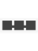| Arrange shapes Auto-arrange shapes|  
|**Assign**|||  
|**Association**|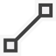|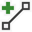 Add association Edit association|  
|**Asymmetric**|||  
|The **Asymmetric** concept is represented by the juxtaposition of opposite imagery (for example, light/dark or left/right).|||  
|**Attach**|| Add attachment Open attachment|  
|**Attribute** Variable, parameter|| Account attribute Add parameter Member variable|  
|**Audio**|| Audio mute Audio playback Sound file|  
|**Audio recording**|| Record mute Record screen and voice|  
|**Autosum**|||  
  
###   B  
  
|Concept|Main icon|Other examples|  
|-------------|---------------|--------------------|  
|**Bidirectional**|||  
|**Binary**|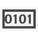| Launch instrumentation target binary|  
|**Bookmark**|| Bookmark project Clear bookmark Go to previous bookmark|  
|**Branch**|| Branch uploaded Remote branch|  
|**Brightness**||Brightness down Brightness up|  
|**Browse**|| Browse next Browse previous|  
|**Bug**|| Create new bug|  
|**Build**|| Build selection Private build instance User-created build|  
|**Builder**|| Cube builder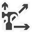 Dimension builder|  
|**Business**|| Business model template Business objects data source Online business|  
|**Button**||Add button Image button Linked button|  
  
###   C  
  
|Concept|Main icon|Other examples|  
|-------------|---------------|--------------------|  
|**Cache**|| Cache OK Cache refresh|  
|**Calendar**|| Date/time axis Global calendar|  
|**Call**|| Call browser Call browser settings Caller or callee view|  
|**Cancel** Same as “Clear” and “Delete”|| Cancel build|  
|**Capture**|| Capture frame Full screenshot Start capturing graphic diagnostics|  
|**CD**|| CD drive|  
|**Certificate**|| Certificate error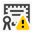 Certificate warning|  
|**Changeset**|| Group changesets New changeset|  
|**Choice toggle**|| Check box field column Check box list|  
|**Class**|| Add class Class details tool window|  
|**Clear** Same as “Cancel” and “Delete”|| Clear all breakpoints Clear bookmark Clear collection|  
|**Close** Terminate|| Close all Close results Terminate process|  
|**Cloud**|| Cloud package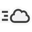 Cloud service|  
|**Code**||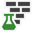 Coded UI test Convert to coded web test|  
|**Collapse**|| Collapse all Return to collapsed value|  
|**Collection**|| Clear collection Count collection|  
|**Column**|| Autosize column Column details Column error|  
|**Comment** Feedback, annotation|| Add comment Callout|  
|**Comment (code)**|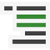| Uncomment|  
|**Compare**|| Compare data Compare folders Compare performance reports|  
|**Component**||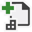 Add component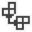 Component diagram Windows Phone RT component|  
|**Connect**|| Add connection Connect test plan Connect to environment|  
|**Console**|| Console test|  
|**Contract (noun)**|| Contract error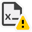 Contract warning|  
|The **Contract (noun)** icon is used to indicate an agreement between the application and the operating system.|||  
|**Contract/expand**| ||  
|The **contract/expand** icons are used in layout situations to indicate that space between two elements will be condensed.|||  
|**Contrast**|||  
|**Control**|| Add control Add custom control Add inherited control|  
|**Convert**|| Convert branch to folder Convert partition Convert to coded web test|  
|**Copy**|| Copy aggregation Copy website|  
|Duplicating and stacking the object represents the **copy** action.|||  
|**Counter**|||  
|**Create**|| Create new bug Create new graph Create new variable|  
|**Cursor** Pointer|| Inspect mode button Set hotspot tool|  
|**Custom expression** Prediction|| Data mining prediction|  
|**Cut**|||  
  
###   D  
  
|Concept|Main icon|Other examples|  
|-------------|---------------|--------------------|  
|**Dark theme**|| Dark theme on|  
|**Data**|| Compare both databases  Database audit specification  Database project|  
|**Data mining**|| Data mining column  Data mining prediction Data mining structure|  
|**Delegate**|| Invoke delegate|  
|**Delete** Same as “Cancel” and “Clear”|| Cancel build  Delete column  Delete dataset  Delete folder|  
|**Dependency**|||  
|**Deploy**|| Deployment configuration extensions  Deployment configurations|  
|**Diagram** Workflow|| New diagram  Show diagram pane|  
|**Dialog**|| Dialog test group  Test dialog|  
|**Dictionary**|| Add new dictionary 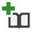 Add to dictionary  Clear dictionary|  
|**Dimension** Plan||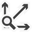 Dimension browser view 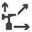 Dimension builder view  Dimension translation view|  
|**Display** Monitor|| Display configuration  Full screenshot|  
|**Document** File|| Documents library  File download  Format document|  
|**Drive**|| CD drive|  
|**Driver**|| Driver package template  Driver test group explorer  Network NDIS driver template|  
|**Dynamic**|| ASP.NET dynamic control  C# dynamic data website  Dynamic validator|  
|**Dynamic value**||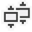 Copy dynamic value  Empty dynamic value|  
  
###   E  
  
|Concept|Main icon|Other examples|  
|-------------|---------------|--------------------|  
|**Edit**|| Address editor  Edit query  Edit relation|  
|The **Edit** annotation faces left or right depending on what the base icon looks like. Choose the orientation that looks best with your overall icon design.|||  
|**Effects** Same as “Function” and “Variable (global)”|||  
|**Empty**|| Blank page  C++ empty project  F# empty website project|  
|**Enumerator**|| Create enumerator|  
|**Environment**|| Connect to environment  Create library environment  Library environment|  
|**Event** Trigger|| Add event  Event log|  
|**Expand**|| Return expanded value|  
|**Export** Same as “Open”|| Export filter  Export report data  Export report filter|  
  
###   F  
  
|Concept|Main icon|Other examples|  
|-------------|---------------|--------------------|  
|**Favorite** Protected, rating|| Add to favorites  Rating|  
|**Field**||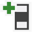 Add field  Edit field|  
|**Field (code element)**|| Go to field New field|  
|**Filter**|| Auto filter  Chart filter  Export filter|  
|**Finance**|| Money editor|  
|**Flagged**|| Flag thread flagged  Flag thread not flagged  Show only flagged threads|  
|**Flow**|||  
|**Folder**|| Documents library  Find in files  Folder open  Linked folder open|  
|**Font**|| Font color  Font size  Serif|  
|**Frame**|||  
|**Friend**|||  
|**Function** Expression Same as “Effects” and “Variable (global)”|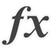|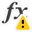 Function warning 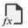 WPF page function|  
  
###   G  
  
|Concept|Main icon|Other examples|  
|-------------|---------------|--------------------|  
|**Get** Download|| Get download folder  Get dictionary value  Get item from collection|  
|**Graph** Bar chart|| HPC performance session|  
|**Graphics (3D)**|||  
|**Grid**|| Asset data grid control  Grid app C++  Toggle grid|  
|**Grid web layout**|| Grid element  Grid splitter element|  
|**Grouping**|| Dialog group  Team  Virtual machines|  
|Stacking multiple objects on top of each other represents the concept of **grouping** or multiplicity.|||  
  
###   H  
  
|Concept|Main icon|Other examples|  
|-------------|---------------|--------------------|  
|**Hierarchy**|| Hierarchy variable  Call hierarchy|  
|**History**|||  
|**Home**|| LightSwitch home screen|  
  
###   I  
  
|Concept|Main icon|Other examples|  
|-------------|---------------|--------------------|  
|**Idea**|||  
|**Image** Assets, resource|| Image loader  Image button  Image list control|  
|**Important** Attention, hot path|| Show hot lines  Hotspot|  
|**Indexer**|| Add indexer|  
|**Inheritance**|| Add inherited control  Add inherited form  Inherited control|  
|The concept of derived **inheritance** is represented by a dotted corner. See also “Nonsubstantive/hidden” and “Virtual.”|||  
|**Inheritance (arrow)**|||  
|The **inheritance (arrow)** icon represents a toolbox control for a modeling surface.|||  
|**Interface**|| Implement interface|  
|**Item**|| Copy item  Create list item  Check in item|  
  
###   K  
  
|Concept|Main icon|Other examples|  
|-------------|---------------|--------------------|  
|**Key** Permission, ID|| New key  Permission  Get current item ID|  
|**Key performance indicator (KPI)**|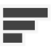| Delete KPI  KPI browser view  KPI with error|  
  
###   L  
  
|Concept|Main icon|Other examples|  
|-------------|---------------|--------------------|  
|**Library**|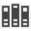| C++ class library project  Exports library  F# Windows Forms control library|  
|**Link**|| Convert to hyperlink  Create linked table  Edit link|  
|**Lock** Private, permission|| Lock X axis  Branch permissions  Private queue|  
|**Log**|| Catalog properties  Action log 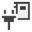 Connect test plan|  
|**Loop**||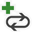 Add or insert conditional loop  Conditional loop|  
  
###   M  
  
|Concept|Main icon|Other examples|  
|-------------|---------------|--------------------|  
|**Mail** Message|| Message queue  Message received trace  Email address viewer|  
|**Manifest**|| Edit manifest  Extension manager manifest  New application manifest|  
|**Markup**|| Markup error  Markup tag  Tag or event snippet 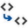 Match tag  Edit tag|  
|The **markup** concept is also used as an element in several compound concepts.|||  
|**Markup: HTML (web)**|| HTML file|  
|**Markup: XAML (WPF)**|| WPF application  WPF browser application VB  WPF control library|  
|**Markup: XML**|| Reload XML  XML file|  
|**Master page**|| File from new master|  
|**Measure**|| Measure calculated  Measure expression|  
|**Media** Film|| My movie collection|  
|**Member** Material editor, specular for 3D|| Add member  Member calculated  Member variable|  
|**Memory (chip)**|| Memory configuration  Memory array  Page file|  
|**Memory** Memory tool window|||  
|**Merge**|| Automerge all  Merge changes with tool  Merge module reference|  
|**Message** Chat|||  
|**Method**||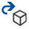 Extract method  Invoke method  Cube builder view|  
|**Mobile phone**|| Mobile services 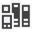 Mobile game components  VB mobile web project|  
|**Module**|| Merge module project  Add module  Merge module exclude|  
|**Move**|||  
  
###   N  
  
|Concept|Main icon|Other examples|  
|-------------|---------------|--------------------|  
|**Namespace**|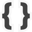|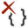 Remove using namespace 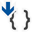 Sort using namespace 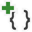 Add using namespace|  
|**Network** Connection|| Network driver package template  Connection offline 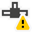 Connection unknown|  
|**Node** Crosshair|||  
|**Nonsubstantive (hidden or template)** Same as “Virtual”||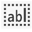 Hidden field 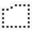 Hidden folder  Dynamic template|  
|A dotted outline of an object indicates that it is **hidden or templated**.|||  
|**Note**|||  
  
###   O  
  
|Concept|Main icon|Other examples|  
|-------------|---------------|--------------------|  
|**Open** Same as “Export”|| Open attachment  Open comparison result  Open file dialog|  
|**Output**|||  
  
###   P  
  
|Concept|Main icon|Other examples|  
|-------------|---------------|--------------------|  
|**Package**|| Cloud package 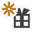 Create package  Driver package template|  
|**Parallel**|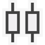| Parallel for each|  
|**Partition**|| Partition scheme  New partition  Partition function|  
|**Parts**|| Assigned part  Misassigned part|  
|**Performance**|||  
|**Pin**|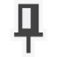|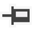 Unpin|  
|**Planning**|||  
|The **Planning** icon is used to indicate part of a workflow on a design surface.|||  
|**Policy**|| Visual Studio policy cache  Visual Studio policy description language|  
|**Pop out**|| Pop in|  
|**Power**|| Uninterruptible power supply|  
|**Previous**|| Previous bookmark  Find previous|  
|**Print**|| Print direct  Print dialog  Print document control|  
|**Procedure** Interactive window|| Python interactive window  Procedure warning  Stored procedure|  
|**Property** Settings, configurations|| Add property  Extended property – warning  New property|  
  
###   Q  
  
|Concept|Main icon|Other examples|  
|-------------|---------------|--------------------|  
|**Query**|| Edit query  Query extender  Quick query|  
  
###   R  
  
|Concept|Main icon|Other examples|  
|-------------|---------------|--------------------|  
|**Record**|| Record screen  Go to recorded test session|  
|**Redo**|||  
|**Reference**|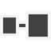|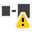 Broken reference  Go to reference  Merge module reference|  
|**Refresh**|| Refresh cloud service  Cache refreshing|  
|**Relationship** Branch||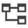 Define relationship 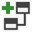 Add relationship  Parent-child|  
|**Remote**|| Remote branch  Remote desktop|  
|**Remove**|||  
|**Rename**|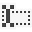||  
|**Reorder**|| Reorder parameters|  
|**Repair**|||  
|**Report**|| File dialog report  Instrumentation performance report  Report project wizard|  
|**Rule**|| New extraction rule 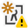 New threshold rule  New validation rule|  
|**Ruler** Measure, guide||Measure mode on 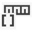 Units of measure|  
  
###   S  
  
|Concept|Main icon|Other examples|  
|-------------|---------------|--------------------|  
|**Save**|| Save all  Save and close  Save file dialog control|  
|**Schema**|| Create schema  Database schema  XML schema|  
|**Script**|| Export to script  Generate change script|  
|**Search** Find, lookup|| Find in files  Find results|  
|**Server (local)**||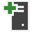 Add SQL server  Login server role  Configure computers|  
|**Server (remote)**||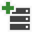 Add server  Run server tests|  
|**Settings** Services, process|| Call browser settings 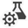 Test settings  Prepare process failed|  
|**Share**|||  
|**Shortcut**|||  
|**Snippet**|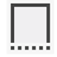| Snippet checked  Tag or event snippet|  
|**Source control**|| Change source control|  
|**Start** Run|| Run concurrency profiling  Server started  Start graphic diagnostics|  
|**Steps** Stage, phase|| Create shared steps  Insert shared steps 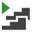 Play all steps|  
|**Structure** Struct|||  
|**Style sheet**|| New style sheet  Attach style sheet|  
|**Synchronize** Update|| Updated JavaScript  Database updated items  Sync|  
  
###   T  
  
|Concept|Main icon|Other examples|  
|-------------|---------------|--------------------|  
|**Table**|| Table warning  Cloud storage table collection|  
|**Tablet**|| Tablet settings  Tablet warning|  
|**Tag** Tagging system|||  
|**Task**|| Linked task  Task list|  
|**Team**|| New team project  Add team project  Team Foundation Server|  
|**Text**|| Picture and text  Rich text box  Text – first indent on|  
|**Thread**|| Many threads stopped  Hide all except selected threads  Hide selected threads|  
|**Time** Pending|| Time up or down  Time picker on|  
|**Timer**|| Time finish  Time start|  
|**Toggle**|| Toggle all breakpoints  Toggle|  
|**Toolbox**|| Winform toolbox control  WPF toolbox control|  
  
###   U  
  
|Concept|Main icon|Other examples|  
|-------------|---------------|--------------------|  
|**Undo** Revert, restore|| Image restore  Undo check out item|  
|**Up** Upload|| File upload parameter  One level up|  
|**User** Role, profile|| Add user  Add web user control  SQL user-defined types|  
|**User interface** UI|||  
  
###   V  
  
|Concept|Main icon|Other examples|  
|-------------|---------------|--------------------|  
|**Variable (local)**|| New variable  Local variable  SQL variable|  
|**Variable (global)** Same as “Effects” and “Function”|| Variable properties  Global variable  Delete variable|  
|**View**|| Advanced view  Data source view|  
|**View** Audit|| Resource view  View in browser  X-ray view|  
|**Virtual** Same as “Nonsubstantive (hidden or template)”|| Virtual environment|  
|Visible|| Cloak or hide|  
  
###   W  
  
|Concept|Main icon|Other examples|  
|-------------|---------------|--------------------|  
|**Watch**|| File system watcher|  
|**We b**|| Publish to web  Download web settings  New website|  
|**Wizard**|| Map layer wizard  MFC class wizard  Map wizard|  
|**Work item**|| Go to work item  Work item query|  
  
###   Y  
  
|Concept|Main icon|Other examples|  
|-------------|---------------|--------------------|  
|**Yield**|||  
  
###   Z  
  
|Concept|Main icon|Other examples|  
|-------------|---------------|--------------------|  
|**Zoom**|| Zoom in  Zoom out|  
  
##   Products and platforms  
  
|Concept|Main icon|Other examples|  
|-------------|---------------|--------------------|  
|**App Insights**|||  
|**ATL**|| ATL active server page component  ATL control class  ATL server|  
|**Blend**|| Blend SketchFlow application  Blend Windows Phone application  Blend Windows Phone pivot application|  
|**CoffeeScript**|||  
|**Crystal reports**|| Crystal reports|  
|**GitHub**|||  
|**LightSwitch**|| C# LightSwitch extension library|  
|**Mercury**|||  
|**Microsoft Foundation Class (MFC)**|| MFC ActiveX control project  MFC application project  C++ MFC DLL project|  
|**Visual Studio**|| Feedback tool|  
|**Visual Studio (transparent logo)**|| Visual Studio solution file (11)  Visual Studio solution file (12)  Visual Studio settings|  
|**Visual Studio Blend**|||  
|**Visual Studio Express for Web**|||  
|**Visual Studio Express for Windows**|||  
|**Visual Studio Express for Win 8**|||  
|**Visual Studio Express for Windows Phone**|||  
|**Visual Studio Online**|||  
|**Visual Studio for Windows Desktop**|||  
|**WCF**|| WCF data services  WCF project F#  WCF project VB|  
|**WF**|| WF project C#  WF project VB|  
  
##   Common concepts using arrows  
  
|Concept|Main icon|Other examples|  
|-------------|---------------|--------------------|  
|**Association line**|||  
|**Branch**|||  
|**Camera orbit**|||  
|**Connector**|||  
|**Current context**|||  
|**Current location**|||  
|**Current row**|||  
|**Cursor**|||  
|**Delegation tool**|||  
|**Dependency**|||  
|**Direct selection**|||  
|**Down** Download|| Download web settings  Download folder  Sort ascending|  
|**Dynamic**|| ASP.NET dynamic control  Dynamic validator  C# dynamic data website|  
|**Expand**|||  
|**Export**|| Export filter  Export report filter (data)  Export report filter|  
|**(Glyph) up**|||  
|**(Glyph) down**|||  
|**(Glyph) next**|||  
|**(Glyph) previous**|||  
|**(Glyph) collapsed file picker**|||  
|**(Glyph) expanded file picker**|||  
|**Import**|| Import catalog part  Import filter|  
|**Inheritance**|||  
|**Instruction pointer**|| Current pointer  Historical pointer  Call return pointer|  
|**Merge**|| Automerge all  Merge changes with tool  Merge module reference|  
|**Move to bottom**|||  
|**Move to top**|||  
|**Navigate back**|| Hyperlink back|  
|**Navigate forward**|| Hyperlink forward|  
|**Next** Generate, go to|| Next error  Generate table  Go to source code|  
|**Open**|| Open attachment  Open comparison result  Open file dialog|  
|**Previous**|| Previous bookmark  Find previous|  
|**Redo**|||  
|**Reorder**|| Reorder parameters|  
|**Sync**|| Sync contents|  
|**Undo** Revert, restore|| Image restore  Uncomment|  
|**Up** Upload|| File upload parameter  One level up|  
  
##   Status indicators  
  
|Concept|Main icon|Other examples|  
|-------------|---------------|--------------------|  
|**Action status: paused**|| Server paused|  
|**Action status: playing, running**|| Server started  Never run|  
|**Action status: stopped**|| Server stopped|  
|**Alert**|| Linked table with error tab cue  Code analysis window|  
|**Breakpoint: advanced disabled**|||  
|**Breakpoint: advanced enabled**|||  
|**Breakpoint: bound**|||  
|**Breakpoint: disabled**|||  
|**Breakpoint: enabled**|| Breakpoints window  Clear all breakpoints  Toggle all breakpoints|  
|**Breakpoint: mapped disabled**|||  
|**Breakpoint: mapped enabled**|||  
|**Complete and OK**|| Task complete  Process done  Cloud service OK|  
|**Error**|| Breakpoint error  Certificate error  Check constraint|  
|**Help/inconclusive**|| Compiled MS help file  MS help index file|  
|**Information**|| Rigid info relationship  System info|  
|**Information tooltip**|||  
|**Invalid**|||  
|**No** Mute, not applicable|| Microphone mute  Audio mute|  
|**Remove** Offline, critical|| Connection offline  Folder offline  Stop query|  
|**Required**|| Test suite requirement|  
|**Security shield alert**|||  
|**Security shield complete and OK**|||  
|**Security shield critical**|||  
|**TracePoint: advanced disabled**|||  
|**TracePoint: advanced enabled**|||  
|**TracePoint: bound**|||  
|**TracePoint: disabled**|| TracePoint with error  TracePoint with warning|  
|**TracePoint: enabled**|||  
|**Warning**|| Missing application role  Assembly not found  Key not found|