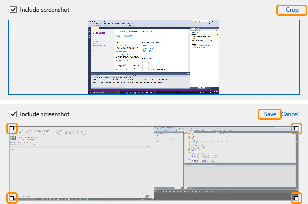
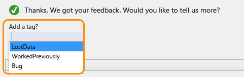
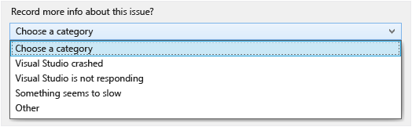
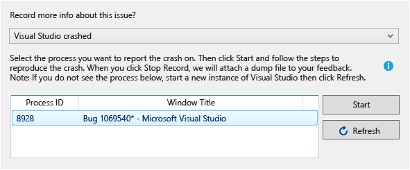
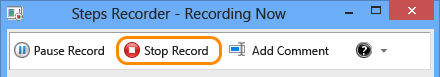
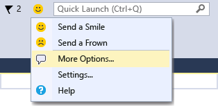

# Visual Studio Send a Smile Instructions
Are you looking for a fast and easy way to send feedback or report a bug to the Visual Studio product team? **Send a Smile** enables you to share your thoughts, provide screenshots, and even record the repro steps for performance issues, hangs and crashes.  Our product team uses your feedback to help prioritize features and to quickly fix product issues that are affecting you.  The remainder of this article details each of the capabilities of **Send a Smile** to help ensure your feedback gets the attention it deserves!  
  
## How to send us feedback  
 Using **Send a Smile** is simple.  If you see something that you like, send us a smile to tell us about it.  If you don’t like something or you encounter a bug, send us a frown. If you want to file a bug, just select “More Options” from the **Send a Smile** Menu Icon. If there is additional information you can provide so we can better understand what you liked and why or didn’t like and why, it helps immensely by making the feedback actionable for us. **Send a Smile** includes several tools to make it easy to share that information as well.  
  
 We’d also love to hear your suggestions for improving existing features and for new features. We’ve found that our UserVoice site tends to be a better place to share your ideas since it enables the community to vote for your suggestions and also enables discussions – so consider sharing your ideas there.  This will help us have a more detailed insight into your suggestion and enable conversation with you and other customers who fall in love with your idea!  
  
## Send a smile  
 Launch **Send a Smile** by clicking the smiley face icon, located next to the Quick launch search box on the right side of the Visual Studio title bar, or by choosing **Help &#124; Customer Feedback Options &#124;  Send a Smile** from the main menu.  
  
   
  
### Add a screenshot (optional)  
 The **Send a Smile** dialog offers an option to include a screenshot and enables you to crop the image to include only the relevant area (or to remove sensitive information that you don't want to share). Choose **Include Screenshot** to see a screenshot of your current Visual Studio window(s). Click **Crop** to display boxes in the four corners of the image. Drag the boxes to size and position the final screenshot that will be sent to Microsoft, and then click **Save**.  
  
   
  
### Include your email address (optional)  
 You can also include your email address (optional). Providing an email address helps us follow up with you for additional details to help diagnose the issue.  
  
## Send a frown  
 Use **Send a Frown** to tell the team about something that you don't like about Visual Studio. **Send a frown** is similar to **Send a Smile**, but it also enables you to optionally send additional information to Microsoft about the problem you are experiencing. After you click on the **Send a Frown** button at the bottom of the initial screen, you will see a second screen to provide optional additional information. This information will help us diagnose the issue faster. If you don’t want to provide any additional information, just click on **No Thanks**.  
  
### Add a tag  
 You can add a tag to your report that helps identify the kind of issue you are experiencing. You can use one of the predefined values or you can create your own tag. When creating your own tag things that help us are: what area of the product you were in when the problem occurred, what project type you were using, the action you were taking, and so on.  
  
   
  
##### To record a dump or trace file  
  
1.  If your issue is related to a crash, hang, or performance, you can optionally record the behavior on your computer into a file and send that file to us. These files are very useful to help us diagnose issues. The kind of file that is created depends on the category of the problem. First, choose the category:  
  
       
  
2.  To record the file, start up a second instance of Visual Studio on which to reproduce the steps that cause the issue. You will use the current instance to do the recording. After you start a second instance, you will see it in the dialog as shown here:  
  
       
  
     If you don't see the instance, click **Refresh**.  
  
3.  Press **Start** (for a crash or performance issue) or **Collect** (for a hang). You will see a **Recording** window appear. Record the steps to reproduce the issue. When you are done recording, press **Stop Record** or **End Recording**.  
  
       
  
4.  Wait for the file to be created. This might take a few minutes. When you’re ready to update your feedback, click the **Update** button. This adds the additional feedback and submits it to us. When the dialogue box disappears, the feedback has been sent to us.  
  
##### To send other kinds of files  
  
1.  If you choose a problem category of **Other**, you can send us screenshots or other files that might help us understand the issue.  
  
### To file a Bug on Connect by using the “More Options” menu item  
 If you have a problem that you believe is a bug, you can also file a bug via the **Send a Smile** menu.  
  
   
  
 On the Connect page, click on **Submit a bug** and fill in the data requested. You can create ETL or dump files by following the steps described earlier on this page.  
  
## Privacy and other supporting information  
 For more information about your privacy when you use Microsoft Feedback Tools, read the [Microsoft Online privacy statement](http://privacy.microsoft.com/en-us/default.mspx).  
  
## See Also  
 [Talk to Us](../vs140/Talk-to-Us.md)