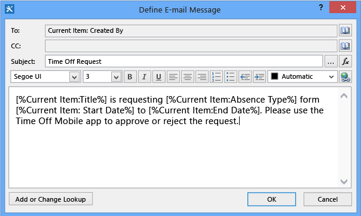
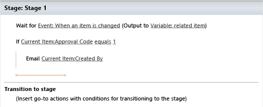
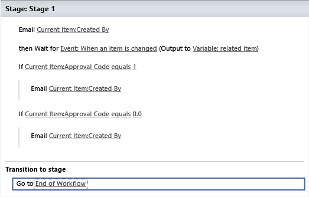

# Walkthrough: Accessing a SharePoint Workflow from a LightSwitch Mobile App
By using LightSwitch, you can create mobile apps that access and update SharePoint workflows, which help ensure that business processes are performed in a particular sequence. For example, you might use a workflow to route a document for approval or to process a payroll.  
  
 In this walkthrough, you’ll create a workflow for requesting and approving time off, hosting a list on SharePoint for Office 365. You’ll also build a client app in HTML so that managers can approve or deny those requests on mobile devices.  
  
## Prerequisites  
  
-   This walkthrough requires the sample files in the download [Acessing a SharePoint Workflow from a LightSwitch Mobile App](http://code.msdn.microsoft.com/Accessing-a-SharePoint-48ed4467).  
  
-   To host the app, you must also have a SharePoint Developer site on Office 365, which you can get from the [Developer Center for Apps for Office and SharePoint](http://go.microsoft.com/fwlink/?LinkId=263490).  
  
## Create a SharePoint List and Workflow  
 As your first steps in creating your app, you'll create a SharePoint list for requesting time off and then design a workflow for approving the requests.  
  
#### To create the list  
  
1.  In a web browser, open your SharePoint Developer site by entering the URL `https://`*Account*`.sharepoint.com/sites/Developer`, where *Account* is the name of your Office 365 developer account.  
  
2.  On the Office 365 menu bar, choose the **Settings** icon, and then choose the **Site Settings** menu item.  
  
3.  In the **Web Designer Galleries** list, choose **List Templates**.  
  
4.  On the **Web Designer Gallery** page, on the menu bar, choose **Files**, **Upload Document**.  
  
5.  In the **Add a Template** dialog box, choose the **browse** button, locate the **TimeOffListTemplate.stp** template file in the sample download, and then choose the **OK** button.  
  
6.  In the **List Template Gallery** dialog box, choose the **Save** button.  
  
7.  On the Office 365 menu bar, choose the **Settings** icon, choose **Site Contents**, choose the **add an app** link, and then choose **Request Time Off**.  
  
8.  In the **Adding Custom List** dialog box, name the list `Request Time Off`, and then choose the **Create** button.  
  
     The list is added to the **Site Contents** page.  
  
9. On the **Site Contents** page, choose the **Request Time Off** list icon to open the list.  
  
#### To create the workflow  
  
1.  On the menu bar, choose **List**, and then, on the ribbon, choose **Workflow Settings**, **Create a Workflow in SharePoint Designer**.  
  
     SharePoint Designer opens, and a **Create List Workflow** dialog box appears.  
  
2.  In the **Create List Workflow** dialog box, in the **Name** box, enter `Time Off Workflow`, and then choose the **OK** button.  
  
3.  On the ribbon, choose **Action**, and then choose **Send an Email**.  
  
     An **Email these users** action appears in the designer.  
  
4.  Choose the **these users** link.  
  
     The **Define E-mail Message** dialog box appears.  
  
5.  ###### To define the email  
6.  1.  For the **To** box, choose the **Browse** icon.  
  
         The **Select Users** dialog box appears.  
  
    2.  In the **Or select from existing Users and Groups** list, choose **User who created current item**.  
  
        > [!NOTE]
        >  The developer account doesn’t support multiple users, so, in this case, the mail will be sent to your email address for the account. In a production environment, you would choose the manager of the employee who requested time off or a payroll group who has approval permissions.  
  
    3.  Choose the **Add** button, and then choose the **OK** button.  
  
    4.  In the **Subject** box, enter `Time Off Request`, and then choose the **Add or Change Lookup** button.  
  
         The **Lookup for String** dialog box appears.  
  
    5.  In the **Field from source** list, choose **Title**, and then choose the **OK** button.  
  
    6.  Enter  `is requesting` , and then choose the **Add or Change Lookup** button.  
  
    7.  In the **Field from source** list, choose **Absence Type**, and then choose the **OK** button.  
  
    8.  Enter  `from` , and then choose the **Add or Change Lookup** button.  
  
    9. In the **Field from source** list, choose **Start Date**, and then choose the **OK** button.  
  
    10. Enter  `to` , and then choose the **Add or Change Lookup** button.  
  
    11. In the **Field from source** list, choose **End Date**, and then choose the **OK** button.  
  
    12. Enter `. Please use the Time Off Mobile app to approve or reject the request.`, and then choose the **OK** button.  
  
         The completed email definition should look like the following illustration.  
  
           
7.  On the ribbon, choose **Action**, **Wait for Event in List Item**.  
  
     A **Wait for this item event** action appears in the designer.  
  
8.  Choose the **this item event** link.  
  
     The **Choose List Item Event** dialog box appears.  
  
9. In the **Event** list, choose **Event: When an item is changed**.  
  
10. In the **List** list, choose **Current List**, and then choose the **OK** button.  
  
11. On the ribbon, choose **Condition**, **If any value equals value**.  
  
12. Choose the first **value** link, and then choose the **Define workflow lookup** button.  
  
     The **Define Workflow Lookup** dialog box appears.  
  
13. In the **Field from source** list, choose **Approval Code**, and then choose the **OK** button.  
  
14. Choose the second **value** link, enter `1`, and then choose the **Start typing or use the Insert group on the Ribbon** section.  
  
15. On the ribbon, choose **Action**, **Send an Email**.  
  
     An **Email these users** action appears in the designer.  
  
16. ###### To define the email  
17. 1.  Choose the **these users** link.  
  
         The **Define E-mail Message** dialog box appears.  
  
    2.  For the **To** field, choose the **Browse** icon.  
  
         The **Select Users** dialog box appears.  
  
    3.  In the **Or select from existing Users and Groups** list, choose **User who created current item**.  
  
    4.  Choose the **Add** button, and then choose the **OK** button.  
  
    5.  In the **Subject** box, enter `Time Off Approved`.  
  
    6.  In the body of the email message, enter `Your request for [%Current Item:Absence Type%] from [%Current Item:Start Date%] to [%Current Item:End Date%] has been approved. [%Current Item:Comments%]`, and then choose the **OK** button.  
18. Choose the space below the current condition, as the following illustration shows.  
  
       
  
     A yellow line appears.  
  
19. On the ribbon, choose **Condition**, **If any value equals value**.  
  
20. Choose the first **value** link, and then choose the **Define workflow lookup** button.  
  
     The **Define Workflow Lookup** dialog box appears.  
  
21. In the **Field from source** list, choose **Approval Code**, and then choose the **OK** button.  
  
22. Choose the second **value** link, enter `0`, and then choose the **Start typing or use the Insert group on the Ribbon** section.  
  
23. On the ribbon, choose **Action**, **Send an Email**.  
  
24. ###### To define the email  
25. 1.  Choose the **these users** link.  
  
         The **Define E-mail Message** dialog box appears.  
  
    2.  For the **To** field, choose the **Browse** icon.  
  
         The **Select Users** dialog box appears.  
  
    3.  In the **Or select from existing Users and Groups** list, choose **User who created current item**.  
  
    4.  Choose the **Add** button, and then choose the **OK** button.  
  
    5.  In the **Subject** box, enter `Time Off Request Denied`.  
  
    6.  In the body of the email, enter `Your request for [%Current Item:Absence Type%] from [%Current Item:Start Date%] to [%Current Item:End Date%] has been denied. [%Current Item:Comments%]`, and then choose the **OK** button.  
26. Choose the **Transition to stage** section, and then, on the ribbon, choose **Action**, **Go to a stage**.  
  
27. Choose the **a stage** link, and then choose **End of Workflow**.  
  
     The completed workflow should look like the following illustration.  
  
       
  
#### To publish the workflow  
  
1.  In SharePoint Designer, on the ribbon, choose **Workflow Settings**.  
  
2.  In the **Start Options** section, select the **Start workflow automatically when an item is created** check box.  
  
3.  On the ribbon, choose **Publish**.  
  
     The workflow is published and associated with the **Request Time Off** list.  
  
## To create the client app  
 As your next step, you'll create a mobile client app to approve or reject requests for time off. The app will use the SharePoint list as a data source, and you’ll write code to update a hidden Approval Code field in the list when a request is saved.  
  
#### To enable SharePoint  
  
1.  In Visual Studio, on the menu bar, choose **File**, **New Project**.  
  
2.  In the list of templates, expand the **Visual Basic** or **Visual C#** node, choose the **LightSwitch** node, and then choose either **LightSwitch HTML Application (Visual Basic)** or **LightSwitch HTML Application (Visual C#)**.  
  
3.  In the **Name** text box, enter `Time Off`, and then choose the **OK** button.  
  
4.  In **Solution Explorer**, choose the **Time Off** node.  
  
5.  On the menu bar, choose **Project**,  **Enable SharePoint**.  
  
6.  In the **Enabling SharePoint** wizard, enter `https://`*Account*`.sharepoint.com/sites/Developer`, where *Account* is the name of your Office 365 developer account, and then choose the **Finish** button.  
  
     A SharePoint project is added to the solution.  
  
#### To attach to the SharePoint list  
  
1.  In **Solution Explorer**, open the shortcut menu for the **Time_Off.Server** node, and then choose **Add Data Source**.  
  
2.  In the **Attach Data Source Wizard**, choose the **SharePoint** icon, and then choose the **Next** button.  
  
3.  In the **Specify the SharePoint site address** box, enter `https://`*Account*`.sharepoint.com/sites/Developer`, where *Account* is the name of your Office 365 developer account, and then choose the **Next** button.  
  
4.  Expand the **Lists** node, and then select the **RequestTimeOff** check box.  
  
5.  In the **Specify the name of the data source** box, enter **TimeOffList**, and then choose the **Finish** button.  
  
     The **RequestTimeOff** entity appears in the Entity Designer.  
  
#### To create the user interface  
  
1.  In **Solution Explorer**, open the shortcut menu for the **Time_Off.HTML Client** node, and then choose **Add Screen**.  
  
     The **Add New Screen** dialog box opens.  
  
2.  In the **Screen Data** list, choose **TimeOffList.RequestTimeOffs**, and then choose the **OK** button.  
  
3.  In the Screen Designer, choose the **Screen &#124; Browse Request Time Offs** node.  
  
4.  In the **Properties** window, set the **Display Name** property to `Time Off Mobile`.  
  
5.  In the Screen Designer, choose the **List &#124; Request Time Offs** node.  
  
6.  In the **Properties** window, choose the **Item Tap: None** link.  
  
     The **Edit Item Tap** dialog box appears.  
  
7.  In the **showTab** list, choose **editSelected**, and then choose the **OK** button.  
  
     The **Add New Screen** dialog box appears.  
  
8.  In the **Name** box, enter `ApproveTimeOff`, and then choose the **OK** button.  
  
9. In the Screen Designer, choose the **Title** field, and then change the control type to **Text**.  
  
10. In the **Properties** window, set the **Display Name** property to `Employee`.  
  
11. In the Screen Designer, choose the **Start Date**, **End Date**, and **Absence Type** fields, and change their control types to **Text**.  
  
12. Delete the **Rows Layout &#124; Right** node.  
  
#### To write the approval code  
  
1.  In **Solution Explorer**, open the shortcut menu for the **RequestTimeOffs.lsml** node, and then choose **Open**.  
  
2.  On the menu bar, open the **Write Code** list, and then choose the **RequestTimeOffs_Updating** method.  
  
3.  In the Code Editor, add the following Imports or using statements:  
  
    ```vb  
    Imports Microsoft.SharePoint.Client  
    ```  
  
    ```c#  
    using Microsoft.SharePoint.Client;  
  
    ```  
  
4.  Add the following code to the **Updating** method:  
  
    ```vb  
    If entity.Status = "Approved" Then  
                    entity.ApprovalCode = 1  
                ElseIf entity.Status = "Rejected" Then  
                    entity.ApprovalCode = 0  
                End If  
    ```  
  
    ```c#  
    {  
    if (entity.Status == "Approved") {  
    entity.ApprovalCode = 1;  
    } else if (entity.Status == "Rejected") {  
    entity.ApprovalCode = 0;  
    }  
    }  
  
    ```  
  
     This code gets the value of the **Status** field and updates the **ApprovalCode** field accordingly. The **Status** field is accessible to users on the SharePoint list, so employees can approve their own requests. By using the hidden **ApprovalCode**, you ensure that only requests that managers approve trigger the next step in the workflow.  
  
## Test the App  
 Now you’re ready to see the workflow and app in action. You’ll need to add your developer account to your email client if you haven't already. The email account ID is the same as your user ID: *YourName*@*Account.*onmicrosoft.com.  
  
#### To add a vacation request  
  
1.  On your SharePoint developer site, choose the **Site Contents** link, and then choose **Request Time Off**.  
  
2.  Choose the **New Item** link, fill out the form, and then choose the **Save** button.  
  
     The workflow starts by executing the first step and sending an email. If you refresh your browser, you can verify that the **Time Off Workflow** field is set to **Stage 1**.  
  
3.  In your email client, locate the **Time Off Requested** email from **Developer**, and verify that it contains the information that you entered in the form.  
  
    > [!NOTE]
    >  The email may take some time to arrive.  
  
#### To review the request  
  
1.  In Visual Studio, on the menu bar, choose **Debug**, **Start Debugging** to run the app.  
  
     If prompted, enter the user ID and password for your developer account.  
  
2.  When the **Do you trust Time Off?** page appears in your browser, choose the **Trust it** button.  
  
3.  On the **Time Off Mobile** screen, choose the entry for the name that you entered in the **Request Time Off** form.  
  
4.  On the **Approve Time Off** screen, choose the **Status** list, and then choose either **Approved** or **Rejected**.  
  
5.  In the **Comments** box, enter a comment, and then choose the **Save** button.  
  
     The changes are saved to the SharePoint list, the next step in the workflow is triggered, and the code in the **Updating** method is run.  
  
6.  In your email client, locate the **Time Off Approved** or **Time Off Request Denied** email from **Developer**, and verify that it contains the comment that you entered.  
  
7.  On your SharePoint developer site, refresh the page, and then verify that the status is updated and contains the comment that you entered.  
  
8.  To view the workflow status, choose the **Stage 1** link for the request, and then verify that the **Internal Status** value is **Completed**.  
  
## Next Steps  
 Now that you’ve verified that everything works, you can publish the LightSwitch app and access it from your mobile device. You’ve learned how to create a simple workflow and access it from LightSwitch, but you can do much more. For example, you might add logic to the app to verify that the dates are valid workdays, or you could add a step to the workflow to move approved requests to another list and start another workflow for payroll processing.  
  
## See Also  
 [LightSwitch Apps for SharePoint](../vs140/LightSwitch-Apps-for-SharePoint.md)   
 [How to: Host a LightSwitch HTML Client Application on SharePoint](../vs140/How-to--Host-a-LightSwitch-HTML-Client-Application-on-Sharepoint.md)   
 [HTML Client Screens for LightSwitch Apps](../vs140/HTML-Client-Screens-for-LightSwitch-Apps.md)