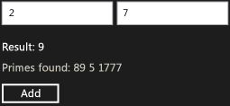

# Walkthrough: Creating a Basic Windows Runtime Component Using WRL
This document shows how to use the [!INCLUDE[cppwrl](../vs140/includes/cppwrl_md.md)] ([!INCLUDE[cppwrl_short](../vs140/includes/cppwrl_short_md.md)]) to create a basic [!INCLUDE[wrt](../vs140/includes/wrt_md.md)] component. The component adds two numbers and raises an event when the result is prime. This document also demonstrates how to use the component from a [!INCLUDE[win8_appname_long](../vs140/includes/win8_appname_long_md.md)] app that uses JavaScript.  
  
## Prerequisites  
  
-   Experience with the [Windows Runtime](http://msdn.microsoft.com/library/windows/apps/br211377.aspx).  
  
-   Experience with COM.  
  
### To create a basic [!INCLUDE[wrt](../vs140/includes/wrt_md.md)] component that adds two numbers  
  
1.  In Visual Studio, create a Visual C++ `WRLClassLibrary` project. The document [Class Library Project Template (WRL)](../vs140/WRL-Class-Library-Project-Template.md) describes how to download this template. Name the project `Contoso`.  
  
2.  In Contoso.cpp and Contoso.idl, replace all instances of "WinRTClass" with "Calculator".  
  
3.  In Contoso.idl, add the `Add` method to the `ICalculator` interface.  
  
     [!CODE [wrl-basic-component#1](../CodeSnippet/VS_Snippets_Misc/wrl-basic-component#1)]  
  
4.  In Contoso.cpp, add the `Add` method to the `public` section of the `Calculator` class.  
  
     [!CODE [wrl-basic-component#2](../CodeSnippet/VS_Snippets_Misc/wrl-basic-component#2)]  
  
    > [!IMPORTANT]
    >  Because you’re creating a COM component, remember to use the `__stdcall` calling convention.  
  
     We recommend that you use `_Out_` and other source annotation language (SAL) annotations to describe how a function uses its parameters. SAL annotations also describe return values. SAL annotations work with the [C/C++ Code Analysis tool](../vs140/Code-Analysis-for-C-C---Overview.md) to discover possible defects in C and C++ source code. Common coding errors that are reported by the tool include buffer overruns, uninitialized memory, null pointer dereferences, and memory and resource leaks.  
  
### To use the component from a [!INCLUDE[win8_appname_long](../vs140/includes/win8_appname_long_md.md)] app that uses JavaScript  
  
1.  In Visual Studio, add a new JavaScript `Blank App` project to the `Contoso` solution. Name the project `CalculatorJS`.  
  
2.  In the `CalculatorJS` project, add a reference to the `Contoso` project.  
  
3.  In default.html, replace the `body` section with these UI elements:  
  
     [!CODE [wrl-basic-component#3](../CodeSnippet/VS_Snippets_Misc/wrl-basic-component#3)]  
  
4.  In default.js, implement the `OnClick` function.  
  
     [!CODE [wrl-basic-component#4](../CodeSnippet/VS_Snippets_Misc/wrl-basic-component#4)]  
  
    > [!NOTE]
    >  In JavaScript, the first letter of a method name is changed to lowercase to match the standard naming conventions.  
  
### To add an event that fires when a prime number is calculated  
  
1.  In Contoso.idl, before the declaration of `ICalculator`, define the delegate type, `PrimeNumberEvent`, which provides an `int` argument.  
  
     [!CODE [wrl-basic-component#5](../CodeSnippet/VS_Snippets_Misc/wrl-basic-component#5)]  
  
     When you use the `delegate` keyword, the MIDL compiler creates an interface that contains an `Invoke` method that matches that delegate's signature. In this example, the generated file Contoso_h.h defines the `IPrimeNumberEvent` interface, which is used later in this procedure.  
  
     [!CODE [wrl-basic-component#13](../CodeSnippet/VS_Snippets_Misc/wrl-basic-component#13)]  
  
2.  In the `ICalculator` interface, define the `PrimeNumberFound` event. The `eventadd` and `eventremove` attributes specify that the consumer of the `ICalculator` interface can both subscribe to and unsubscribe from this event.  
  
     [!CODE [wrl-basic-component#6](../CodeSnippet/VS_Snippets_Misc/wrl-basic-component#6)]  
  
3.  In Contoso.cpp, add a `private`[Microsoft::WRL::EventSource](../vs140/EventSource-Class.md) member variable to manage the event subscribers and invoke the event handler.  
  
     [!CODE [wrl-basic-component#7](../CodeSnippet/VS_Snippets_Misc/wrl-basic-component#7)]  
  
4.  In Contoso.cpp, implement the `add_PrimeNumberFound` and `remove_PrimeNumberFound` methods.  
  
     [!CODE [wrl-basic-component#8](../CodeSnippet/VS_Snippets_Misc/wrl-basic-component#8)]  
  
### To raise the event when a prime number is calculated  
  
1.  In Contoso.cpp, add the `IsPrime` method to the `private` section of the `Calculator` class.  
  
     [!CODE [wrl-basic-component#12](../CodeSnippet/VS_Snippets_Misc/wrl-basic-component#12)]  
  
2.  Modify the `Calculator`’s `Add` method to call the [Microsoft::WRL::EventSource::InvokeAll](../vs140/EventSource--InvokeAll-Method.md) method when a prime number is calculated.  
  
     [!CODE [wrl-basic-component#11](../CodeSnippet/VS_Snippets_Misc/wrl-basic-component#11)]  
  
### To handle the event from JavaScript  
  
1.  In default.html, modify the `body` section to include a text area that contains prime numbers.  
  
     [!CODE [wrl-basic-component#9](../CodeSnippet/VS_Snippets_Misc/wrl-basic-component#9)]  
  
2.  In default.js, modify the `Add` function to handle the `PrimeNumberFound` event. The event handler appends the prime number to the text area that was defined by the previous step.  
  
     [!CODE [wrl-basic-component#10](../CodeSnippet/VS_Snippets_Misc/wrl-basic-component#10)]  
  
    > [!NOTE]
    >  In JavaScript, the event names are changed to lower-case and are prepended with "on" to match the standard naming conventions.  
  
 The following illustration shows the basic Calculator app.  
  
   
  
## Next Steps  
  
## See Also  
 [Windows Runtime C++ Template Library](../vs140/Windows-Runtime-C---Template-Library--WRL-.md)   
 [Class Library Project Template (WRL)](../vs140/WRL-Class-Library-Project-Template.md)   
 [C/C++ Code Analysis tool](../vs140/Code-Analysis-for-C-C---Overview.md)