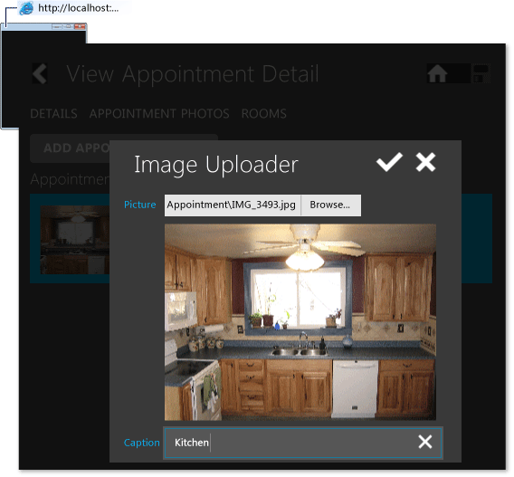

# Walkthrough: Creating a LightSwitch Client for Mobile Users
By using LightSwitch, you can create an HTML client in which mobile users can view, add, and update data from remote locations by using modern, touch-oriented devices such as phones and tablets. In this walkthrough, you'll create a client for a fictional moving company, Contoso Moving, so that its customer-service staff can more easily estimate how many people, trucks, and boxes each job will require.  
  
 At Contoso, schedulers spend most of their time in the office, talking to prospective customers in person or on the phone and arranging follow up visits. These workers use a rich desktop client that's based on Silverlight and that better supports heavy data entry with the keyboard and mouse. In contrast, the planning specialists travel all day, making follow up visits in various locations and recording information such as the size, contents, and entry requirements of each room. These mobile users need a client that not only shows them information about each follow up visit from the schedulers but also supports entering specific types of data, taking pictures, and alerting the move team about parking restrictions or other details.  
  
 The desktop client for the schedulers has already been built. You’ll build the mobile client that the planning specialists use to track the appointments that the schedulers arrange and to enter details about each move.  
  
## Prerequisites  
  
-   Download the [ContosoMoving sample application](http://code.msdn.microsoft.com/LightSwitch-HTML-Client-d243f5cb).  
  
## Getting Started  
 Before you build the mobile client, you will create some sample data for the desktop client, which you downloaded.  
  
#### To create sample data  
  
1.  On the menu bar, choose **File**, **Open**, **Project/Solution**.  
  
2.  Locate the ContosoMoving.sln file that you downloaded, and then open it.  
  
3.  On the menu bar, choose **Debug**, **Start Debugging**.  
  
4.  In the running client, on the menu bar, choose **Sample Data**, **Create Sample Data**.  
  
5.  On the toolbar in the **Create Sample Data** screen, choose the **Add All Sample Data** button.  
  
     Sample data is created for the **State**, **Employee**, **Customer**, and **Appointment** entities.  
  
6.  On the toolbar, choose the **Save** button.  
  
7.  On the menu bar, choose **Home**.  
  
8.  On the toolbar, choose the **Refresh** button.  
  
     A list of upcoming appointments for all employees appears, and you can explore the other screens in the desktop client.  
  
## Add a mobile client  
 Next you will add an HTML client project to the existing solution.  
  
#### To add an HTML client project  
  
1.  In **Solution Explorer**, choose the **ContosoMoving** node.  
  
2.  On the menu bar, choose **Project**, **Add Client**.  
  
3.  In the **Add Client** dialog box, choose **HTML Client**, name it `MobileClient`, and then choose the **OK** button.  
  
     A **MobileClient** project node is added to **Solution Explorer**.  
  
## Create Screens and Define Navigation  
 Next you will create a home screen and a details screen, define the navigation between the screens, and create a modal dialog box. Mobile clients use a different navigation model than desktop clients. Typically, only one screen is visible at a time in a mobile client, and changes are committed when you move from one screen to another.  
  
#### To create a home screen  
  
1.  In **Solution Explorer**, choose the **MobileClient** node.  
  
2.  On the menu bar, choose **Project**, **Add Screen**.  
  
3.  In the **Add New Screen** dialog box, choose the **Browse Data Screen** template.  
  
4.  In the **Screen Name** text box, enter `Home`.  
  
5.  In the **Screen Data** list, choose **UpcomingAppointments**, and then choose the **OK** button.  
  
#### To customize the home screen  
  
1.  In the screen designer, choose the **Appointment** node, and then choose **Rows Layout** in the drop-down list.  
  
2.  Under the **Rows Layout &#124; Appointment** node, delete all nodes except for **Start Date** and **Customer**.  
  
3.  On the menu bar, choose **Start Debugging**.  
  
     The mobile client appears in the browser.  
  
     At this point, the screen displays only the appointments. Next you’ll add a details screen so that appointment details appear when a user taps an appointment.  
  
#### To create a details screen  
  
1.  In the screen designer, choose the **Upcoming Appointments** node.  
  
2.  In the **Properties** window, choose the **Item Tap : None** link.  
  
3.  In the **Edit ItemTap action** dialog box, choose the **Choose an existing method** option button, and then choose **UpcomingAppointments.ViewSelected** in the list.  
  
4.  In the **Navigate To** list, choose **(New Screen)**, and then choose the **OK** button.  
  
     The **Add New Screen** dialog box appears.  
  
5.  In the **Add New Screen** dialog box, choose the **View Details Screen** template.  
  
6.  In the **Screen Name** text box, enter `ViewAppointment`.  
  
7.  In the **Screen Data** list, choose **Appointment**.  
  
8.  Select the **Appointment Details**, **Appointment Photos**, and **Appointment Rooms** check boxes, and then choose the **OK** button.  
  
     In the screen designer, a **Tabs** layout is created, and the different types of data are organized by tabs.  
  
9. On the menu bar, choose **Start Debugging** to run the mobile client.  
  
10. Tap an appointment to display the **View Appointment** screen.  
  
11. Resize the browser window, and notice how the layout changes between two columns and a single column.  
  
#### To customize the details screen  
  
1.  In **Solution Explorer**, open the **ViewAppointment** screen.  
  
2.  In the screen designer, choose the **Rows Layout &#124; Details** node.  
  
3.  Delete the **Start Date**, **End Date**, **Notes**, **Move Type**, **Employee**, and **Customer** nodes.  
  
4.  Move the **State** node so that it appears under the **City** node.  
  
5.  Choose the **Rows Layout &#124; right** node, expand the **Add** node, and then choose **Other Screen Data**.  
  
     The **Add Screen Data** dialog box appears.  
  
6.  In the **Specify the screen data to add** text box, enter `Customer.Phone`, and then choose the **OK** button.  
  
7.  Expand the **Add** node, and then choose **Other Screen Data**.  
  
     The **Add Screen Data** dialog box appears.  
  
8.  In the **Specify the screen data to add** text box, enter `Customer.Email`, and then choose the **OK** button.  
  
#### To create a modal dialog box  
  
1.  In **Solution Explorer**, open the **ViewAppointment** screen.  
  
2.  In the screen designer, open the shortcut menu for the **Command Bar** node of the **Details** tab, and then choose **Add Button**.  
  
3.  In the **Add Button** dialog box, choose the **Choose an existing method** option button, and then choose **Appointment.edit** in the list.  
  
4.  In the **Navigate To** list, choose **(New Screen)**, and then choose the **OK** button.  
  
     The **Add New Screen** dialog box appears.  
  
5.  In the **Screen Name** text box, enter `EditAppointment`, and then choose the **OK** button.  
  
     In the **Properties** window, the **Show As Dialog** check box is selected, which means that the screen will appear as a modal dialog box.  
  
6.  In the screen designer, delete the **Columns Layout &#124; columns** node.  
  
7.  Expand the **Add** node, and then choose **Other Screen Data**.  
  
     The **Add Screen Data** dialog box appears.  
  
8.  In the **Specify the screen data to add** text box, enter `Appointment.Customer.FirstName`, and then choose the **OK** button.  
  
9. Expand the **Add** node, and then choose **Other Screen Data**.  
  
     The **Add Screen Data** dialog box appears.  
  
10. In the **Specify the screen data to add** text box, enter `Appointment.Customer.LastName`, and then choose the **OK** button.  
  
11. Expand the **Add** node, and then choose **Other Screen Data**.  
  
     The **Add Screen Data** dialog box appears.  
  
12. In the **Specify the screen data to add** text box, enter `Appointment.Customer.Phone`, and then choose the **OK** button.  
  
13. Expand the **Add** node, and then choose **Other Screen Data**.  
  
     The **Add Screen Data** dialog box appears.  
  
14. In the **Specify the screen data to add** text box, enter `Appointment.Customer.Email`, and then choose the **OK** button.  
  
15. In the left-hand pane, drag **Street**, **City**, **State**, and **PostalCode** under the **Email** node.  
  
    > [!NOTE]
    >  Instead of dragging, you could also add the **Street**, **StreetLine2**, **City**, **State**, and **PostalCode** fields by following the same steps as the **FirstName** and **LastName** fields.  
  
#### To show the dialog box  
  
1.  In **Solution Explorer**, open the **ViewAppointment** screen.  
  
2.  In the screen designer, choose the **Edit Appointment** node.  
  
3.  In the **Properties** window, expand the **Icon**, list and then choose **Edit**.  
  
4.  On the menu bar, choose **Debug**, **Start Debugging** to run the mobile client.  
  
5.  In the running client, tap an appointment to open a **View Appointment** screen.  
  
6.  Tap the **Edit Appointment** button to display the dialog box.  
  
     **OK** and **Cancel** buttons are included automatically.  
  
## Customize the User Interface  
 You can customize the user interface of your client not only by changing settings in the screen designer but also by adding custom controls and writing JavaScript code.  
  
#### To apply custom formatting by using JavaScript libraries  
  
1.  In **Solution Explorer**, open the **Home** screen.  
  
2.  In the screen designer, choose the **Rows Layout &#124; Appointment** node, and then choose **Custom Control** in the list.  
  
3.  In the **Write Code** list, choose the **RowTemplate_render** method.  
  
4.  In the code editor, add the following code for the `RowTemplate_render` function:  
  
    ```javascript  
    myapp.Home.RowTemplate_render = function (element, contentItem) {  
        var itemTemplate = $("<div> </div>");  
        var title = $("<h3>" + moment(contentItem.value.StartDate).format("ddd, MMM Do, h:mm") + "-" + moment(contentItem.value.EndDate).format("h:mma") + "</h3>");  
        var subTitle = $("<span>" + contentItem.value.Customer.FirstName + " " + contentItem.value.Customer.LastName + " - " + contentItem.value.Customer.Phone + "</span>");  
        title.appendTo($(itemTemplate));  
        subTitle.appendTo($(itemTemplate));  
        itemTemplate.appendTo($(element));  
    };  
    ```  
  
     This JavaScript code uses the `contentItem.value` member variable to determine what to display and the `format` method to define the formatting.  
  
5.  In **Solution Explorer**, open the shortcut menu for the **MobileClient** node, and then choose **Manage NuGet Packages**.  
  
6.  In the **Manage NuGet Packages** dialog box, choose the **Online** node.  
  
7.  In the **Search Online** text box, enter `moment.js`.  
  
8.  Choose the **Install** button to install the Moment.js library, and then choose the **Close** button.  
  
9. In **Solution Explorer**, expand the **MobileClient** node, and then open the **default.htm** file.  
  
10. In the code editor, add the following script tag after the last `</script>` tag:  
  
    ```html  
    <script type="text/javascript" src="Scripts/moment.js" charset="utf-8"></script>  
    ```  
  
     This tag adds a reference to the moment.js library.  
  
11. On the menu bar, choose **Debug**, **Start Debugging** to run the client.  
  
     The appointment is formatted, and the time and the phone number are added.  
  
#### To change the layout to a tiled list  
  
1.  In **Solution Explorer**, open the **Home** screen.  
  
2.  In the screen designer, choose the **List &#124; Upcoming Appointments** node, and then choose **Tile List** in the list.  
  
3.  On the menu bar, choose **Debug**, **Start Debugging** to run the client.  
  
     The home screen displays upcoming appointments in a tile-based layout. Change the width of the browser window to demonstrate how the layout of the tiles dynamically adjusts to make good use of available horizontal space. This demonstration shows how the list layout could change based on the orientation and screen size of a mobile device.  
  
#### To add a dynamic screen title  
  
1.  In **Solution Explorer**, open the **ViewAppointment** screen.  
  
2.  In the screen designer, choose the **Rows Layout &#124; Details** node.  
  
3.  In the **Write Code** list, choose **Details_postRender**.  
  
4.  In the code editor, add the following JavaScript code:  
  
    ```javascript  
    myapp.ViewAppointmentDetail.Details_postRender = function (element, contentItem) {  
        contentItem.dataBind("value.Appointment.Customer.FirstName", function () {  
            formatAppointmentScreenTitle(contentItem);  
        });  
  
        contentItem.dataBind("value.Appointment.Customer.LastName", function () {  
            formatAppointmentScreenTitle(contentItem);  
        });  
  
        function formatAppointmentScreenTitle(contentItem) {  
            contentItem.screen.details.displayName = contentItem.value.Appointment.Customer.FirstName + " " +  
            contentItem.value.Appointment.Customer.LastName + " " +  
            moment(contentItem.value.Appointment.StartDate).format("h:mma") + " - " +  
            moment(contentItem.value.Appointment.EndDate).format("h:mma");  
        };  
    };  
    ```  
  
5.  On the menu bar, choose **Debug**, **Start Debugging** to run the client.  
  
     The appointment-detail screens show the customer’s name and the start and end times for the appointment.  
  
## Add a Custom Control to Upload Photos  
 The appointment details screen has an **Appointment Photos** tab so that a planning specialist for Contoso Moving can take pictures of a customer’s site to estimate the job more accurately. To enable this task, you will add a custom control to the client.  
  
#### To add a custom control  
  
1.  In **Solution Explorer**, open the shortcut menu for the **Scripts** node, choose **Add**, and then choose **Existing Item**.  
  
2.  In the **Add Existing Item** dialog box, navigate to the **ContosoMoving** folder, and then open the **Sample Resources** folder.  
  
3.  Choose the **image_uploader-base64-file-encoder** and **image-uploader** files, and then choose the **Add** button.  
  
4.  Open the default.htm file, and then, in the code editor, add the following reference to image-uploader.js at the end of the script references block:  
  
    ```  
    <script type="text/javascript" src="Scripts/image-uploader.js" charset="utf-8"></script>  
    ```  
  
5.  In **Solution Explorer**, open the **ViewAppointment** screen.  
  
6.  In the screen designer, choose the **List &#124; Photos** node, and then choose **Tile List** in the list.  
  
7.  In the **Properties** window, open the **Height** property list, and then choose **Stretch to Container**.  
  
8.  In the **Min** text box, enter `150`.  
  
9. In the screen designer, open the shortcut menu for the **Photos** tab **Command Bar** node, and then choose **Add Button**.  
  
10. In the **Add Button** dialog box, choose the **Choose an existing method** option button, choose **Photos.addEditNew** in the list, and then choose the **OK** button.  
  
     The **Add New Screen** dialog box appears.  
  
11. In the **Screen Name** text box, enter `UploadPhoto`, and then choose the **OK** button.  
  
12. In the screen designer, delete the **Rows Layout &#124; right** node.  
  
13. Choose the **Caption** node, and then change the control type to **Text Area**.  
  
14. Choose the **Picture** node, and then change the control type to **Custom Control**.  
  
15. In the **Properties** window, choose the **Edit Render Code** hyperlink.  
  
16. In the code editor, add the following code to the Picture1_render function:  
  
    ```javascript  
    createImageUploader(element, contentItem, "max-width: 300px; max-height: 300px");  
    ```  
  
     This code initializes the ImageUploader custom control when the screen is rendered.  
  
17. In **Solution Explorer**, open the **ViewAppointment** screen.  
  
18. In the screen designer, choose the **Add Photo** button node, and then change the **Icon** property to **Add Picture**.  
  
19. On the menu bar, choose **Debug**, **Start Debugging** to run the client.  
  
20. In the running client, tap an appointment.  
  
21. On the appointment detail screen, tap the **Photos** tab.  
  
22. Tap the **Add Photo** button to open the **Image Uploader** dialog box.  
  
       
  
## Map the Customer’s Address  
 The planning specialist must also be able to find the customer’s site, so next you will add mapping functionality by using a Bing map control.  
  
#### To add a map control  
  
1.  In **Solution Explorer**, open the shortcut menu for the **Scripts** node, choose **Add**, and then choose **Existing Item**.  
  
2.  In the **Add Existing Item** dialog box, navigate to the **ContosoMoving** folder, and then open the **Sample Resources** folder.  
  
3.  Choose the **lightswitch.bing-maps.js** file, and then choose the **Add** button.  
  
4.  Open the default.htm file and then, in the code editor, add a reference at the start of the script references block:  
  
    ```  
    <script type="text/javascript" charset="utf-8" src="http://ecn.dev.virtualearth.net/mapcontrol/mapcontrol.ashx?v=7.0"></script>  
    ```  
  
5.  At the end of the script references block, add a reference to the JavaScript file:  
  
    ```  
    <script type="text/javascript" src="Scripts/lightswitch.bing-maps.js" charset="utf-8"></script>  
    ```  
  
6.  In **Solution Explorer**, open the **ViewAppointment** screen.  
  
7.  In the screen designer, open the shortcut menu for the **Tabs** node, and then choose **Add Tab**.  
  
8.  In the **Properties** window, set the value of the **Name** property to `Map`.  
  
9. Open the shortcut menu for the **Rows Layout &#124; Map** node, and then choose **Add Custom Control**.  
  
     The **Add Custom Control** dialog box appears.  
  
10. In the **Specify the data for the new custom control** text box, enter `Appointment`, and then choose the **OK** button.  
  
11. In the **Properties** window, choose the **Edit Render Code** hyperlink.  
  
12. In the code editor, add the following utility methods before the **Appointment_render** function:  
  
    ```javascript  
    function rebindMap(element, contentItem) {  
        // Verify that we aren't updating the map continuously due to multiple bound values changing.  
        var now = new Date();  
        if (now.getTime() - mapLastUpdated.getTime() > 15) {  
            setTimeout(function () {  
                updateMap(element, contentItem);  
                mapLastUpdated = new Date();  
            }, 20);  
        }  
    };  
  
    function updateMap(element, contentItem) {  
        var mapDiv = $("#appointmentMap");  
        // If we've previously created the map, make sure to clean up the div that contained it;  
        // otherwise, the Bing map control fails to create properly.  
        if (mapDiv.length > 0) {  
            $(mapDiv).remove();  
        }  
        mapDiv = $("<div id='appointmentMap' class='msls-hauto msls-vauto' ></div>");  
  
        $(mapDiv).appendTo($(element));  
        mapControl = mapDiv.lightswitchBingMapsControl({  
            street: contentItem.value.Street,  
            city: contentItem.value.City,  
            state: contentItem.value.State.Name,  
            zipcode: contentItem.value.PostalCode,  
            mapTypeId: Microsoft.Maps.MapTypeId.road,  
  
            height: "400"  
        });  
    };  
    ```  
  
13. Add the following code to the **Appointment_render** function:  
  
    ```javascript  
    updateMap(element, contentItem);  
    mapLastUpdated = new Date();  
        contentItem.dataBind("value.Street", function () { rebindMap(element, contentItem); });  
        contentItem.dataBind("value.City", function () { rebindMap(element, contentItem); });  
        contentItem.dataBind("value.Zip", function () { rebindMap(element, contentItem); });  
        contentItem.dataBind("value.PostalCode", function () { rebindMap(element, contentItem); });  
    ```  
  
     This code binds the fields of the appointment to the map control when the screen is rendered.  
  
14. On the menu bar, choose **Debug**, **Start Debugging** to run the client.  
  
15. In the running client, tap an appointment.  
  
16. On the appointment detail screen, tap the **Map** tab to display a map of the customer’s address.  
  
## Add Branding  
 Next you’ll change the title of the client to something more meaningful than MobileClient, and you’ll add a Contoso Moving corporate logo to personalize the client.  
  
#### To change the title  
  
1.  In **Solution Explorer**, open the default.htm file, and then, in the code editor, replace the `<title>MobileClient</title>` element with the following code:  
  
    ```  
    <title>Contoso Moving Mobile</title>  
    ```  
  
#### To add an icon  
  
1.  In **Solution Explorer**, expand the **Content** and **Images** nodes.  
  
2.  Delete the **user-logo.png** file.  
  
3.  Open the shortcut menu for the **Images** node, choose **Add**, and then choose **Existing Item**.  
  
4.  In the **Add Existing Item** dialog box, navigate to the **ContosoMoving** folder, and then open the **Sample Resources** folder.  
  
5.  Choose the **user-logo.png** file, and then choose the **Add** button.  
  
    > [!NOTE]
    >  You can also customize the image that appears on the splash screen if you replace the **user-splash-screen.png** file.  
  
6.  On the menu bar, choose **Debug**, **Start Debugging** to run the client.  
  
    > [!NOTE]
    >  You may need to clear your browser cache before the changes will appear.  
  
## Change the Theme  
 Cascading style sheets (CSS) to define the theme of a client. You can modify the default theme to change the appearance of your client, or you can replace that theme by changing the .css file. You will use a web tool, ThemeRoller, to create a.css file with a customized theme.  
  
#### To switch between themes  
  
1.  In **Solution Explorer**, open the default.htm file, and then, in the code editor, replace “light” in the following two lines `<link rel="stylesheet" type="text/css" href="Content/light-theme.css" />`, `<link rel="stylesheet" type="text/css" href="Content/msls-light.css" />`with `dark`.  
  
2.  On the menu bar, choose **Debug**, **Start Debugging** to run the client.  
  
#### To customize an existing theme  
  
1.  In your web browser, navigate to the [ThemeRoller](http://go.microsoft.com/fwlink/?LinkId=266599) website.  
  
2.  On the ThemeRoller toolbar, choose the **Import or upgrade** button.  
  
     The **Import Theme** dialog box appears.  
  
3.  In Visual Studio, in **Solution Explorer**, choose **File View** from the list on the toolbar.  
  
4.  Expand the **Content** node, and then open the **dark-theme.css** file.  
  
5.  In the code editor, copy the entire contents of the file.  
  
6.  In ThemeRoller, paste the contents of the **dark-theme.css** file into the **Import Theme** dialog box, and then choose the **Import** button.  
  
7.  In the left pane, choose the **Global** tab, and then expand the **Corner Radii** node.  
  
8.  In the **Group** text box, enter `0.8em`.  
  
9. In the **Button** text box, enter `1.5em`.  
  
     The UI elements in the right-hand pane now have rounded corners.  
  
10. In the right-hand pane, drag a color from the color palette onto the background area of **Swatch A**.  
  
11. Drag another color onto the **Radio** element.  
  
     All related elements also change color. When you point to an element, it changes to a complementary color, indicating the selection color.  
  
12. On the ThemeRoller toolbar, choose the **Download** button.  
  
13. In the **Download Theme** dialog box, name the theme my-theme, and then choose the **Download Zip** button.  
  
14. Extract the contents of the compressed file to a local folder.  
  
15. In **Solution Explorer**, open the shortcut menu for the **Content** node, choose **Add**, and then choose **Existing Item**.  
  
16. In the **Add Existing Item** dialog box, navigate to the folder where you extracted the files, choose the **my-theme.css** file, and then choose the **Add** button.  
  
17. Open the default.htm file, locate the line `<link rel="stylesheet" type="text/css" href="Content/dark-theme.css" charset="utf-8" />` in the code editor, and then replace ”dark-theme” with `my-theme`.  
  
18. On the menu bar, choose **Debug**, **Start Debugging** to run the client.  
  
## Next Steps  
 You now have a working mobile client application. To test it on a mobile device, publish the application to Internet Information Services (IIS) or Microsoft Azure.  
  
## See Also  
 [HTML Client Applications in LightSwitch](../vs140/HTML-Client-Screens-for-LightSwitch-Apps.md)   
 [How to: Deploy a 3-tier Application](../vs140/How-to--Deploy-a-Three-Tier-LightSwitch-Application.md)   
 [How to: Host an Application on Microsoft Azure](../vs140/How-to--Host-a-LightSwitch-Application-on-Microsoft-Azure.md)